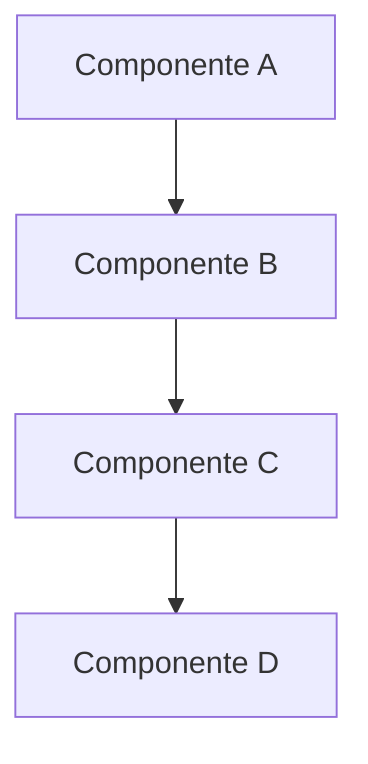

# Architecture Pattern Template

## Informações Básicas
- **Padrão/Decisão**: [Nome do padrão ou decisão arquitetural]
- **Data da Decisão**: [Data]
- **Responsável**: [Nome/Equipe]
- **Status**: [Proposta/Aprovada/Implementada/Deprecada]

## Decisão
[Descrição clara e concisa da decisão arquitetural tomada]

## Contexto
### Problema
[Descrição do problema que levou à necessidade desta decisão]

### Restrições
- [Restrição 1]: [Descrição]
- [Restrição 2]: [Descrição]

### Objetivos
- [Objetivo 1]: [Descrição]
- [Objetivo 2]: [Descrição]

## Alternativas Consideradas

### Alternativa 1: [Nome da Alternativa]
- **Descrição**: [Descrição da alternativa]
- **Prós**:
  - [Pró 1]
  - [Pró 2]
- **Contras**:
  - [Contra 1]
  - [Contra 2]
- **Por que não foi escolhida**: [Justificativa detalhada]

### Alternativa 2: [Nome da Alternativa]
- **Descrição**: [Descrição da alternativa]
- **Prós**:
  - [Pró 1]
  - [Pró 2]
- **Contras**:
  - [Contra 1]
  - [Contra 2]
- **Por que não foi escolhida**: [Justificativa detalhada]

## Solução Escolhida
### Descrição
[Descrição detalhada da solução implementada]

### Diagrama Arquitetural


### Componentes
- **[Componente 1]**: [Descrição e responsabilidade]
- **[Componente 2]**: [Descrição e responsabilidade]
- **[Componente 3]**: [Descrição e responsabilidade]

## Implementação
### Estrutura de Código
```code
// Exemplo de implementação do padrão
```

### Configuração
```json
{
  "configuração": "exemplo"
}
```

### Fluxo de Dados
1. [Passo 1]
2. [Passo 2]
3. [Passo 3]

## Impactos
### Impactos Positivos
- [Impacto 1]: [Descrição e benefício]
- [Impacto 2]: [Descrição e benefício]

### Impactos Negativos
- [Impacto 1]: [Descrição e mitigação]
- [Impacto 2]: [Descrição e mitigação]

### Riscos Identificados
- **Risco 1**: [Descrição do risco]
  - **Probabilidade**: [Baixa/Média/Alta]
  - **Impacto**: [Baixo/Médio/Alto]
  - **Mitigação**: [Como mitigar]

- **Risco 2**: [Descrição do risco]
  - **Probabilidade**: [Baixa/Média/Alta]
  - **Impacto**: [Baixo/Médio/Alto]
  - **Mitigação**: [Como mitigar]

## Métricas e Monitoramento
### Métricas de Performance
- [Métrica 1]: [Como medir e interpretar]
- [Métrica 2]: [Como medir e interpretar]

### Métricas de Qualidade
- [Métrica 1]: [Como medir e interpretar]
- [Métrica 2]: [Como medir e interpretar]

### Alertas
- [Alerta 1]: [Condição e ação]
- [Alerta 2]: [Condição e ação]

## Testes
### Testes de Arquitetura
- [Teste 1]: [Descrição e critérios]
- [Teste 2]: [Descrição e critérios]

### Testes de Integração
- [Teste 1]: [Descrição e critérios]
- [Teste 2]: [Descrição e critérios]

### Testes de Performance
- [Teste 1]: [Descrição e critérios]
- [Teste 2]: [Descrição e critérios]

## Documentação Relacionada
- [Link para documentação técnica]
- [Link para diagramas]
- [Link para exemplos de implementação]

## Histórico de Revisões
| Data | Versão | Alteração | Responsável |
|------|--------|-----------|-------------|
| [Data] | [Versão] | [Descrição da alteração] | [Responsável] |

## Próximos Passos
- [ ] [Ação 1]
- [ ] [Ação 2]
- [ ] [Ação 3]

## Observações
[Observações importantes sobre a implementação ou contexto adicional]
