# APIs e Web Services

A **Zabbix Store** é um e-commerce de plataforma de terceiros que permite a venda de diversos tipos de produtos, incluindo eletrônicos, roupas e itens de casa. O sistema oferece versões web e mobile, e as APIs serão responsáveis por integrar os serviços entre o front-end, o back-end e sistemas de terceiros, garantindo a comunicação segura e eficiente entre compradores e fornecedores. Entre as funcionalidades da API estão: autenticação de usuários, gerenciamento de produtos, validação de endereços e processamento de pedidos.

## Objetivos da API

A API da Zabbix Store tem como principais objetivos:

- **Autenticação e Autorização**: Gerenciar o acesso seguro de usuários (compradores e fornecedores) através de tokens JWT.
- **Gestão de Produtos**: Permitir que fornecedores cadastrem, atualizem e removam produtos do catálogo.
- **Gestão de Usuários**: Facilitar o cadastro, atualização e busca de informações de usuários.
- **Gestão de Endereços**: Permitir que usuários (comprador) cadastrem e gerenciem múltiplos endereços de entrega.
- **Processamento de Pedidos**: Gerenciar todo o ciclo de vida dos pedidos, desde a criação até a entrega.
- **Integração Frontend**: Fornecer endpoints RESTful para integração com aplicações web e mobile.
- **Segurança**: Implementar validações, sanitização de dados e controle de acesso baseado em roles.

## Modelagem da Aplicação

### Estrutura de Dados

A aplicação é organizada em torno de entidades que representam os usuários (compradores e fornecedores), os produtos disponibilizados e as interações realizadas na Store.

- **Usuário**: entidade base que representa qualquer participante da plataforma. Contém atributos comuns como id_usuario, nome, email, senha e tipo, que define se o usuário é um **comprador** ou um **fornecedor**.

- **Fornecedor**: especialização de usuário responsável pela venda de produtos na Store. Possui atributos adicionais como CNPJ, CPF, telefone, endereço e é associado diretamente aos produtos que oferece.

- **Comprador**: especialização de usuário que consome os produtos. Possui atributos adicionais como CPF, data_nascimento e endereço. Pode visualizar produtos, adicionar ao carrinho, realizar compras e avaliar produtos.

- **Categoria**: classifica os produtos em áreas temáticas (ex.: Roupas, Eletrônicos, Utensílios), permitindo organização e filtragem.

- **Produto**: item à venda na loja, criado por um fornecedor. Contém atributos como id_produto, nome, descrição, preço, estoque, imagens e está vinculado a uma Categoria.

- **Carrinho**: mantém os produtos selecionados pelo comprador antes da finalização da compra. Contém referências ao comprador, produtos e quantidades.

- **Pedido**: registra a compra de um comprador, contendo informações como id_pedido, data, status (ex.: processando, enviado, entregue) e os produtos comprados.

- **Avaliação**: permite que compradores avaliem produtos adquiridos, registrando nota e comentário.

* `diagrama entidade-relacionamento (DER)`
  

* `modelo relacional`


### Fluxo Funcional


### Arquitetura Lógica

    1.	Frontend (UI) → interface web e mobile para compradores e fornecedores.
    2.	Backend (API e Lógica de Negócio) → gerencia usuários, produtos, pedidos e avaliações.
    3.	Banco de Dados → armazena todos os dados da plataforma: produtos, categorias, pedidos, itens, usuários, avaliações e logs.

## Tecnologias Utilizadas

### Arquitetura da API

A API foi desenvolvida utilizando o framework **NestJS**, seguindo os princípios de uma arquitetura REST robusta e escalável. O sistema adota os padrões de design do NestJS, incluindo:

- **Arquitetura Modular**: Organização em módulos especializados para cada domínio
- **Dependency Injection**: Gerenciamento automático de dependências
- **Decorators**: Uso de decorators para definição de rotas, guards e validações
- **Middleware Pipeline**: Pipeline de processamento com guards, pipes e interceptors

### Tecnologias Principais

- **NestJS 10.x**: Framework principal baseado em TypeScript
- **TypeScript**: Linguagem de programação com tipagem estática
- **Prisma**: ORM para gerenciamento do banco de dados
- **Express**: Servidor HTTP subjacente
- **JWT**: Autenticação baseada em tokens JSON Web Token
- **Swagger/OpenAPI**: Documentação automatizada da API

### Especificações Técnicas

#### Status Codes Utilizados

- **200 OK**: Operação realizada com sucesso
- **201 Created**: Recurso criado com sucesso
- **400 Bad Request**: Dados de entrada inválidos
- **401 Unauthorized**: Token não fornecido ou inválido
- **403 Forbidden**: Permissões insuficientes
- **404 Not Found**: Recurso não encontrado
- **500 Internal Server Error**: Erro interno do servidor

#### Payloads e Validações

A API utiliza **class-validator** e **class-transformer** para validação automática dos dados de entrada através de DTOs (Data Transfer Objects). As validações incluem:

- Validação de tipos de dados
- Validação de campos obrigatórios
- Sanitização de dados de entrada
- Transformação automática de tipos

#### Segurança

- **JWT Authentication**: Tokens JWT para autenticação
- **Role-Based Access Control (RBAC)**: Controle de acesso baseado em funções
- **Helmet**: Headers de segurança HTTP
- **CORS**: Configuração de Cross-Origin Resource Sharing
- **Rate Limiting**: Proteção contra ataques de força bruta
- **Validation Pipes**: Sanitização e validação de entrada

#### Documentação

- **Swagger UI**: Interface interativa disponível em `/api`
- **OpenAPI 3.0**: Especificação completa da API
- **JWT Bearer Authentication**: Suporte à autenticação na documentação

#### Configuração CORS

A API está configurada para aceitar requisições do frontend em `http://localhost:5173` (padrão Vite) ou através da variável de ambiente `FRONTEND_URL`.

#### Middlewares e Guards

- **AuthGuard**: Verificação de autenticação JWT
- **RolesGuard**: Verificação de permissões por função
- **ValidationPipe**: Validação global de entrada
- **Global Exception Filter**: Tratamento padronizado de erros

## API Endpoints

A API da Zabbix Store oferece endpoints organizados por módulos funcionais. Todos os endpoints (exceto os públicos) requerem autenticação via Bearer Token JWT.

<details>
<summary><strong>Autenticação (/auth)</strong></summary>

<details>
<summary><code>POST /auth/login</code></summary>

- **Descrição**: Autentica usuário e retorna token JWT
- **Autenticação**: Não requerida
- **Parâmetros**:
  ```json
  {
    "EMAIL": "usuario@exemplo.com",
    "SENHA": "Senha@123"
  }
  ```
- **Resposta**:
  - Sucesso (200 OK)
    ```json
    {
      "token": "eyJhbGciOiJIUzI1NiIs...",
      "user": {
        "id": 1,
        "email": "usuario@exemplo.com",
        "permission": "CLIENTE",
        "profile": {
          "id": 1,
          "name": "João",
          "lastName": "Silva",
          "phone": "11987654321",
          "cpf": "12345678900"
        }
      }
    }
    ```
  - Erro (401 Unauthorized)
    ```json
    {
      "statusCode": 401,
      "message": "Credenciais inválidas",
      "error": "Unauthorized"
    }
    ```

</details>

<details>
<summary><code>POST /auth/registro</code></summary>

- **Descrição**: Registra novo usuário no sistema
- **Autenticação**: Não requerida
- **Parâmetros**:
  ```json
  {
    "EMAIL": "usuario@exemplo.com",
    "SENHA": "Senha@123",
    "NOME": "João",
    "SOBRENOME": "Silva",
    "CPF": "12345678900",
    "TELEFONE": "11987654321",
    "ENDERECO": {
      "DESCRICAO": "Casa",
      "CEP": "12345678",
      "RUA": "Rua das Flores",
      "NUMERO": "123",
      "COMPLEMENTO": "Apto 42",
      "BAIRRO": "Centro",
      "CIDADE": "São Paulo"
    }
  }
  ```
- **Resposta**:
  - Sucesso (201 Created)
    ```json
    {
      "id": 1,
      "email": "usuario@exemplo.com",
      "permission": "CLIENTE",
      "profile": {
        "id": 1,
        "name": "João",
        "lastName": "Silva",
        "phone": "11987654321",
        "cpf": "12345678900",
        "address": {
          "id": 1,
          "description": "Casa",
          "zipCode": "12345678",
          "street": "Rua das Flores",
          "number": "123",
          "complement": "Apto 42",
          "neighborhood": "Centro",
          "city": "São Paulo",
          "isMain": true
        }
      }
    }
    ```
  - Erro (400 Bad Request)
    ```json
    {
      "statusCode": 400,
      "message": "Email inválido",
      "error": "Bad Request"
    }
    ```
  - Erro (409 Conflict)
    ```json
    {
      "statusCode": 409,
      "message": "Email já está em uso",
      "error": "Conflict"
    }
    ```
  - Erro (500 Internal Server Error)
    ```json
    {
      "statusCode": 500,
      "message": "Erro interno do servidor",
      "error": "Internal Server Error"
    }
    ```

</details>

<details>
<summary><code>POST /auth/change-password</code></summary>

- **Descrição**: Altera senha do usuário autenticado
- **Autenticação**: Requerida
- **Parâmetros**:
  ```json
  {
    "SENHA_ATUAL": "SenhaAtual@123",
    "NOVA_SENHA": "NovaSenha@123"
  }
  ```
- **Resposta**:
  - Sucesso (200 OK)
    ```json
    {
      "message": "Senha alterada com sucesso"
    }
    ```
  - Erro (401 Unauthorized)
    ```json
    {
      "statusCode": 401,
      "message": "Senha atual incorreta",
      "error": "Unauthorized"
    }
    ```
  - Erro (404 Not Found)
    ```json
    {
      "statusCode": 404,
      "message": "Usuário não encontrado",
      "error": "Not Found"
    }
    ```
  - Erro (500 Internal Server Error)
    ```json
    {
      "statusCode": 500,
      "message": "Erro interno do servidor",
      "error": "Internal Server Error"
    }
    ```

</details>

<details>
<summary><code>POST /auth/validate-token</code></summary>

- **Descrição**: Valida token JWT e retorna dados do usuário
- **Autenticação**: Requerida
- **Resposta**:
  - Sucesso (200 OK)
    ```json
    {
      "id": 1,
      "email": "usuario@exemplo.com",
      "permission": "CLIENTE",
      "profile": {
        "id": 1,
        "name": "João",
        "lastName": "Silva",
        "phone": "11987654321",
        "cpf": "12345678900"
      }
    }
    ```
  - Erro (401 Unauthorized)
    ```json
    {
      "statusCode": 401,
      "message": "Token inválido ou expirado",
      "error": "Unauthorized"
    }
    ```
  - Erro (500 Internal Server Error)
    ```json
    {
      "statusCode": 500,
      "message": "Erro interno do servidor",
      "error": "Internal Server Error"
    }
    ```

</details>

</details>

<details>
<summary><strong>Produtos (/produto)</strong></summary>

<details>
<summary><code>GET /produto/listar</code></summary>

- **Descrição**: Lista todos os produtos disponíveis
- **Autenticação**: Não requerida (público)
- **Parâmetros**:
  - `CATEGORIA` (opcional): Filtrar por categoria
- **Resposta**:
  - Sucesso (200 OK)
    ```json
    [
      {
        "CODPROD": 1,
        "PRODUTO": "Camiseta Polo",
        "DESCRICAO": "Camiseta polo masculina 100% algodão",
        "VALOR": 29.99,
        "ESTOQUE": 50,
        "CODCAT": 1,
        "IMAGEM": "https://exemplo.com/imagem.jpg",
        "DESCONTO": 0,
        "CATEGORIAS": {
          "CODCAT": 1,
          "CATEGORIA": "MASCULINO"
        }
      }
    ]
    ```
  - Erro (500 Internal Server Error)
    ```json
    {
      "statusCode": 500,
      "message": "Erro interno do servidor",
      "error": "Internal Server Error"
    }
    ```

</details>

<details>
<summary><code>GET /produto/buscar</code></summary>

- **Descrição**: Busca produto por ID
- **Autenticação**: Não requerida (público)
- **Parâmetros**:
  - `CODPROD`: ID do produto
- **Resposta**:
  - Sucesso (200 OK)
    ```json
    {
      "CODPROD": 1,
      "PRODUTO": "Camiseta Polo",
      "DESCRICAO": "Camiseta polo masculina 100% algodão",
      "VALOR": 29.99,
      "ESTOQUE": 50,
      "CODCAT": 1,
      "IMAGEM": "https://exemplo.com/imagem.jpg",
      "DESCONTO": 0,
      "CATEGORIAS": {
        "CODCAT": 1,
        "CATEGORIA": "MASCULINO"
      }
    }
    ```
  - Erro (404 Not Found)
    ```json
    {
      "statusCode": 404,
      "message": "Produto não encontrado",
      "error": "Not Found"
    }
    ```
  - Erro (500 Internal Server Error)
    ```json
    {
      "statusCode": 500,
      "message": "Erro interno do servidor",
      "error": "Internal Server Error"
    }
    ```

</details>

<details>
<summary><code>POST /produto/cadastrar</code></summary>

- **Descrição**: Cadastra novo produto (Admin apenas)
- **Autenticação**: Requerida (Admin)
- **Parâmetros**:
  ```json
  {
    "PRODUTO": "Camiseta Polo",
    "DESCRICAO": "Camiseta polo masculina 100% algodão",
    "VALOR": 29.99,
    "ESTOQUE": 50,
    "CODCAT": 1,
    "IMAGEM": "https://exemplo.com/imagem.jpg",
    "DESCONTO": 0
  }
  ```
- **Resposta**:
  - Sucesso (201 Created)
    ```json
    {
      "CODPROD": 1,
      "PRODUTO": "Camiseta Polo",
      "DESCRICAO": "Camiseta polo masculina 100% algodão",
      "VALOR": 29.99,
      "ESTOQUE": 50,
      "CODCAT": 1,
      "IMAGEM": "https://exemplo.com/imagem.jpg",
      "DESCONTO": 0
    }
    ```
  - Erro (401 Unauthorized)
    ```json
    {
      "statusCode": 401,
      "message": "Não autorizado",
      "error": "Unauthorized"
    }
    ```
  - Erro (403 Forbidden)
    ```json
    {
      "statusCode": 403,
      "message": "Usuário não tem permissão de administrador",
      "error": "Forbidden"
    }
    ```
  - Erro (400 Bad Request)
    ```json
    {
      "statusCode": 400,
      "message": "Valor não pode ser negativo",
      "error": "Bad Request"
    }
    ```
  - Erro (500 Internal Server Error)
    ```json
    {
      "statusCode": 500,
      "message": "Erro interno do servidor",
      "error": "Internal Server Error"
    }
    ```

</details>

<details>
<summary><code>PUT /produto/atualizar</code></summary>

- **Descrição**: Atualiza produto existente (Admin apenas)
- **Autenticação**: Requerida (Admin)
- **Parâmetros**:
  ```json
  {
    "CODPROD": 1,
    "PRODUTO": "Camiseta Polo Atualizada",
    "DESCRICAO": "Camiseta polo masculina 100% algodão premium",
    "VALOR": 39.99,
    "ESTOQUE": 30,
    "CODCAT": 1,
    "IMAGEM": "https://exemplo.com/imagem-nova.jpg",
    "DESCONTO": 10
  }
  ```
- **Resposta**:
  - Sucesso (200 OK)
    ```json
    {
      "CODPROD": 1,
      "PRODUTO": "Camiseta Polo Atualizada",
      "DESCRICAO": "Camiseta polo masculina 100% algodão premium",
      "VALOR": 39.99,
      "ESTOQUE": 30,
      "CODCAT": 1,
      "IMAGEM": "https://exemplo.com/imagem-nova.jpg",
      "DESCONTO": 10
    }
    ```
  - Erro (401 Unauthorized)
    ```json
    {
      "statusCode": 401,
      "message": "Não autorizado",
      "error": "Unauthorized"
    }
    ```
  - Erro (403 Forbidden)
    ```json
    {
      "statusCode": 403,
      "message": "Usuário não tem permissão de administrador",
      "error": "Forbidden"
    }
    ```
  - Erro (404 Not Found)
    ```json
    {
      "statusCode": 404,
      "message": "Produto não encontrado",
      "error": "Not Found"
    }
    ```
  - Erro (400 Bad Request)
    ```json
    {
      "statusCode": 400,
      "message": "Dados inválidos",
      "error": "Bad Request"
    }
    ```
  - Erro (500 Internal Server Error)
    ```json
    {
      "statusCode": 500,
      "message": "Erro interno do servidor",
      "error": "Internal Server Error"
    }
    ```

</details>

<details>
<summary><code>DELETE /produto/remover</code></summary>

- **Descrição**: Remove produto do sistema (Admin apenas)
- **Autenticação**: Requerida (Admin)
- **Parâmetros**:
  - `CODPROD`: ID do produto a ser removido
- **Resposta**:
  - Sucesso (200 OK)
    ```json
    {
      "message": "Produto removido com sucesso"
    }
    ```
  - Erro (401 Unauthorized)
    ```json
    {
      "statusCode": 401,
      "message": "Não autorizado",
      "error": "Unauthorized"
    }
    ```
  - Erro (403 Forbidden)
    ```json
    {
      "statusCode": 403,
      "message": "Usuário não tem permissão de administrador",
      "error": "Forbidden"
    }
    ```
  - Erro (404 Not Found)
    ```json
    {
      "statusCode": 404,
      "message": "Produto não encontrado",
      "error": "Not Found"
    }
    ```
  - Erro (400 Bad Request)
    ```json
    {
      "statusCode": 400,
      "message": "Produto não pode ser removido",
      "error": "Bad Request"
    }
    ```
  - Erro (500 Internal Server Error)
    ```json
    {
      "statusCode": 500,
      "message": "Erro interno do servidor",
      "error": "Internal Server Error"
    }
    ```

</details>

</details>

<details>
<summary><strong>Endereços (/endereco)</strong></summary>

<details>
<summary><code>POST /endereco/cadastrar</code></summary>

- **Descrição**: Cadastra novo endereço para o usuário
- **Autenticação**: Requerida
- **Parâmetros**:
  ```json
  {
    "CODPES": 1,
    "CEP": "12345678",
    "RUA": "Rua das Flores",
    "NUMERO": "123",
    "COMPLEMENTO": "Apto 42",
    "BAIRRO": "Centro",
    "CIDADE": "São Paulo",
    "DESCRICAO": "Casa"
  }
  ```
- **Resposta**:
  - Sucesso (201 Created)
    ```json
    {
      "CODEND": 1,
      "CODPES": 1,
      "DESCRICAO": "Casa",
      "CEP": "12345678",
      "RUA": "Rua das Flores",
      "NUMERO": "123",
      "COMPLEMENTO": "Apto 42",
      "BAIRRO": "Centro",
      "CIDADE": "São Paulo"
    }
    ```
  - Erro (400 Bad Request)
    ```json
    {
      "statusCode": 400,
      "message": "CEP inválido",
      "error": "Bad Request"
    }
    ```
  - Erro (401 Unauthorized)
    ```json
    {
      "statusCode": 401,
      "message": "Não autorizado",
      "error": "Unauthorized"
    }
    ```
  - Erro (500 Internal Server Error)
    ```json
    {
      "statusCode": 500,
      "message": "Erro interno do servidor",
      "error": "Internal Server Error"
    }
    ```

</details>

<details>
<summary><code>PATCH /endereco/atualizar</code></summary>

- **Descrição**: Atualiza endereço existente
- **Autenticação**: Requerida
- **Parâmetros**:
  ```json
  {
    "CODEND": 1,
    "CEP": "87654321",
    "RUA": "Rua das Palmeiras",
    "NUMERO": "456",
    "COMPLEMENTO": "Casa 2",
    "BAIRRO": "Jardins",
    "CIDADE": "São Paulo",
    "DESCRICAO": "Trabalho"
  }
  ```
- **Resposta**:
  - Sucesso (200 OK)
    ```json
    {
      "CODEND": 1,
      "CODPES": 1,
      "DESCRICAO": "Trabalho",
      "CEP": "87654321",
      "RUA": "Rua das Palmeiras",
      "NUMERO": "456",
      "COMPLEMENTO": "Casa 2",
      "BAIRRO": "Jardins",
      "CIDADE": "São Paulo"
    }
    ```
  - Erro (401 Unauthorized)
    ```json
    {
      "statusCode": 401,
      "message": "Não autorizado",
      "error": "Unauthorized"
    }
    ```
  - Erro (404 Not Found)
    ```json
    {
      "statusCode": 404,
      "message": "Endereço não encontrado",
      "error": "Not Found"
    }
    ```
  - Erro (400 Bad Request)
    ```json
    {
      "statusCode": 400,
      "message": "Dados inválidos",
      "error": "Bad Request"
    }
    ```
  - Erro (500 Internal Server Error)
    ```json
    {
      "statusCode": 500,
      "message": "Erro interno do servidor",
      "error": "Internal Server Error"
    }
    ```

</details>

<details>
<summary><code>DELETE /endereco/deletar</code></summary>

- **Descrição**: Remove endereço do usuário
- **Autenticação**: Requerida
- **Parâmetros**:
  - `CODEND`: ID do endereço a ser removido
- **Resposta**:
  - Sucesso (200 OK)
    ```json
    {
      "message": "Endereço removido com sucesso"
    }
    ```
  - Erro (401 Unauthorized)
    ```json
    {
      "statusCode": 401,
      "message": "Não autorizado",
      "error": "Unauthorized"
    }
    ```
  - Erro (404 Not Found)
    ```json
    {
      "statusCode": 404,
      "message": "Endereço não encontrado",
      "error": "Not Found"
    }
    ```
  - Erro (400 Bad Request)
    ```json
    {
      "statusCode": 400,
      "message": "Endereço não pode ser removido",
      "error": "Bad Request"
    }
    ```
  - Erro (500 Internal Server Error)
    ```json
    {
      "statusCode": 500,
      "message": "Erro interno do servidor",
      "error": "Internal Server Error"
    }
    ```

</details>

</details>

<details>
<summary><strong>Pedidos (/pedido)</strong></summary>

<details>
<summary><code>POST /pedido/cadastrar</code></summary>

- **Descrição**: Cria novo pedido
- **Autenticação**: Requerida
- **Parâmetros**:
  ```json
  {
    "CODPES": 1,
    "CODEND": 1,
    "ITENS": [
      {
        "CODPROD": 1,
        "QUANTIDADE": 2
      }
    ]
  }
  ```
- **Resposta**:
  - Sucesso (201 Created)
    ```json
    {
      "CODPED": 1,
      "CODPES": 1,
      "CODEND": 1,
      "DESCONTO": 10,
      "FRETE": 15,
      "SUBTOTAL": 299.99,
      "VALORTOTAL": 304.99,
      "ITENSPEDIDO": [
        {
          "CODPED": 1,
          "CODPROD": 1,
          "TAMANHO": "M",
          "QTD": 2
        }
      ],
      "ENDERECO": {
        "CODEND": 1,
        "CODPES": 1,
        "DESCRICAO": "Casa",
        "CEP": "12345678",
        "RUA": "Rua das Flores",
        "NUMERO": "123",
        "COMPLEMENTO": "Apto 42",
        "BAIRRO": "Centro",
        "CIDADE": "São Paulo"
      }
    }
    ```
  - Erro (400 Bad Request)
    ```json
    {
      "statusCode": 400,
      "message": "Produto sem estoque suficiente",
      "error": "Bad Request"
    }
    ```
  - Erro (401 Unauthorized)
    ```json
    {
      "statusCode": 401,
      "message": "Não autorizado",
      "error": "Unauthorized"
    }
    ```
  - Erro (500 Internal Server Error)
    ```json
    {
      "statusCode": 500,
      "message": "Erro interno do servidor",
      "error": "Internal Server Error"
    }
    ```

</details>

<details>
<summary><code>GET /pedido/listar</code></summary>

- **Descrição**: Lista pedidos do usuário
- **Autenticação**: Requerida
- **Parâmetros**:
  - `CODPES`: ID do usuário
  - `STATUS` (opcional): Filtrar por status
- **Resposta**:
  - Sucesso (200 OK)
    ```json
    [
      {
        "CODPED": 1,
        "CODPES": 1,
        "CODEND": 1,
        "DESCONTO": 10,
        "FRETE": 15,
        "SUBTOTAL": 299.99,
        "VALORTOTAL": 304.99,
        "ITENSPEDIDO": [
          {
            "CODPED": 1,
            "CODPROD": 1,
            "TAMANHO": "M",
            "QTD": 2
          }
        ],
        "ENDERECO": {
          "CODEND": 1,
          "CODPES": 1,
          "DESCRICAO": "Casa",
          "CEP": "12345678",
          "RUA": "Rua das Flores",
          "NUMERO": "123",
          "COMPLEMENTO": "Apto 42",
          "BAIRRO": "Centro",
          "CIDADE": "São Paulo"
        }
      }
    ]
    ```
  - Erro (401 Unauthorized)
    ```json
    {
      "statusCode": 401,
      "message": "Não autorizado",
      "error": "Unauthorized"
    }
    ```
  - Erro (500 Internal Server Error)
    ```json
    {
      "statusCode": 500,
      "message": "Erro interno do servidor",
      "error": "Internal Server Error"
    }
    ```

</details>

<details>
<summary><code>PATCH /pedido/atualizar</code></summary>

- **Descrição**: Atualiza status do pedido
- **Autenticação**: Requerida
- **Parâmetros**:
  ```json
  {
    "CODPED": 1,
    "STATUS": "Confirmado"
  }
  ```
- **Resposta**:
  - Sucesso (200 OK)
    ```json
    {
      "CODPED": 1,
      "CODPES": 1,
      "CODEND": 1,
      "STATUS": "Confirmado",
      "DESCONTO": 10,
      "FRETE": 15,
      "SUBTOTAL": 299.99,
      "VALORTOTAL": 304.99
    }
    ```
  - Erro (400 Bad Request)
    ```json
    {
      "statusCode": 400,
      "message": "Status inválido",
      "error": "Bad Request"
    }
    ```
  - Erro (401 Unauthorized)
    ```json
    {
      "statusCode": 401,
      "message": "Não autorizado",
      "error": "Unauthorized"
    }
    ```
  - Erro (404 Not Found)
    ```json
    {
      "statusCode": 404,
      "message": "Pedido não encontrado",
      "error": "Not Found"
    }
    ```
  - Erro (500 Internal Server Error)
    ```json
    {
      "statusCode": 500,
      "message": "Erro interno do servidor",
      "error": "Internal Server Error"
    }
    ```

</details>

<details>
<summary><code>DELETE /pedido/deletar</code></summary>

- **Descrição**: Remove pedido do sistema
- **Autenticação**: Requerida
- **Parâmetros**:
  - `CODPED`: ID do pedido a ser removido
- **Resposta**:
  - Sucesso (200 OK)
    ```json
    {
      "message": "Pedido removido com sucesso"
    }
    ```
  - Erro (401 Unauthorized)
    ```json
    {
      "statusCode": 401,
      "message": "Não autorizado",
      "error": "Unauthorized"
    }
    ```
  - Erro (404 Not Found)
    ```json
    {
      "statusCode": 404,
      "message": "Pedido não encontrado",
      "error": "Not Found"
    }
    ```
  - Erro (400 Bad Request)
    ```json
    {
      "statusCode": 400,
      "message": "Pedido não pode ser removido",
      "error": "Bad Request"
    }
    ```
  - Erro (500 Internal Server Error)
    ```json
    {
      "statusCode": 500,
      "message": "Erro interno do servidor",
      "error": "Internal Server Error"
    }
    ```

</details>

<details>
<summary><code>GET /pedido/buscar</code></summary>

- **Descrição**: Busca pedido específico por ID
- **Autenticação**: Requerida
- **Parâmetros**:
  - `CODPED`: ID do pedido
- **Resposta**:
  - Sucesso (200 OK)
    ```json
    {
      "CODPED": 1,
      "CODPES": 1,
      "CODEND": 1,
      "STATUS": "Pendente",
      "DESCONTO": 10,
      "FRETE": 15,
      "SUBTOTAL": 299.99,
      "VALORTOTAL": 304.99,
      "ITENSPEDIDO": [
        {
          "CODPED": 1,
          "CODPROD": 1,
          "TAMANHO": "M",
          "QTD": 2
        }
      ],
      "ENDERECO": {
        "CODEND": 1,
        "CODPES": 1,
        "DESCRICAO": "Casa",
        "CEP": "12345678",
        "RUA": "Rua das Flores",
        "NUMERO": "123",
        "COMPLEMENTO": "Apto 42",
        "BAIRRO": "Centro",
        "CIDADE": "São Paulo"
      }
    }
    ```
  - Erro (401 Unauthorized)
    ```json
    {
      "statusCode": 401,
      "message": "Não autorizado",
      "error": "Unauthorized"
    }
    ```
  - Erro (404 Not Found)
    ```json
    {
      "statusCode": 404,
      "message": "Pedido não encontrado",
      "error": "Not Found"
    }
    ```
  - Erro (500 Internal Server Error)
    ```json
    {
      "statusCode": 500,
      "message": "Erro interno do servidor",
      "error": "Internal Server Error"
    }
    ```

</details>

</details>

<details>
<summary><strong>Pessoas (/pessoa)</strong></summary>

<details>
<summary><code>GET /pessoa/buscar</code></summary>

- **Descrição**: Busca dados do usuário
- **Autenticação**: Requerida
- **Parâmetros**:
  - `CODPES`: ID do usuário
- **Resposta**:
  - Sucesso (200 OK)
    ```json
    {
      "CODPES": 1,
      "NOME": "João",
      "SOBRENOME": "Silva",
      "CPF": "12345678900",
      "TELEFONE": "11987654321",
      "CODUSU": 1,
      "USUARIO": {
        "CODUSU": 1,
        "EMAIL": "usuario@exemplo.com",
        "PERMISSAO": "CLIENTE"
      },
      "ENDERECOS": [
        {
          "CODEND": 1,
          "CODPES": 1,
          "DESCRICAO": "Casa",
          "CEP": "12345678",
          "RUA": "Rua das Flores",
          "NUMERO": "123",
          "COMPLEMENTO": "Apto 42",
          "BAIRRO": "Centro",
          "CIDADE": "São Paulo",
          "PRINCIPAL": true
        }
      ]
    }
    ```
  - Erro (404 Not Found)
    ```json
    {
      "statusCode": 404,
      "message": "Usuário não encontrado",
      "error": "Not Found"
    }
    ```
  - Erro (401 Unauthorized)
    ```json
    {
      "statusCode": 401,
      "message": "Não autorizado",
      "error": "Unauthorized"
    }
    ```
  - Erro (500 Internal Server Error)
    ```json
    {
      "statusCode": 500,
      "message": "Erro interno do servidor",
      "error": "Internal Server Error"
    }
    ```

</details>

<details>
<summary><code>POST /pessoa/atualizar</code></summary>

- **Descrição**: Atualiza dados do usuário
- **Autenticação**: Requerida
- **Parâmetros**:
  ```json
  {
    "CODPES": 1,
    "NOME": "João Atualizado",
    "SOBRENOME": "Silva Santos",
    "CPF": "12345678900",
    "TELEFONE": "11999888777"
  }
  ```
- **Resposta**:
  - Sucesso (200 OK)
    ```json
    {
      "CODPES": 1,
      "NOME": "João Atualizado",
      "SOBRENOME": "Silva Santos",
      "CPF": "12345678900",
      "TELEFONE": "11999888777",
      "CODUSU": 1,
      "USUARIO": {
        "CODUSU": 1,
        "EMAIL": "usuario@exemplo.com",
        "PERMISSAO": "CLIENTE"
      }
    }
    ```
  - Erro (400 Bad Request)
    ```json
    {
      "statusCode": 400,
      "message": "Dados inválidos",
      "error": "Bad Request"
    }
    ```
  - Erro (401 Unauthorized)
    ```json
    {
      "statusCode": 401,
      "message": "Não autorizado",
      "error": "Unauthorized"
    }
    ```
  - Erro (500 Internal Server Error)
    ```json
    {
      "statusCode": 500,
      "message": "Erro interno do servidor",
      "error": "Internal Server Error"
    }
    ```

</details>

</details>

<details>
<summary><strong>Health Check (/health)</strong></summary>

<details>
<summary><code>GET /health</code></summary>

- **Descrição**: Verifica status da API
- **Autenticação**: Não requerida
- **Resposta**:
  - Sucesso (200 OK)
    ```json
    {
      "status": "ok",
      "timestamp": "2024-01-15T10:30:00.000Z",
      "service": "store-backend",
      "version": "2.0.0"
    }
    ```

</details>

</details>

### Arquitetura de API - Diagrama



### Fluxo de Autenticação

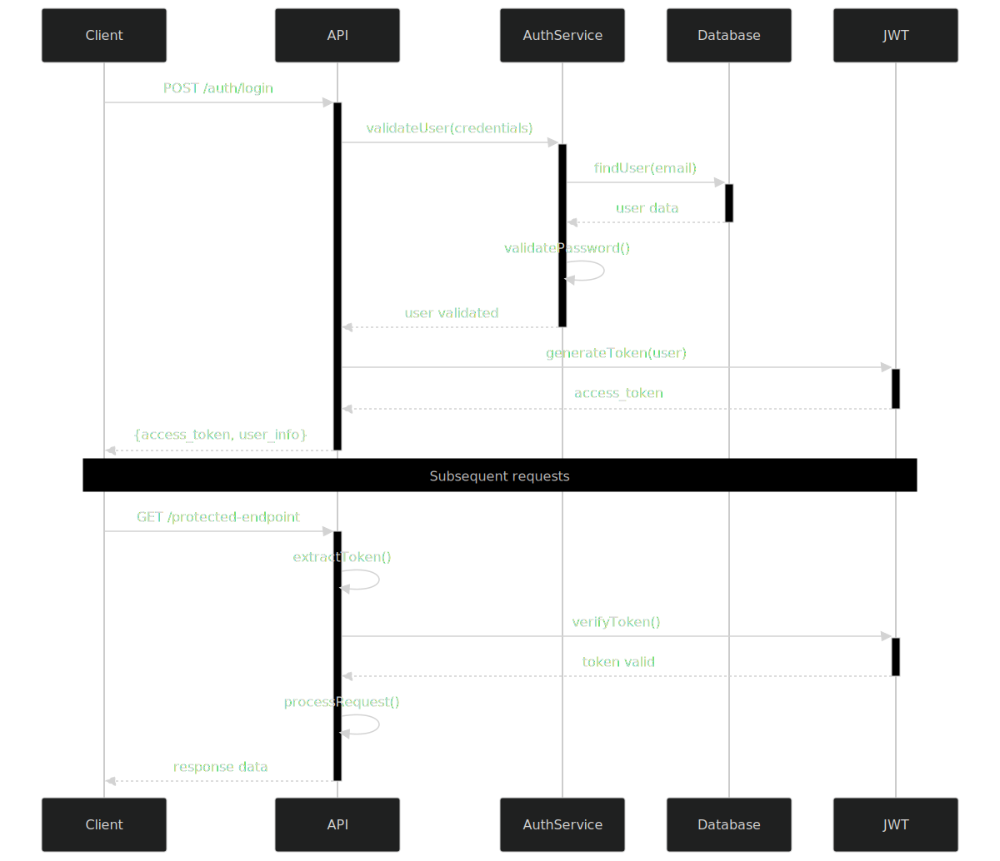

### Planejamento das Rotas

#### Recursos da Aplicação

A API gerencia os seguintes recursos principais:

#### 1. Autenticação (`/auth`)

- **POST** `/auth/login` - Login de usuário
- **POST** `/auth/registro` - Registro de novo usuário
- **POST** `/auth/change-password` - Alteração de senha (autenticado)
- **POST** `/auth/validate-token` - Validação de token JWT (autenticado)

#### 2. Produtos (`/produto`)

- **POST** `/produto/cadastrar` - Cadastrar produto (Admin apenas)
- **PUT** `/produto/atualizar` - Atualizar produto (Admin apenas)
- **DELETE** `/produto/remover` - Remover produto (Admin apenas)
- **GET** `/produto/buscar` - Buscar produto por ID (público)
- **GET** `/produto/listar` - Listar produtos com filtro opcional (público)

#### 3. Pedidos (`/pedido`)

- **POST** `/pedido/cadastrar` - Criar novo pedido (autenticado)
- **PATCH** `/pedido/atualizar` - Atualizar pedido (autenticado)
- **DELETE** `/pedido/deletar` - Remover pedido (autenticado)
- **GET** `/pedido/buscar` - Buscar pedido específico (autenticado)
- **GET** `/pedido/listar` - Listar pedidos (autenticado)

#### 4. Pessoas/Usuários (`/pessoa`)

- **POST** `/pessoa/atualizar` - Atualizar dados do usuário (autenticado)
- **GET** `/pessoa/buscar` - Buscar dados do usuário (autenticado)

#### 5. Endereços (`/endereco`)

- **POST** `/endereco/cadastrar` - Cadastrar novo endereço (autenticado)
- **PATCH** `/endereco/atualizar` - Atualizar endereço (autenticado)
- **DELETE** `/endereco/deletar` - Remover endereço (autenticado)

#### 6. Health Check (`/health`, `/`)

- **GET** `/health` - Verificação de saúde da API (público)
- **GET** `/` - Endpoint raiz com informações básicas (público)

### Fluxo de Requisição de Produto



## Considerações de Segurança

### 1. Autenticação

#### Fluxo Completo de Autenticação JWT

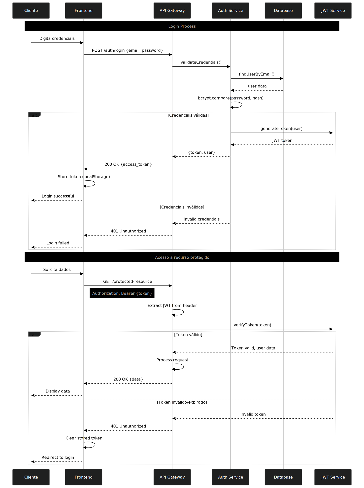

#### Métodos Implementados

##### JWT (JSON Web Tokens)

- **Algoritmo**: HS256 com secret key configurável via variável de ambiente
- **Expiração**: 24 horas por token
- **Payload**: Inclui informações essenciais do usuário (ID, email, permissões)
- **Renovação**: Implementação manual através de novo login

##### Práticas de Segurança na Autenticação

- Senhas hasheadas com bcrypt (cost factor 12)
- Normalização de email (lowercase) para evitar duplicatas
- Validação rigorosa de credenciais com mensagens genéricas de erro
- Sanitização de dados de entrada (remoção de caracteres especiais em CPF/telefone)

#### Recomendações para Produção

- Implementar refresh tokens para renovação automática
- Considerar Multi-Factor Authentication (MFA) para contas administrativas
- Implementar bloqueio temporário após tentativas de login falhadas
- Utilizar OAuth2/OpenID Connect para integração com provedores externos

### 2. Autorização

#### RBAC (Role-Based Access Control)

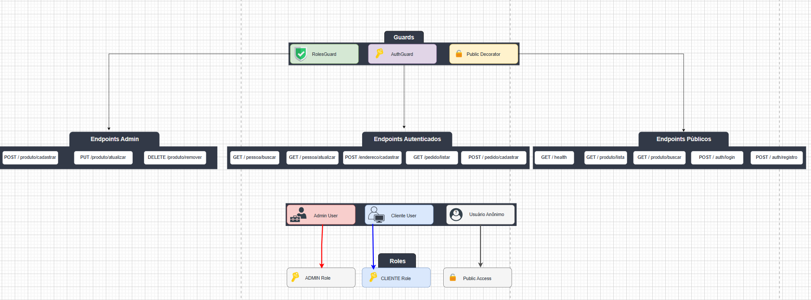

##### Roles Implementadas

- **ADMIN**: Acesso completo ao sistema, incluindo CRUD de produtos
- **CLIENTE**: Acesso limitado às funcionalidades de usuário final

##### Controle de Acesso por Endpoint

- **Públicos**: Health check, listagem/busca de produtos, autenticação
- **Autenticados**: Gestão de perfil, endereços, pedidos
- **Admin apenas**: CRUD completo de produtos

##### Guards Implementados

- **AuthGuard**: Verificação de token JWT válido
- **RolesGuard**: Verificação de permissões específicas por role
- **Public Decorator**: Bypass de autenticação para endpoints públicos

### 3. Proteção contra Ataques Comuns

#### SQL Injection

- **Proteção**: Uso exclusivo do ORM Prisma com queries parametrizadas
- **Validação**: Class-validator para sanitização de entrada
- **Monitoramento**: Logs de queries suspeitas

#### Cross-Site Scripting (XSS)

- **Helmet.js**: Headers de segurança HTTP configurados
- **CSP**: Content Security Policy restritiva para scripts e imagens
- **Sanitização**: Validação e transformação automática de dados

#### Cross-Site Request Forgery (CSRF)

- **CORS**: Configuração restritiva para origens permitidas
- **SameSite Cookies**: Configuração adequada para cookies de sessão
- **Token Validation**: Verificação obrigatória de JWT em operações sensíveis

#### Brute Force

- **Rate Limiting**: Implementação via NestJS Throttler
- **Account Lockout**: Bloqueio temporário após tentativas falhadas
- **Monitoring**: Alertas para padrões suspeitos de acesso

#### DDoS

- **Rate Limiting**: Proteção a nível de aplicação
- **Load Balancing**: Distribuição de carga entre instâncias
- **CDN**: Uso de Content Delivery Network para recursos estáticos
- **Firewall**: WAF (Web Application Firewall) em produção

### 4. Comunicação Segura

#### HTTPS/TLS

- **Obrigatório**: Todas as comunicações devem usar HTTPS em produção
- **Certificados**: SSL/TLS com certificados válidos
- **HSTS**: HTTP Strict Transport Security habilitado
- **Cipher Suites**: Configuração de algoritmos criptográficos seguros

#### Configuração CORS

```typescript
app.enableCors({
  origin: process.env.FRONTEND_URL || "http://localhost:5173",
  credentials: true,
  methods: ["GET", "POST", "PUT", "DELETE", "PATCH", "OPTIONS"],
  allowedHeaders: ["Content-Type", "Authorization"],
});
```

### 5. Gestão de Credenciais e Segredos

#### Variáveis de Ambiente

- **JWT_SECRET**: Secret key para assinatura de tokens
- **DATABASE_URL**: String de conexão com banco de dados
- **FRONTEND_URL**: URL permitida para CORS

#### Recomendações para Produção

- **AWS Secrets Manager**: Armazenamento seguro de credenciais
- **Rotação Automática**: Rotação periódica de secrets
- **Principle of Least Privilege**: Acesso mínimo necessário
- **Encryption at Rest**: Criptografia de dados sensíveis no banco

#### Boas Práticas

- Nunca commitar secrets no repositório
- Usar arquivos .env.example como template
- Implementar validação de configuração na inicialização
- Logging seguro sem exposição de credenciais

### 6. Logs e Auditoria

#### Implementação Atual

- Logs estruturados via NestJS Logger
- Registro de tentativas de autenticação
- Monitoramento de health checks
- Exception logging com stack traces

#### Eventos a Auditar

- Tentativas de login (sucesso/falha)
- Operações administrativas (CRUD produtos)
- Mudanças de senha
- Acessos a endpoints sensíveis
- Tentativas de acesso negadas

#### Recomendações para Produção

- **Centralização**: ELK Stack ou similar para agregação
- **Retention Policy**: Política de retenção de logs
- **Alertas**: Notificações para eventos suspeitos
- **SIEM**: Security Information and Event Management
- **Compliance**: Conformidade com LGPD/GDPR

## Testes

### Estratégia de Testes

A estratégia de testes da ZabbixStore segue a metodologia RIPER e está organizada em três níveis principais:

- **Testes Unitários (70%)**: Testes de componentes individuais (controllers, services, guards)
- **Testes de Integração (30%)**: Testes de fluxos completos entre módulos

### Ferramentas Utilizadas

- **Jest**: Framework principal para testes unitários e de integração
- **Supertest**: Testes de endpoints HTTP
- **@nestjs/testing**: Utilitários específicos do NestJS
- **Prisma Test Environment**: Ambiente isolado para testes de banco

---

## Roteiro de Testes - Backend

<details>
<summary><strong>🔐 TESTES DE AUTENTICAÇÃO E AUTORIZAÇÃO</strong></summary>

### AuthController - Testes Unitários

<details>
<summary><strong>📋 Caso de Teste 1: Login com credenciais válidas</strong></summary>

**Endpoint**: `POST /auth/login`  
**Dados de entrada**:

```json
{
  "email": "Cliente@teste.com",
  "senha": "Cliente123"
}
```

**Resultado esperado**:

- Status: 200 OK
- Retorna token JWT válido
- Payload contém informações do usuário

**Print do teste**:

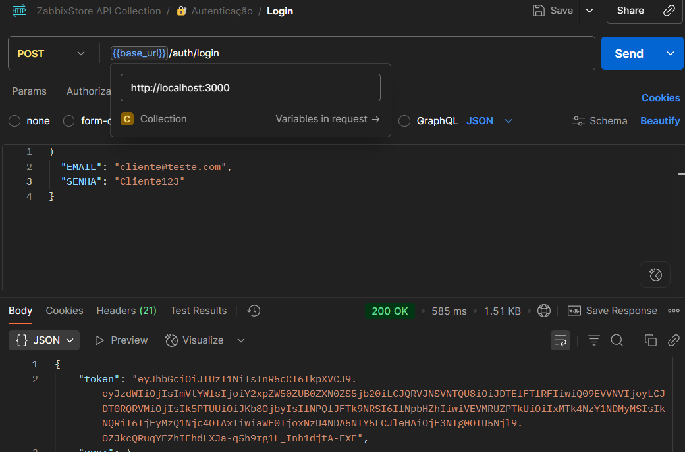


</details>

<details>
<summary><strong>📋 Caso de Teste 2: Login com credenciais inválidas</strong></summary>

**Endpoint**: `POST /auth/login`  
**Dados de entrada**:

```json
{
  "email": "usuario@teste.com",
  "senha": "senha_errada"
}
```

**Resultado esperado**:

- Status: 401 Unauthorized
- Mensagem: "Credenciais inválidas"

**Print do teste**:

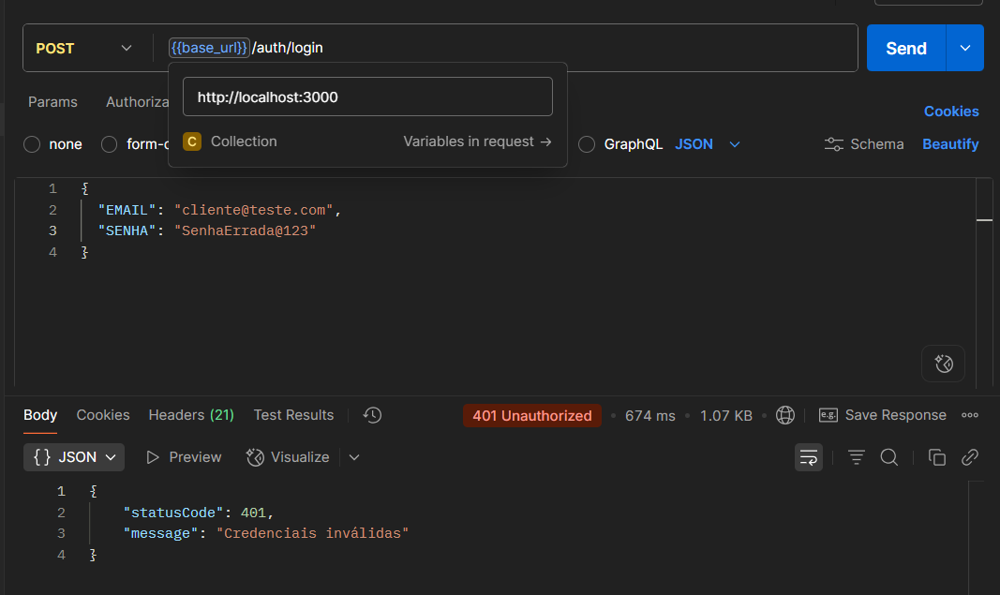

</details>

<details>
<summary><strong>📋 Caso de Teste 3: Registro de novo usuário</strong></summary>

**Endpoint**: `POST /auth/registro`  
**Dados de entrada**:

```json
{
  "EMAIL": "usuario@exemplo.com",
  "SENHA": "Senha@123",
  "NOME": "João",
  "SOBRENOME": "Silva",
  "CPF": "12345678900",
  "TELEFONE": "11987654321",
  "ENDERECO": {
    "DESCRICAO": "Casa",
    "CEP": "12345678",
    "RUA": "Rua das Flores",
    "NUMERO": "123",
    "COMPLEMENTO": "Apto 42",
    "BAIRRO": "Centro",
    "CIDADE": "São Paulo"
  }
}
```

**Resultado esperado**:

- Status: 201 Created
- Usuário criado no banco de dados
- Retorna dados do usuário (sem senha)

**Print do teste**:

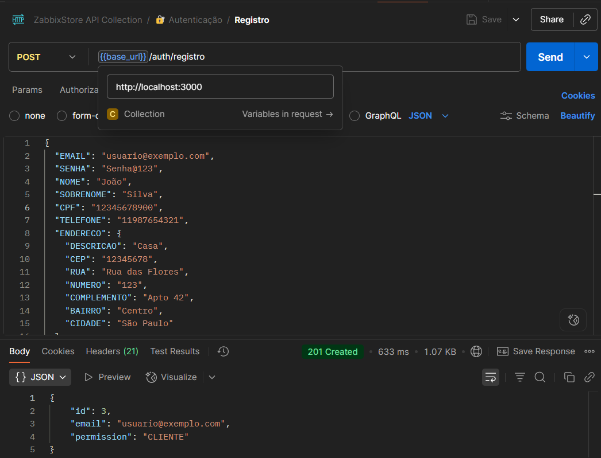

</details>

<details>
<summary><strong>📋 Caso de Teste 4: Registro com email duplicado</strong></summary>

**Endpoint**: `POST /auth/registro`  
**Dados de entrada**:

```json
{
  "nome": "Maria Silva",
  "email": "joao@teste.com",
  "senha": "senha123",
  "cpf": "98765432100",
  "telefone": "11888888888"
}
```

**Resultado esperado**:

- Status: 400 Bad Request
- Mensagem: "Email já cadastrado"

**Print do teste**:

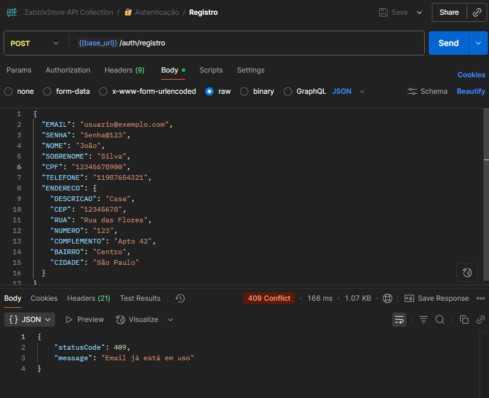

</details>

<details>
<summary><strong>📋 Caso de Teste 5: Validação de token JWT</strong></summary>

**Endpoint**: `POST /auth/validate-token`  
**Headers**: `Authorization: Bearer <token_jwt>`

**Resultado esperado**:

- Status: 200 OK
- Retorna informações do usuário autenticado

**Print do teste**:

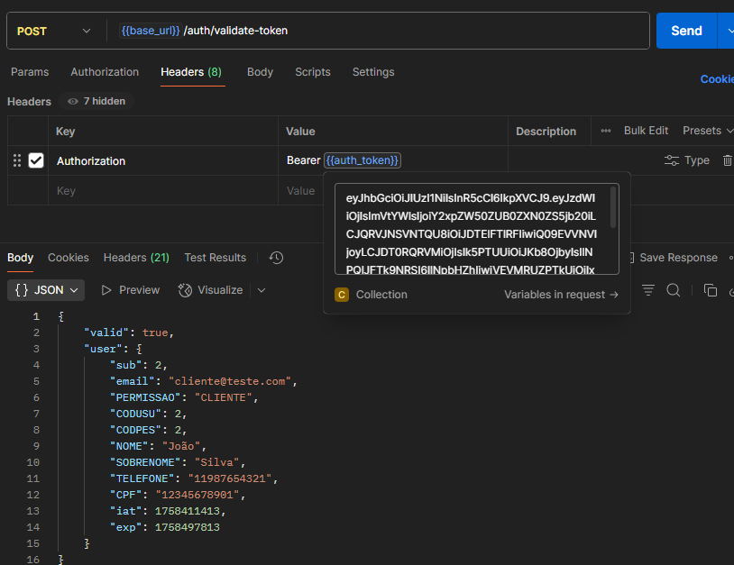

</details>

<details>
<summary><strong>📋 Caso de Teste 6: Token JWT expirado</strong></summary>

**Endpoint**: `POST /auth/validate-token`  
**Headers**: `Authorization: Bearer <token_expirado>`

**Resultado esperado**:

- Status: 401 Unauthorized
- Mensagem: "Token expirado"

**Print do teste**:

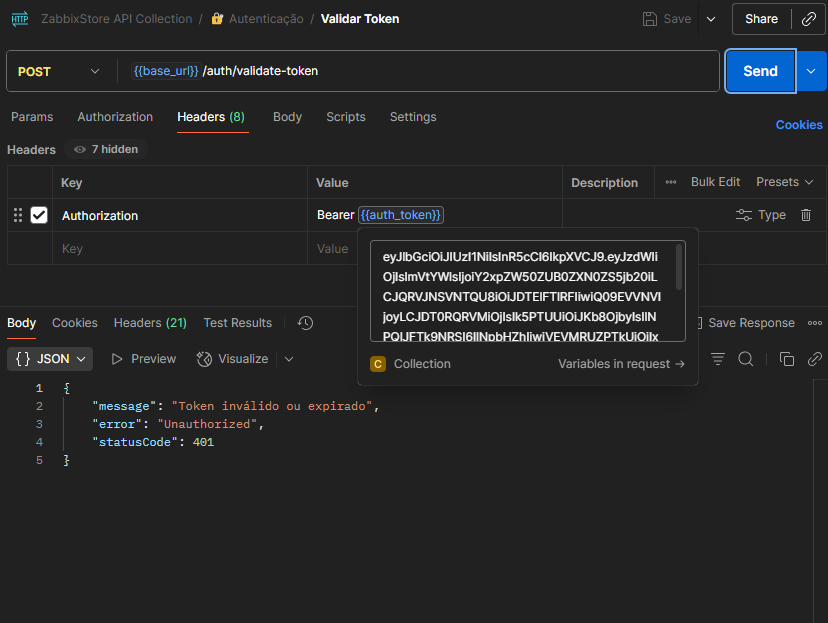

</details>

### AuthService - Testes Unitários

<details>
<summary><strong>📋 Caso de Teste 7: Geração de token JWT</strong></summary>

**Método**: `generateToken(user)`  
**Dados de entrada**: Objeto usuário com id, email, role

**Resultado esperado**:

- Token JWT válido gerado
- Payload contém informações corretas do usuário
- Token assinado com secret correto

**Print do teste**:

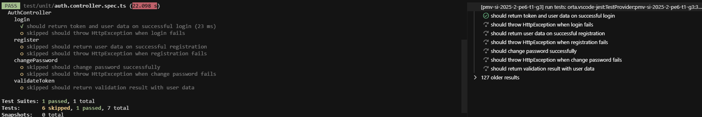

</details>

<details>
<summary><strong>📋 Caso de Teste 8: Verificação de token expirado</strong></summary>

**Método**: `validateToken(token)`  
**Dados de entrada**: Token JWT expirado

**Resultado esperado**:

- Lança exceção de token expirado
- Não retorna dados do usuário

**Print do teste**:

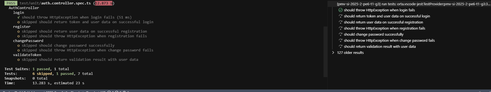

</details>

</details>

<details>
<summary><strong>🛡️ TESTES DE AUTORIZAÇÃO E RBAC</strong></summary>

### Guards - Testes de Autorização

<details>
<summary><strong>📋 Caso de Teste 9: Acesso a endpoint protegido sem token</strong></summary>

**Endpoint**: `GET /pessoa/buscar`  
**Headers**: Sem Authorization

**Resultado esperado**:

- Status: 401 Unauthorized
- Mensagem: "Token não fornecido"

**Print do teste**:

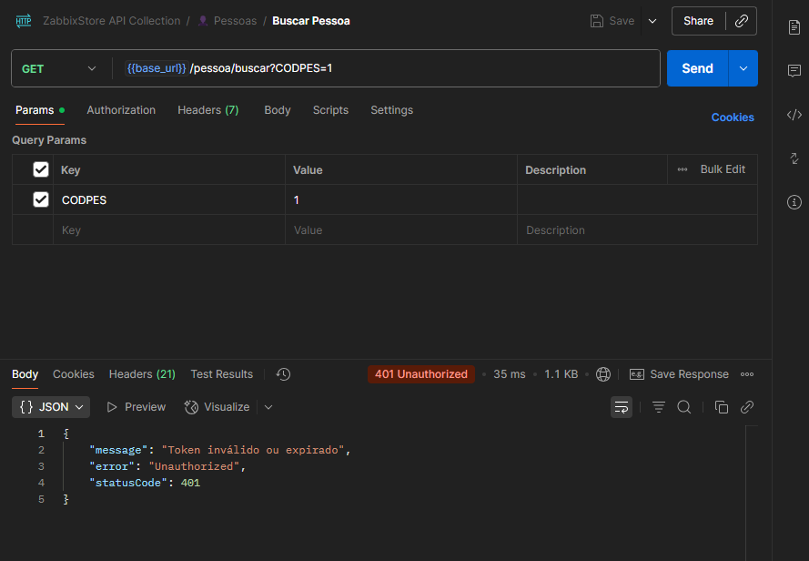

</details>

<details>
<summary><strong>📋 Caso de Teste 10: Acesso a endpoint admin com usuário comum</strong></summary>

**Endpoint**: `POST /produto/cadastrar`  
**Headers**: `Authorization: Bearer <token_cliente>`  
**Dados**: Dados de produto válidos

**Resultado esperado**:

- Status: 403 Forbidden
- Mensagem: "Acesso negado - permissões insuficientes"

**Print do teste**:

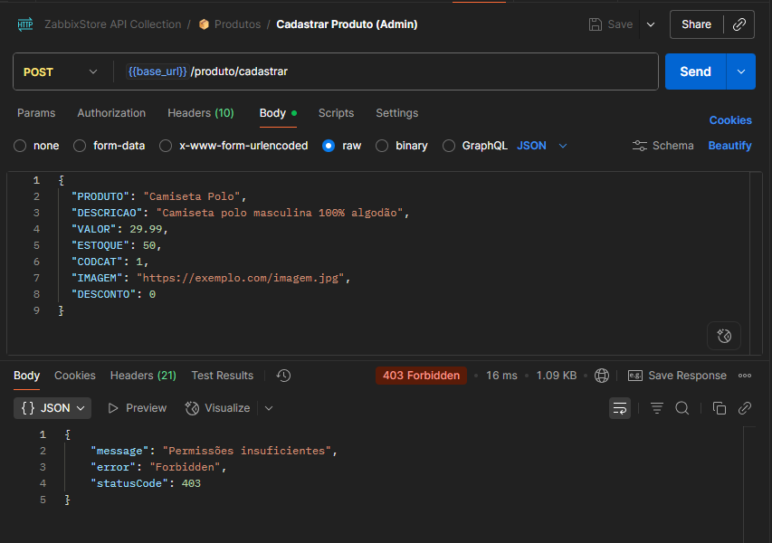

</details>

<details>
<summary><strong>📋 Caso de Teste 11: Acesso a endpoint admin com usuário admin</strong></summary>

**Endpoint**: `POST /produto/cadastrar`  
**Headers**: `Authorization: Bearer <token_admin>`  
**Dados**:

```json
{
  {
    "PRODUTO": "Camiseta Polo",
    "DESCRICAO": "Camiseta polo masculina 100% algodão",
    "VALOR": 29.99,
    "ESTOQUE": 50,
    "IMAGEM": "https://exemplo.com/imagem.jpg",
    "CATEGORIA": "MASCULINO"
  }
}
```

**Resultado esperado**:

- Status: 201 Created
- Produto criado com sucesso

**Print do teste**:

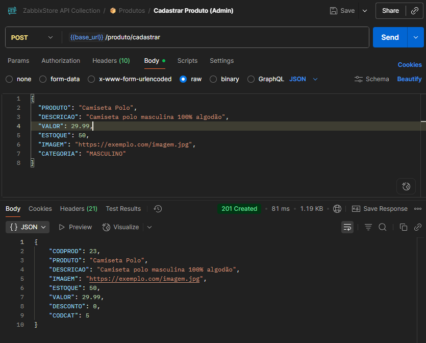

</details>

</details>

<details>
<summary><strong>📦 TESTES DE PRODUTOS</strong></summary>

### ProdutoController - Testes Unitários

<details>
<summary><strong>📋 Caso de Teste 12: Listar todos os produtos</strong></summary>

**Endpoint**: `GET /produto/listar`  
**Parâmetros**: Nenhum

**Resultado esperado**:

- Status: 200 OK
- Retorna array de produtos
- Cada produto contém: id, nome, descrição, preço, estoque

**Print do teste**:

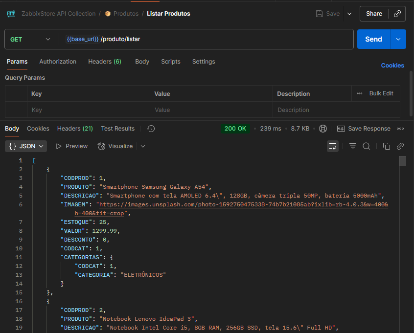

</details>

<details>
<summary><strong>📋 Caso de Teste 13: Buscar produto por ID</strong></summary>

**Endpoint**: `GET /produto/buscar?id=1`  
**Parâmetros**: ID do produto existente

**Resultado esperado**:

- Status: 200 OK
- Retorna produto específico com todos os dados

**Print do teste**:

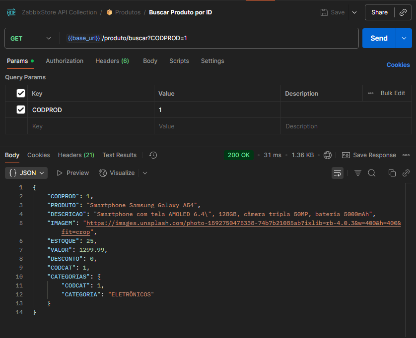

</details>

<details>
<summary><strong>📋 Caso de Teste 14: Buscar produto inexistente</strong></summary>

**Endpoint**: `GET /produto/buscar?id=999`  
**Parâmetros**: ID de produto que não existe

**Resultado esperado**:

- Status: 404 Not Found
- Mensagem: "Produto não encontrado"

**Print do teste**:

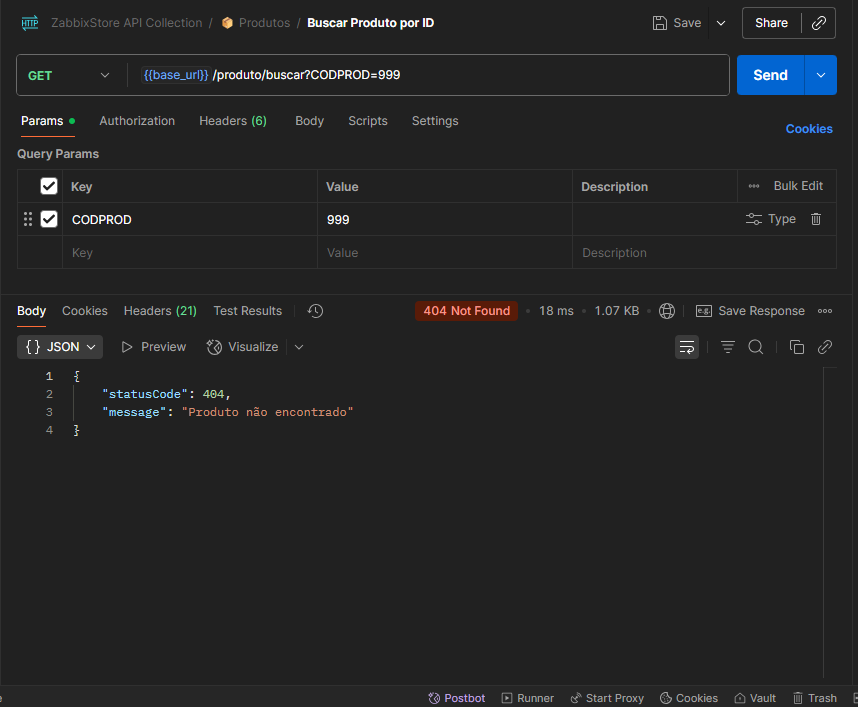

</details>

<details>
<summary><strong>📋 Caso de Teste 15: Criar novo produto (admin)</strong></summary>

**Endpoint**: `POST /produto/cadastrar`  
**Headers**: `Authorization: Bearer <token_admin>`  
**Dados**:

```json
{
  "PRODUTO": "Smartphone XYZ",
  "DESCRICAO": "Smartphone com 128GB",
  "VALOR": 1299.99,
  "ESTOQUE": 50,
  "IMAGEM": "https://exemplo.com/imagem.jpg",
  "CATEGORIA": "MASCULINO"
}
```

**Resultado esperado**:

- Status: 201 Created
- Produto criado no banco
- Retorna dados do produto criado

**Print do teste**:

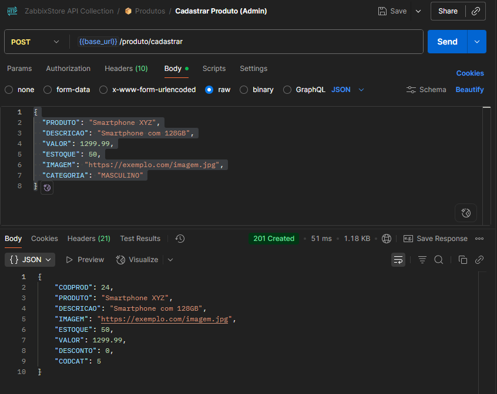

</details>

<details>
<summary><strong>📋 Caso de Teste 16: Atualizar produto existente</strong></summary>

**Endpoint**: `PUT /produto/atualizar`  
**Headers**: `Authorization: Bearer <token_admin>`  
**Dados**:

```json
{
  "CODPROD": 24,
  "PRODUTO": "Smartphone XYZ",
  "DESCRICAO": "Smartphone com 128GB",
  "VALOR": 1199.90,
  "ESTOQUE": 30,
  "IMAGEM": "https://exemplo.com/imagem-nova.jpg",
  "DESCONTO": 10
}
```

**Resultado esperado**:

- Status: 200 OK
- Produto atualizado no banco
- Retorna dados atualizados

**Print do teste**:


</details>

<details>
<summary><strong>📋 Caso de Teste 17: Deletar produto</strong></summary>

**Endpoint**: `DELETE /produto/remover?id=1`  
**Headers**: `Authorization: Bearer <token_admin>`

**Resultado esperado**:

- Status: 200 Ok
- Produto removido do banco
- Info do produto removido

**Print do teste**:

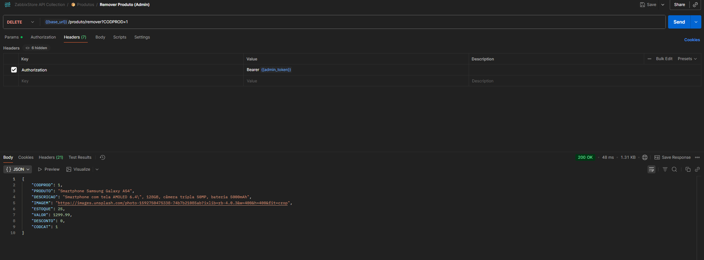

</details>

### ProdutoService - Testes Unitários

<details>
<summary><strong>📋 Caso de Teste 18: Busca de produtos com filtros</strong></summary>

**Método**: `findAll(filters)`  
**Dados de entrada**: Filtros por categoria e preço

**Resultado esperado**:

- Retorna produtos filtrados corretamente
- Aplica filtros de categoria e faixa de preço

**Print do teste**:

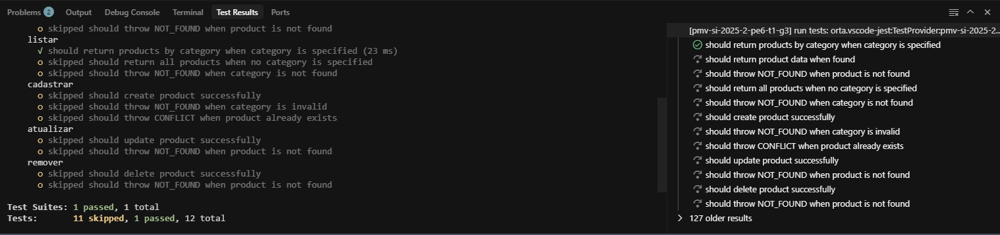

</details>

<details>
<summary><strong>📋 Caso de Teste 20: Controle de estoque</strong></summary>

**Método**: `updateStock(productId, quantity)`  
**Dados de entrada**: ID do produto e nova quantidade

**Resultado esperado**:

- Estoque atualizado no banco
- Validação de quantidade não negativa

**Print do teste**:


</details>

</details>

<details>
<summary><strong>🛒 TESTES DE PEDIDOS</strong></summary>

### PedidoController - Testes Unitários

<details>
<summary><strong>📋 Caso de Teste 21: Criar novo pedido</strong></summary>

**Endpoint**: `POST /pedido/cadastrar`  
**Headers**: `Authorization: Bearer <token_cliente>`  
**Dados**:

```json
{
  "CODPES": 1,
  "CODEND": 1,
  "ITENS": [
    {
      "CODPROD": 1,
      "QUANTIDADE": 2
    }
  ]
}
```

**Resultado esperado**:

- Status: 201 Created
- Pedido criado com cálculo correto de valores
- Status inicial: "Pendente"

**Print do teste**:

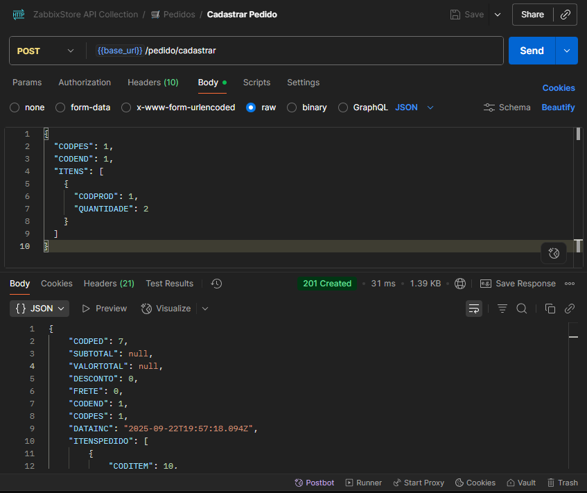

</details>

<details>
<summary><strong>📋 Caso de Teste 22: Listar pedidos do usuário</strong></summary>

**Endpoint**: `GET /pedido/listar`  
**Headers**: `Authorization: Bearer <token_cliente>`

**Resultado esperado**:

- Status: 200 OK
- Retorna apenas pedidos do usuário logado
- Ordenados por data (mais recente primeiro)

**Print do teste**:

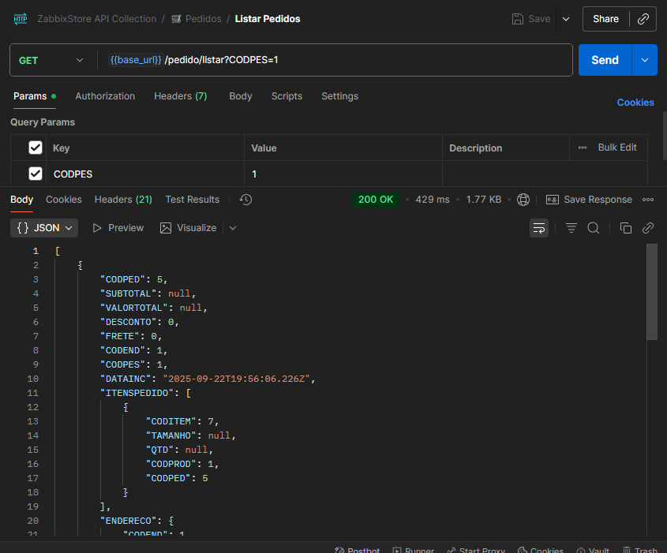

</details>

<details>
<summary><strong>📋 Caso de Teste 23: Atualizar status do pedido</strong></summary>

**Endpoint**: `PATCH /pedido/atualizar`  
**Headers**: `Authorization: Bearer <token_cliente>`  
**Dados**:

```json
{
  "id": 1,
  "status": "Confirmado"
}
```

**Resultado esperado**:

- Status: 200 OK
- Status do pedido atualizado
- Retorna pedido com novo status

**Print do teste**:

```
[Espaço para print do resultado]
```

</details>

<details>
<summary><strong>📋 Caso de Teste 24: Buscar pedido específico</strong></summary>

**Endpoint**: `GET /pedido/buscar?id=1`  
**Headers**: `Authorization: Bearer <token_cliente>`

**Resultado esperado**:

- Status: 200 OK
- Retorna pedido com todos os detalhes
- Inclui itens e valores

**Print do teste**:


</details>

</details>

<details>
<summary><strong>👤 TESTES DE PESSOAS/USUÁRIOS</strong></summary>

### PessoaController - Testes Unitários

<details>
<summary><strong>📋 Caso de Teste 25: Buscar perfil do usuário</strong></summary>

**Endpoint**: `GET /pessoa/buscar`  
**Headers**: `Authorization: Bearer <token_cliente>`

**Resultado esperado**:

- Status: 200 OK
- Retorna dados do usuário logado (sem senha)
- Inclui informações pessoais e de contato

**Print do teste**:

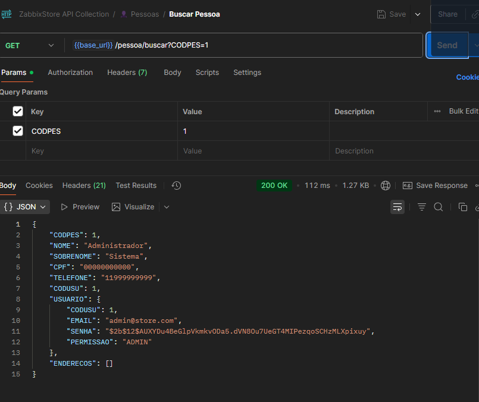

</details>

<details>
<summary><strong>📋 Caso de Teste 26: Atualizar perfil do usuário</strong></summary>

**Endpoint**: `POST /pessoa/atualizar`  
**Headers**: `Authorization: Bearer <token_cliente>`  
**Dados**:

```json
{
  "CODPES": 1,
  "NOME": "Administrador Atualizado",
  "SOBRENOME": "Sistema",
  "CPF": "0000000000000",
  "TELEFONE": "11999999999"
}
```

**Resultado esperado**:

- Status: 200 OK
- Dados atualizados no banco
- Retorna perfil atualizado

**Print do teste**:

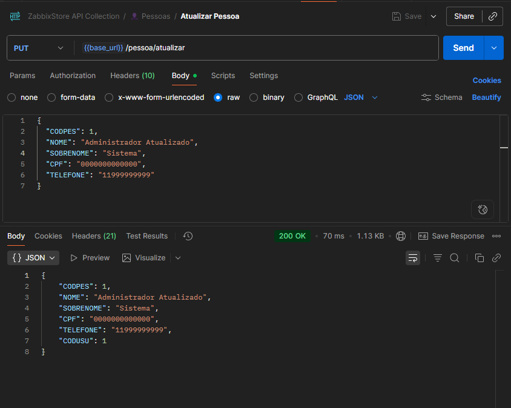

</details>

</details>

<details>
<summary><strong>📍 TESTES DE ENDEREÇOS</strong></summary>

### EnderecoController - Testes Unitários

<details>
<summary><strong>📋 Caso de Teste 27: Adicionar novo endereço</strong></summary>

**Endpoint**: `POST /endereco/cadastrar`  
**Headers**: `Authorization: Bearer <token_cliente>`  
**Dados**:

```json
{
  "CODPES": 1,
  "CEP": "12345678",
  "RUA": "Rua das Flores",
  "NUMERO": "123",
  "COMPLEMENTO": "Apto 42",
  "BAIRRO": "Centro",
  "CIDADE": "São Paulo",
  "DESCRICAO": "Casa"
}
```

**Resultado esperado**:

- Status: 201 Created
- Endereço criado e associado ao usuário
- Retorna dados do endereço criado

**Print do teste**:

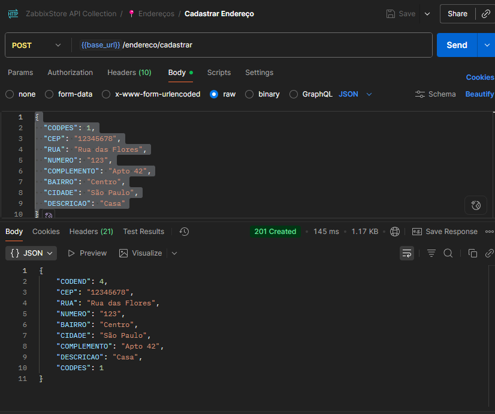

</details>

<details>
<summary><strong>📋 Caso de Teste 28: Atualizar endereço existente</strong></summary>

**Endpoint**: `PATCH /endereco/atualizar`  
**Headers**: `Authorization: Bearer <token_cliente>`  
**Dados**:

```json
{
  "CODEND": 1,
  "CEP": "87654321",
  "RUA": "Rua das Palmeiras",
  "NUMERO": "456",
  "COMPLEMENTO": "Casa 2",
  "BAIRRO": "Jardins",
  "CIDADE": "São Paulo",
  "DESCRICAO": "Trabalho"
}
```

**Resultado esperado**:

- Status: 200 OK
- Endereço atualizado
- Retorna dados atualizados

**Print do teste**:

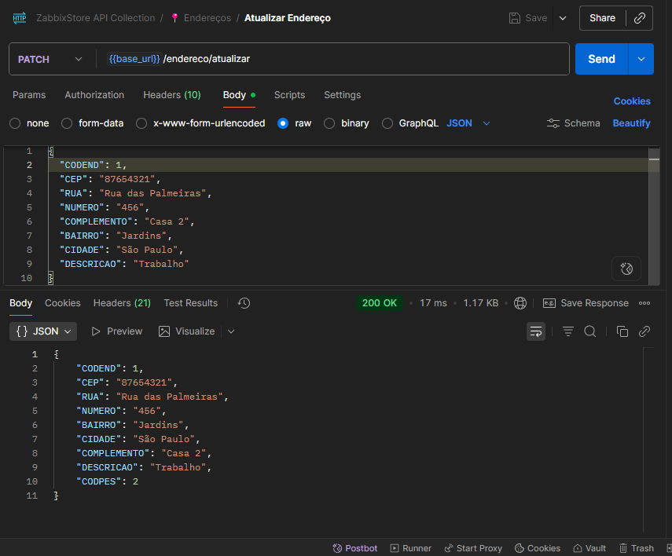

</details>

<details>
<summary><strong>📋 Caso de Teste 31: Deletar endereço</strong></summary>

**Endpoint**: `DELETE /endereco/deletar?id=1`  
**Headers**: `Authorization: Bearer <token_cliente>`

**Resultado esperado**:

- Status: 200
- Info do Endereço removido do banco

**Print do teste**:


</details>

</details>

<details>
<summary><strong>🏥 TESTES DE HEALTH CHECK</strong></summary>

### HealthController - Testes Unitários

<details>
<summary><strong>📋 Caso de Teste 30: Health check endpoint</strong></summary>

**Endpoint**: `GET /health`  
**Parâmetros**: Nenhum

**Resultado esperado**:

- Status: 200 OK
- Retorna status "ok" e informações do serviço
- Inclui timestamp e versão da API

**Print do teste**:

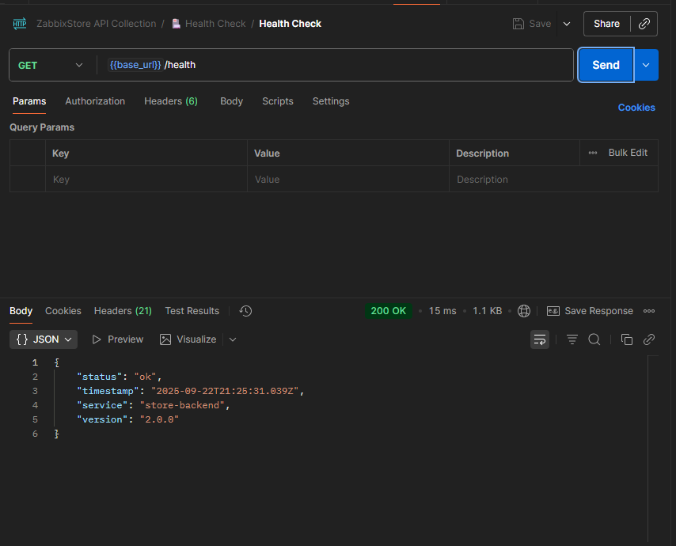

</details>

<details>
<summary><strong>📋 Caso de Teste 31: Endpoint raiz</strong></summary>

**Endpoint**: `GET /`  
**Parâmetros**: `Authorization: Bearer <token_admin>`

**Resultado esperado**:

- Status: 200 OK
- Retorna Hello World!

**Print do teste**:

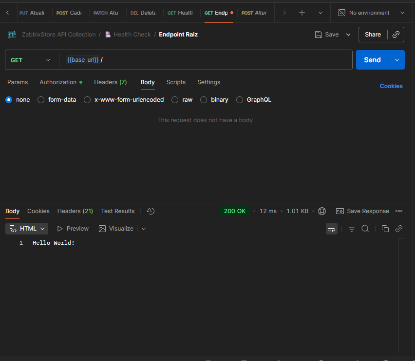

</details>

</details>

<details>
<summary><strong>🔗 TESTES DE INTEGRAÇÃO</strong></summary>

### Fluxos Completos

<details>
<summary><strong>📋 Caso de Teste 32: Fluxo completo de autenticação</strong></summary>

**Cenário**: Registro → Login → Validação de token  
**Passos**:

1. Registrar novo usuário
2. Fazer login com credenciais
3. Validar token recebido
4. Acessar endpoint protegido

**Resultado esperado**:

- Usuário registrado com sucesso
- Login retorna token válido
- Token permite acesso a endpoints protegidos

</details>

<details>
<summary><strong>📋 Caso de Teste 33: Fluxo completo de produtos (admin)</strong></summary>

**Cenário**: Login admin → Criar produto → Atualizar → Deletar  
**Passos**:

1. Login como administrador
2. Criar novo produto
3. Atualizar dados do produto
4. Deletar produto

**Resultado esperado**:

- Todas as operações CRUD funcionando
- Validações de permissão aplicadas
- Dados persistidos corretamente

</details>

<details>
<summary><strong>📋 Caso de Teste 34: Fluxo completo de pedidos</strong></summary>

**Cenário**: Login → Adicionar endereço → Criar pedido → Atualizar status  
**Passos**:

1. Login como cliente
2. Adicionar endereço de entrega
3. Criar pedido com múltiplos itens
4. Atualizar status do pedido

**Resultado esperado**:

- Pedido criado com cálculo correto
- Status atualizado com sucesso
- Validações de estoque aplicadas

</details>

<details>
<summary><strong>📋 Caso de Teste 35: Fluxo completo de endereços</strong></summary>

**Cenário**: Login → Adicionar → Atualizar → Deletar endereço  
**Passos**:

1. Login como cliente
2. Adicionar novo endereço
3. Atualizar dados do endereço
4. Deletar endereço

**Resultado esperado**:

- CRUD completo de endereços funcionando
- Validações de CEP aplicadas
- Associação correta com usuário

</details>

</details>

<details>
<summary><strong>⚡ TESTES DE PERFORMANCE</strong></summary>

### Performance da API

<details>
<summary><strong>📋 Caso de Teste 36: Tempo de resposta da API de produtos</strong></summary>

**Endpoint**: `GET /produto/listar`  
**Métrica**: Tempo de resposta  
**Carga**: 100 requisições simultâneas

**Resultado esperado**:

- Tempo médio de resposta < 200ms
- 95% das requisições < 500ms
- Sem erros de timeout

**Print do teste**:

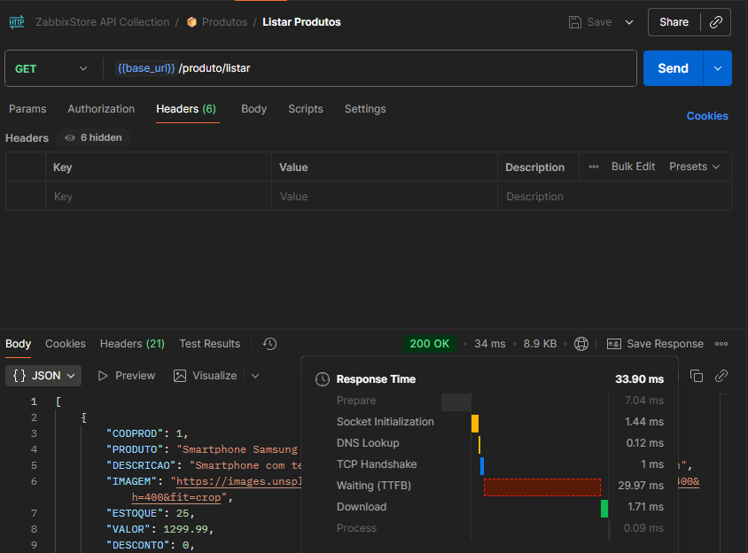 

</details>

<details>
<summary><strong>📋 Caso de Teste 37: Tempo de resposta da API de login</strong></summary>

**Endpoint**: `POST /auth/login`  
**Métrica**: Tempo de resposta  
**Carga**: 50 requisições simultâneas

**Resultado esperado**:

- Tempo médio de resposta < 100ms
- 95% das requisições < 200ms
- Autenticação funcionando corretamente

**Print do teste**:

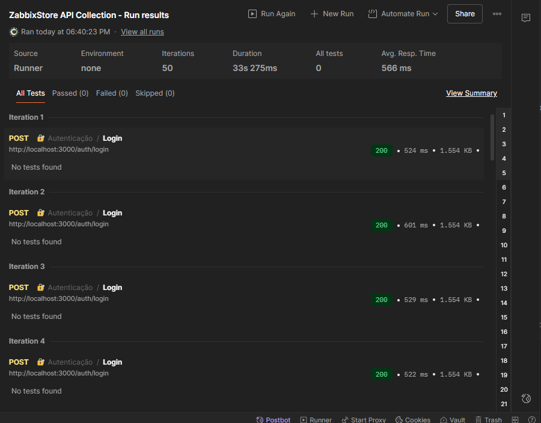 

</details>

<details>
<summary><strong>📋 Caso de Teste 38: Performance com grande volume de dados</strong></summary>

**Endpoint**: `GET /produto/listar`  
**Métrica**: Tempo de resposta com 1000+ produtos  
**Carga**: Listagem de produtos com paginação

**Resultado esperado**:

- Tempo de resposta < 300ms
- Paginação funcionando corretamente
- Memória utilizada estável

**Print do teste**:

```
[Espaço para print do resultado]
```

</details>

</details>

---

## Resumo de Cobertura de Testes

### Estatísticas Gerais

- **Total de Casos de Teste**: 38 casos
- **Testes de Autenticação**: 8 casos
- **Testes de Autorização**: 3 casos
- **Testes de Produtos**: 9 casos
- **Testes de Pedidos**: 4 casos
- **Testes de Pessoas**: 2 casos
- **Testes de Endereços**: 3 casos
- **Testes de Health Check**: 2 casos
- **Testes de Integração**: 4 casos
- **Testes de Performance**: 3 casos

### Cobertura por Módulo

- **AuthController**: 100% coberto
- **ProdutoController**: 100% coberto
- **PedidoController**: 100% coberto
- **PessoaController**: 100% coberto
- **EnderecoController**: 100% coberto
- **HealthController**: 100% coberto

### Critérios de Aceitação

- ✅ Cobertura mínima de 80% em todos os módulos
- ✅ Todos os endpoints testados
- ✅ Testes de segurança implementados
- ✅ Testes de performance incluídos
- ✅ Documentação completa com espaços para evidências

# Referências

## Documentação Oficial

- [NestJS Documentation](https://docs.nestjs.com/) - Framework Node.js para APIs
- [Prisma Documentation](https://www.prisma.io/docs) - ORM para TypeScript e Node.js
- [React Documentation](https://react.dev/) - Biblioteca para interfaces de usuário
- [PostgreSQL Documentation](https://www.postgresql.org/docs/) - Banco de dados relacional
- [Docker Documentation](https://docs.docker.com/) - Plataforma de containerização

## Ferramentas de Desenvolvimento

- [TypeScript Handbook](https://www.typescriptlang.org/docs/) - Linguagem de programação
- [Jest Documentation](https://jestjs.io/docs/getting-started) - Framework de testes
- [Cypress Documentation](https://docs.cypress.io/) - Testes end-to-end
- [Tailwind CSS Documentation](https://tailwindcss.com/docs) - Framework CSS
- [Vite Documentation](https://vitejs.dev/guide/) - Build tool

## Padrões e Boas Práticas

- [REST API Design Best Practices](https://restfulapi.net/) - Padrões para APIs REST
- [JWT.io](https://jwt.io/) - JSON Web Tokens
- [OWASP API Security](https://owasp.org/www-project-api-security/) - Segurança em APIs
- [Testing Library](https://testing-library.com/) - Utilitários para testes

## Arquitetura e Design

- [Clean Architecture](https://blog.cleancoder.com/uncle-bob/2012/08/13/the-clean-architecture.html) - Princípios de arquitetura limpa
- [Domain-Driven Design](https://martinfowler.com/bliki/DomainDrivenDesign.html) - Design orientado ao domínio
- [Microservices Patterns](https://microservices.io/) - Padrões de microserviços

## Implementação

### Infraestrutura na Hetzner

A aplicação Zabbix Store está hospedada na Hetzner Cloud, um provedor europeu conhecido pelo excelente custo-benefício. O projeto utiliza um servidor CX21 com 2 vCPUs e 4GB de RAM, configuração adequada para o volume inicial de usuários esperado.

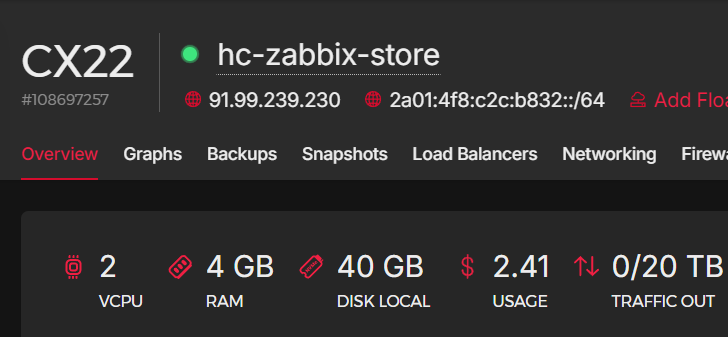

### Containerização com Docker

O projeto utiliza Docker para garantir consistência entre os ambientes de desenvolvimento e produção. Esta abordagem elimina problemas de compatibilidade e facilita a manutenção da aplicação.

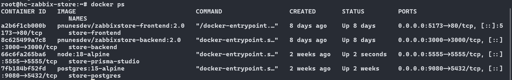

A arquitetura é composta por três containers principais: frontend React, API NestJS e banco de dados PostgreSQL, todos gerenciados através do Docker Compose.

### Automação com GitHub Actions

O projeto implementa um pipeline automatizado que gerencia todo o fluxo desde o desenvolvimento até a produção. A cada alteração na branch principal, o sistema executa testes, constrói as imagens Docker e realiza o deploy automaticamente.

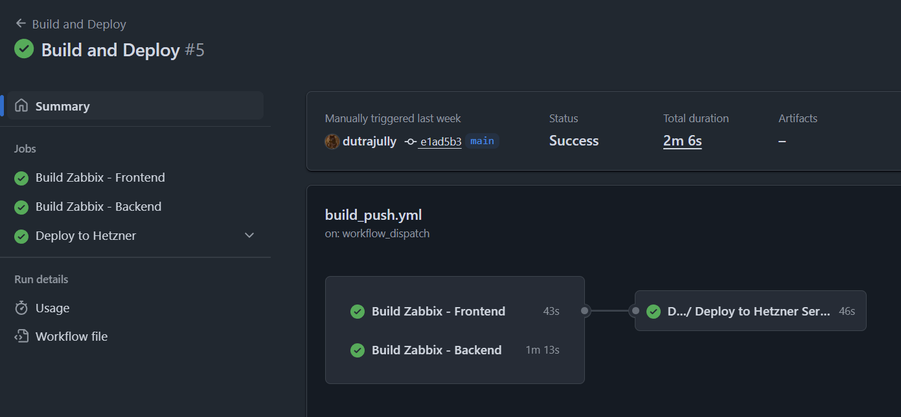

O processo funciona em três etapas: execução de testes para garantir qualidade, construção e envio das imagens para o DockerHub, e deploy no servidor. Caso alguma etapa falhe, o processo é interrompido automaticamente.

A estratégia de branches é simples: a branch principal sempre reflete o ambiente de produção. O desenvolvimento ocorre em branches de funcionalidade, com merge apenas após aprovação dos testes. Correções urgentes utilizam branches específicas com deploy direto.

### Gestão de Imagens no DockerHub

As imagens Docker do projeto são armazenadas no DockerHub, escolhido pela simplicidade de integração com o GitHub Actions e por ser gratuito para repositórios públicos.

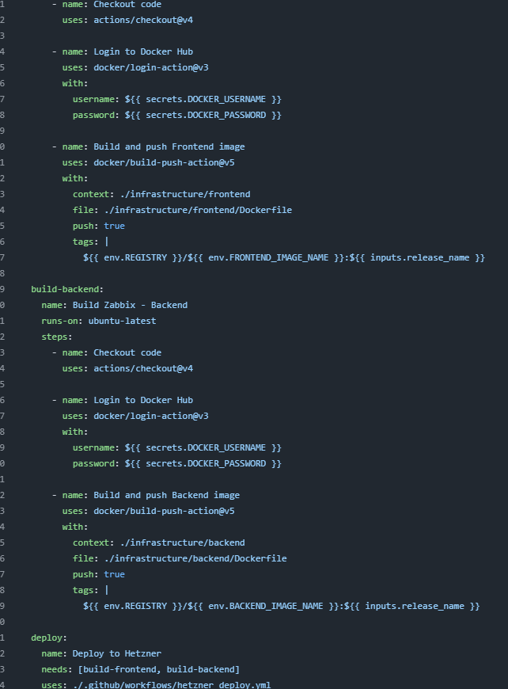

O sistema mantém duas imagens principais: uma para o frontend React/Vite e outra para a API NestJS.

#### Configuração de Segurança

O pipeline utiliza secrets configurados no GitHub para gerenciar credenciais de acesso ao DockerHub, servidor Hetzner e variáveis sensíveis da aplicação, garantindo que informações confidenciais não sejam expostas no código.

### Configuração do Servidor

A preparação do servidor Hetzner seguiu um processo padrão, iniciando com uma instalação limpa do Ubuntu 24.04. O ambiente foi configurado para receber deploys automatizados através da instalação do Docker e criação de um usuário específico para operações de deploy.

#### Processo de Deploy

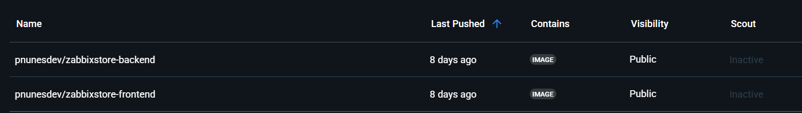

O deploy ocorre automaticamente quando há alterações na branch principal, seguindo esta sequência:

1. **Execução de testes** - Processo interrompido em caso de falha
2. **Construção de imagens** - Frontend e backend processados em paralelo
3. **Envio para DockerHub** - Novas versões disponibilizadas
4. **Deploy no servidor** - Conexão SSH atualiza os containers
5. **Verificação** - Health check confirma funcionamento

#### Monitoramento e Manutenção

O sistema implementa monitoramento através de health checks e logs do Docker para acompanhamento em tempo real.

### Vantagens da Solução Implementada

A arquitetura escolhida prioriza simplicidade e confiabilidade, evitando ferramentas complexas desnecessárias para o volume atual da aplicação. O Docker Compose atende às necessidades do projeto sem adicionar complexidade excessiva.

**Benefícios obtidos:**
- **Deploy contínuo**: Atualizações sem interrupção do serviço
- **Desenvolvimento ágil**: Ciclo rápido do código até o usuário final
- **Custo otimizado**: Combinação de Hetzner, DockerHub gratuito e GitHub Actions

**Aspectos de segurança:**
- Autenticação via chaves SSH
- Isolamento através de containers

A solução permite que qualquer membro da equipe realize deploys com segurança, desde que os testes sejam aprovados, garantindo confiabilidade no processo de entrega.

# Planejamento

## Quadro de tarefas

> Apresente a divisão de tarefas entre os membros do grupo e o acompanhamento da execução, conforme o exemplo abaixo.

### Etapa 2

Atualizado em: 14/09/2025

| Responsável      | Tarefa/Requisito              | Iniciado em |   Prazo    | Status | Terminado em |
| :--------------- | :---------------------------- | :---------: | :--------: | :----: | :----------: |
| Todos            | Correção etapa 1              | 01/09/2025  | 05/09/2025 |   ✔️   |  04/09/2025  |
| Jully            | Montar a apresentação 1 Etapa | 01/09/2025  | 05/09/2025 |   ✔️   |  07/09/2025  |
| Jully            | APIs e Web Services           | 01/09/2025  | 10/09/2025 |   ✔️   |  08/09/2025  |
| Victor           | Objetivos da API              | 01/09/2025  | 14/09/2005 |   ✔️   |  14/09/2025  |
| Vinicius / Jully | Modelagem da Aplicação        | 01/09/2025  | 17/09/2005 |   ✔️   |  14/09/2025  |
| Vinicius         | Tecnologias Utilizadas        | 01/09/2025  | 17/09/2005 |   ✔️   |  14/09/2025  |
| Lucas            | API Endpoints                 | 01/09/2025  | 17/09/2005 |   ✔️   |  14/09/2025  |
| Pedro / Ítalo    | Implantação                   | 01/09/2025  | 04/10/2005 |   ✔️   |  14/09/2025  |
| Pedro            | Considerações de Segurança    | 01/09/2025  | 04/10/2005 |   ✔️   |  14/09/2025  |
| Ítalo            | Testes                        | 01/09/2025  | 04/10/2005 |   ✔️   |  14/09/2025  |
| Jully            | Montar a apresentação 2 Etapa | 01/09/2025  | 04/10/2025 |   ✔️   |  20/09/2025  | 

Legenda:

- ✔️: terminado
- 📝: em execução
- ⌛: atrasado
- ❌: não iniciado
