# APIs e Web Services

A **Zabbix Store** é um e-commerce de plataforma de terceiros que permite a venda de diversos tipos de produtos, incluindo eletrônicos, roupas e itens de casa. O sistema oferece versões web e mobile, e as APIs serão responsáveis por integrar os serviços entre o front-end, o back-end e sistemas de terceiros, garantindo a comunicação segura e eficiente entre compradores e fornecedores. Entre as funcionalidades da API estão: autenticação de usuários, gerenciamento de produtos, validação de endereços e processamento de pedidos.


## Objetivos da API

O primeiro passo é definir os objetivos da sua API. O que você espera alcançar com ela? Você quer que ela seja usada por clientes externos ou apenas por aplicações internas? Quais são os recursos que a API deve fornecer?

[Inclua os objetivos da sua api.]


## Modelagem da Aplicação

### Estrutura de Dados

A aplicação é organizada em torno de entidades que representam os usuários (compradores e fornecedores), os produtos disponibilizados e as interações realizadas na Store.

- **Usuário**: entidade base que representa qualquer participante da plataforma. Contém atributos comuns como id_usuario, nome, email, senha e tipo, que define se o usuário é um **comprador** ou um **fornecedor**.

- **Fornecedor**: especialização de usuário responsável pela venda de produtos na Store. Possui atributos adicionais como CNPJ, CPF, telefone, endereço e é associado diretamente aos produtos que oferece.

- **Comprador**: especialização de usuário que consome os produtos. Possui atributos adicionais como CPF, data_nascimento e endereço. Pode visualizar produtos, adicionar ao carrinho, realizar compras e avaliar produtos.

- **Categoria**: classifica os produtos em áreas temáticas (ex.: Roupas, Eletrônicos, Utensílios), permitindo organização e filtragem.

- **Produto**: item à venda na loja, criado por um fornecedor. Contém atributos como id_produto, nome, descrição, preço, estoque, imagens e está vinculado a uma Categoria.

- **Carrinho**: mantém os produtos selecionados pelo comprador antes da finalização da compra. Contém referências ao comprador, produtos e quantidades.

- **Pedido**: registra a compra de um comprador, contendo informações como id_pedido, data, status (ex.: processando, enviado, entregue) e os produtos comprados.

- **Avaliação**: permite que compradores avaliem produtos adquiridos, registrando nota e comentário.

* `diagrama entidade-relacionamento (DER)`


* `modelo relacional`
  


### Fluxo Funcional


### Arquitetura Lógica
	1.	Frontend (UI) → interface web e mobile para compradores e fornecedores.
	2.	Backend (API e Lógica de Negócio) → gerencia usuários, produtos, pedidos e avaliações.
	3.	Banco de Dados → armazena todos os dados da plataforma: produtos, categorias, pedidos, itens, usuários, avaliações e logs.

## Tecnologias Utilizadas

### Arquitetura da API

A API foi desenvolvida utilizando o framework **NestJS**, seguindo os princípios de uma arquitetura REST robusta e escalável. O sistema adota os padrões de design do NestJS, incluindo:

- **Arquitetura Modular**: Organização em módulos especializados para cada domínio
- **Dependency Injection**: Gerenciamento automático de dependências
- **Decorators**: Uso de decorators para definição de rotas, guards e validações
- **Middleware Pipeline**: Pipeline de processamento com guards, pipes e interceptors

### Tecnologias Principais

- **NestJS 10.x**: Framework principal baseado em TypeScript
- **TypeScript**: Linguagem de programação com tipagem estática
- **Prisma**: ORM para gerenciamento do banco de dados
- **Express**: Servidor HTTP subjacente
- **JWT**: Autenticação baseada em tokens JSON Web Token
- **Swagger/OpenAPI**: Documentação automatizada da API

### Especificações Técnicas

#### Status Codes Utilizados

- **200 OK**: Operação realizada com sucesso
- **201 Created**: Recurso criado com sucesso
- **400 Bad Request**: Dados de entrada inválidos
- **401 Unauthorized**: Token não fornecido ou inválido
- **403 Forbidden**: Permissões insuficientes
- **404 Not Found**: Recurso não encontrado
- **500 Internal Server Error**: Erro interno do servidor

#### Payloads e Validações

A API utiliza **class-validator** e **class-transformer** para validação automática dos dados de entrada através de DTOs (Data Transfer Objects). As validações incluem:

- Validação de tipos de dados
- Validação de campos obrigatórios
- Sanitização de dados de entrada
- Transformação automática de tipos

#### Segurança

- **JWT Authentication**: Tokens JWT para autenticação
- **Role-Based Access Control (RBAC)**: Controle de acesso baseado em funções
- **Helmet**: Headers de segurança HTTP
- **CORS**: Configuração de Cross-Origin Resource Sharing
- **Rate Limiting**: Proteção contra ataques de força bruta
- **Validation Pipes**: Sanitização e validação de entrada

#### Documentação

- **Swagger UI**: Interface interativa disponível em `/api`
- **OpenAPI 3.0**: Especificação completa da API
- **JWT Bearer Authentication**: Suporte à autenticação na documentação

#### Configuração CORS

A API está configurada para aceitar requisições do frontend em `http://localhost:5173` (padrão Vite) ou através da variável de ambiente `FRONTEND_URL`.

#### Middlewares e Guards

- **AuthGuard**: Verificação de autenticação JWT
- **RolesGuard**: Verificação de permissões por função
- **ValidationPipe**: Validação global de entrada
- **Global Exception Filter**: Tratamento padronizado de erros

## API Endpoints

### Arquitetura de API - Diagrama


### Fluxo de Autenticação


### Planejamento das Rotas

#### Recursos da Aplicação

A API gerencia os seguintes recursos principais:

#### 1. Autenticação (`/auth`)
- **POST** `/auth/login` - Login de usuário
- **POST** `/auth/registro` - Registro de novo usuário
- **POST** `/auth/change-password` - Alteração de senha (autenticado)
- **POST** `/auth/validate-token` - Validação de token JWT (autenticado)

#### 2. Produtos (`/produto`)
- **POST** `/produto/cadastrar` - Cadastrar produto (Admin apenas)
- **PUT** `/produto/atualizar` - Atualizar produto (Admin apenas)
- **DELETE** `/produto/remover` - Remover produto (Admin apenas)
- **GET** `/produto/buscar` - Buscar produto por ID (público)
- **GET** `/produto/listar` - Listar produtos com filtro opcional (público)

#### 3. Pedidos (`/pedido`)
- **POST** `/pedido/cadastrar` - Criar novo pedido (autenticado)
- **PATCH** `/pedido/atualizar` - Atualizar pedido (autenticado)
- **DELETE** `/pedido/deletar` - Remover pedido (autenticado)
- **GET** `/pedido/buscar` - Buscar pedido específico (autenticado)
- **GET** `/pedido/listar` - Listar pedidos (autenticado)

#### 4. Pessoas/Usuários (`/pessoa`)
- **POST** `/pessoa/atualizar` - Atualizar dados do usuário (autenticado)
- **GET** `/pessoa/buscar` - Buscar dados do usuário (autenticado)

#### 5. Endereços (`/endereco`)
- **POST** `/endereco/cadastrar` - Cadastrar novo endereço (autenticado)
- **PATCH** `/endereco/atualizar` - Atualizar endereço (autenticado)
- **DELETE** `/endereco/deletar` - Remover endereço (autenticado)

#### 6. Health Check (`/health`, `/`)
- **GET** `/health` - Verificação de saúde da API (público)
- **GET** `/` - Endpoint raiz com informações básicas (público)

### Fluxo de Requisição de Produto


## Considerações de Segurança


### 1. Autenticação

#### Fluxo Completo de Autenticação JWT


#### Métodos Implementados

##### JWT (JSON Web Tokens)
- **Algoritmo**: HS256 com secret key configurável via variável de ambiente
- **Expiração**: 24 horas por token
- **Payload**: Inclui informações essenciais do usuário (ID, email, permissões)
- **Renovação**: Implementação manual através de novo login

##### Práticas de Segurança na Autenticação
- Senhas hasheadas com bcrypt (cost factor 12)
- Normalização de email (lowercase) para evitar duplicatas
- Validação rigorosa de credenciais com mensagens genéricas de erro
- Sanitização de dados de entrada (remoção de caracteres especiais em CPF/telefone)

#### Recomendações para Produção
- Implementar refresh tokens para renovação automática
- Considerar Multi-Factor Authentication (MFA) para contas administrativas
- Implementar bloqueio temporário após tentativas de login falhadas
- Utilizar OAuth2/OpenID Connect para integração com provedores externos

### 2. Autorização

#### RBAC (Role-Based Access Control)



##### Roles Implementadas
- **ADMIN**: Acesso completo ao sistema, incluindo CRUD de produtos
- **CLIENTE**: Acesso limitado às funcionalidades de usuário final

##### Controle de Acesso por Endpoint
- **Públicos**: Health check, listagem/busca de produtos, autenticação
- **Autenticados**: Gestão de perfil, endereços, pedidos
- **Admin apenas**: CRUD completo de produtos

##### Guards Implementados
- **AuthGuard**: Verificação de token JWT válido
- **RolesGuard**: Verificação de permissões específicas por role
- **Public Decorator**: Bypass de autenticação para endpoints públicos

### 3. Proteção contra Ataques Comuns

#### SQL Injection
- **Proteção**: Uso exclusivo do ORM Prisma com queries parametrizadas
- **Validação**: Class-validator para sanitização de entrada
- **Monitoramento**: Logs de queries suspeitas

#### Cross-Site Scripting (XSS)
- **Helmet.js**: Headers de segurança HTTP configurados
- **CSP**: Content Security Policy restritiva para scripts e imagens
- **Sanitização**: Validação e transformação automática de dados

#### Cross-Site Request Forgery (CSRF)
- **CORS**: Configuração restritiva para origens permitidas
- **SameSite Cookies**: Configuração adequada para cookies de sessão
- **Token Validation**: Verificação obrigatória de JWT em operações sensíveis

#### Brute Force
- **Rate Limiting**: Implementação via NestJS Throttler
- **Account Lockout**: Bloqueio temporário após tentativas falhadas
- **Monitoring**: Alertas para padrões suspeitos de acesso

#### DDoS
- **Rate Limiting**: Proteção a nível de aplicação
- **Load Balancing**: Distribuição de carga entre instâncias
- **CDN**: Uso de Content Delivery Network para recursos estáticos
- **Firewall**: WAF (Web Application Firewall) em produção

### 4. Comunicação Segura

#### HTTPS/TLS
- **Obrigatório**: Todas as comunicações devem usar HTTPS em produção
- **Certificados**: SSL/TLS com certificados válidos
- **HSTS**: HTTP Strict Transport Security habilitado
- **Cipher Suites**: Configuração de algoritmos criptográficos seguros

#### Configuração CORS
```typescript
app.enableCors({
  origin: process.env.FRONTEND_URL || 'http://localhost:5173',
  credentials: true,
  methods: ['GET', 'POST', 'PUT', 'DELETE', 'PATCH', 'OPTIONS'],
  allowedHeaders: ['Content-Type', 'Authorization'],
});
```

### 5. Gestão de Credenciais e Segredos

#### Variáveis de Ambiente
- **JWT_SECRET**: Secret key para assinatura de tokens
- **DATABASE_URL**: String de conexão com banco de dados
- **FRONTEND_URL**: URL permitida para CORS

#### Recomendações para Produção
- **AWS Secrets Manager**: Armazenamento seguro de credenciais
- **Rotação Automática**: Rotação periódica de secrets
- **Principle of Least Privilege**: Acesso mínimo necessário
- **Encryption at Rest**: Criptografia de dados sensíveis no banco

#### Boas Práticas
- Nunca commitar secrets no repositório
- Usar arquivos .env.example como template
- Implementar validação de configuração na inicialização
- Logging seguro sem exposição de credenciais

### 6. Logs e Auditoria

#### Implementação Atual
- Logs estruturados via NestJS Logger
- Registro de tentativas de autenticação
- Monitoramento de health checks
- Exception logging com stack traces

#### Eventos a Auditar
- Tentativas de login (sucesso/falha)
- Operações administrativas (CRUD produtos)
- Mudanças de senha
- Acessos a endpoints sensíveis
- Tentativas de acesso negadas

#### Recomendações para Produção
- **Centralização**: ELK Stack ou similar para agregação
- **Retention Policy**: Política de retenção de logs
- **Alertas**: Notificações para eventos suspeitos
- **SIEM**: Security Information and Event Management
- **Compliance**: Conformidade com LGPD/GDPR

## Implantação

[Instruções para implantar a aplicação distribuída em um ambiente de produção.]

1. Defina os requisitos de hardware e software necessários para implantar a aplicação em um ambiente de produção.
2. Escolha uma plataforma de hospedagem adequada, como um provedor de nuvem ou um servidor dedicado.
3. Configure o ambiente de implantação, incluindo a instalação de dependências e configuração de variáveis de ambiente.
4. Faça o deploy da aplicação no ambiente escolhido, seguindo as instruções específicas da plataforma de hospedagem.
5. Realize testes para garantir que a aplicação esteja funcionando corretamente no ambiente de produção.

## Testes

[Descreva a estratégia de teste, incluindo os tipos de teste a serem realizados (unitários, integração, carga, etc.) e as ferramentas a serem utilizadas.]

1. Crie casos de teste para cobrir todos os requisitos funcionais e não funcionais da aplicação.
2. Implemente testes unitários para testar unidades individuais de código, como funções e classes.
3. Realize testes de integração para verificar a interação correta entre os componentes da aplicação.
4. Execute testes de carga para avaliar o desempenho da aplicação sob carga significativa.
5. Utilize ferramentas de teste adequadas, como frameworks de teste e ferramentas de automação de teste, para agilizar o processo de teste.

# Referências

Inclua todas as referências (livros, artigos, sites, etc) utilizados no desenvolvimento do trabalho.

# Planejamento

##  Quadro de tarefas

> Apresente a divisão de tarefas entre os membros do grupo e o acompanhamento da execução, conforme o exemplo abaixo.

### Etapa 2

Atualizado em: 14/09/2025

| Responsável      | Tarefa/Requisito            | Iniciado em    | Prazo      | Status  | Terminado em    |
| :----            |    :----                    |   :----:       | :----:     | :----:  | :----:          |
| Todos            | Correção etapa 1            |  01/09/2025    | 05/09/2025 |  ✔️     | 04/09/2025      |
| Jully            |Montar a apresentação 1 Etapa|  01/09/2025    | 05/09/2025 |  ✔️     | 07/09/2025      |
| Jully            | APIs e Web Services         |  01/09/2025    | 10/09/2025 |  ✔️     | 08/09/2025      |
| Victor           | Objetivos da API            |  01/09/2025    | 14/09/2005 |  ❌     |                 |
| Vinicius / Jully | Modelagem da Aplicação      |  01/09/2025    | 17/09/2005 |  ✔️     |  14/09/2025     |
| Vinicius         | Tecnologias Utilizadas      |  01/09/2025    | 17/09/2005 |  ❌     |                 |
| Lucas            | API Endpoints               |  01/09/2025    | 17/09/2005 |  ❌     |                 |
| Lucas / Pedro    | Tecnologias Utilizadas      |  01/09/2025    | 17/09/2005 |  ❌     |                 |
| Victor /Pedro    | Considerações de Segurança  |  01/09/2025    | 04/10/2005 |  ❌     |                 |
| Pedro / Ítalo    | Implantação                 |  01/09/2025    | 04/10/2005 |  ❌     |                 |
| Pedro            | Considerações de Segurança  |  01/09/2025    | 04/10/2005 |  ❌     |                 |
| Ítalo            | Testes                      |  01/09/2025    | 04/10/2005 |  ❌     |                 |


Legenda:
- ✔️: terminado
- 📝: em execução
- ⌛: atrasado
- ❌: não iniciado

