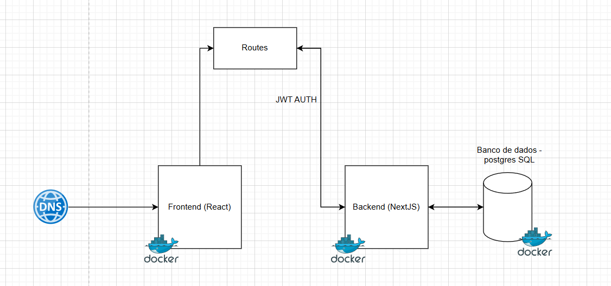
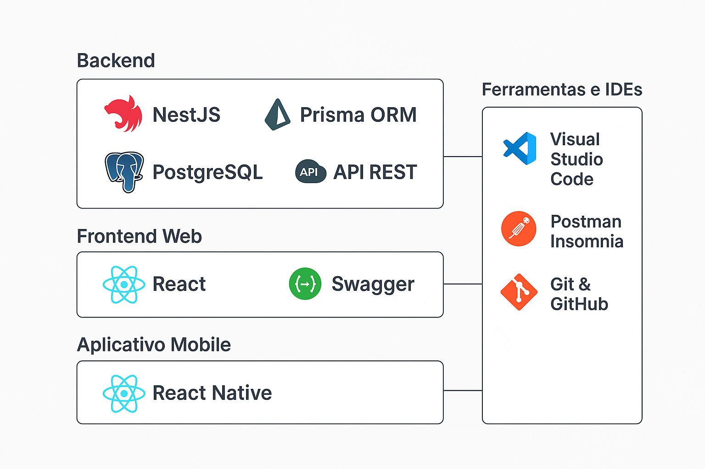

# Introdução

Nos últimos anos, o **comércio eletrônico** tem se consolidado como um dos principais canais de compra e venda de produtos, impulsionado pela popularização da internet e pela facilidade de acesso a dispositivos móveis. Plataformas como *Mercado Livre*, *Amazon* e *Shopee* demonstram que consumidores buscam cada vez mais **praticidade**, **variedade de produtos** e **segurança nas transações**.
Paralelamente, **pequenos e médios fornecedores** enfrentam desafios para competir com grandes marcas, especialmente no que diz respeito à:  
- 📢 **Divulgação**  
- 📦 **Gestão de estoque**  
- 📊 **Análise de vendas**  
Nesse cenário, **soluções tecnológicas** que conectem vendedores e compradores de forma **simples**, **escalável** e **segura** tornam-se cada vez mais necessárias.

## Problema
Apesar do crescimento do **e-commerce**, muitos fornecedores  principalmente pequenos empreendedores e comerciantes locais  encontram dificuldades para ingressar ou se manter no mercado digital [(CARTA CAPITAL, 2023)](../docs/references.md).  

Entre os principais desafios estão:  
- Falta de infraestrutura tecnológica para gerenciar produtos e vendas.  
- Baixa visibilidade de seus produtos frente a grandes marcas.  
- Ausência de ferramentas de análise que auxiliem na tomada de decisão.  
- Dificuldade em integrar múltiplos canais de venda de forma centralizada.  

Por outro lado, compradores muitas vezes enfrentam a limitação de encontrar produtos diversificados e competitivos em uma única plataforma, o que os leva a utilizar diversos aplicativos e sites, aumentando o tempo e o esforço para realizar uma compra.

## Objetivos

### Objetivo Geral
Desenvolver uma plataforma de e-commerce, chamada **ZABBIX STORE**, que conecte fornecedores e compradores, oferecendo um ambiente digital seguro, escalável e com recursos de análise de vendas para fornecedores.

### Objetivos Específicos
- Permitir o cadastro de fornecedores e seus produtos de forma simples e intuitiva.  
- Disponibilizar um painel (dashboard) para acompanhamento e análise das vendas.  
- Oferecer um ambiente de compra eficiente, com filtragem e busca de produtos.  
- Garantir segurança nas transações e proteção dos dados dos usuários.  
- Suportar acesso via web e dispositivos móveis.

## Justificativa

A criação da ZABBIX STORE busca atender a uma necessidade crescente do mercado digital: proporcionar oportunidades para pequenos e médios fornecedores competirem em condições mais equilibradas com grandes empresas. As Micro, Pequenas e Médias Empresas (MPMEs) têm um papel relevante na economia, sendo responsáveis por grande parte do emprego e da produção local, o que fortalece o impacto social e produtivo do projeto [(BRASIL, 2021)](../docs/references.md).

Além disso, o e-commerce surge como uma solução acessível e eficiente, especialmente para empreendedores que enfrentam barreiras financeiras ou logísticas para expandir seus negócios de forma tradicional. Esse modelo digital permite superar limitações físicas e alcançar novos mercados com menores custos [(SILVA; PEREIRA, 2020)](../docs/references.md).

O potencial de expansão e internacionalização das plataformas digitais já foi demonstrado por diversos empreendedores e estudos, como o relatório da FedEx, que evidencia o crescimento de negócios que adotam o comércio eletrônico para ampliar suas operações globalmente [(FEDEX, 2023)](../docs/references.md).

A importância dessas soluções digitais se torna ainda mais crítica em contextos de crise ou isolamento físico, como observado durante a pandemia, quando o comércio tradicional foi fortemente impactado, evidenciando a necessidade de alternativas robustas e seguras para manter a atividade econômica [(OLIVEIRA, 2021)](../docs/references.md).

A ConectaShop também contribui para a inclusão digital e a capacitação tecnológica dos pequenos e médios empreendedores, ajudando a reduzir a disparidade no uso das Tecnologias da Informação e Comunicação (TICs) por MPMEs, fator essencial para a competitividade no mercado atual [(MINISTÉRIO DA ECONOMIA, 2022)](../docs/references.md).

Finalmente, a plataforma se apoia nas estratégias de marketing digital, que oferecem baixo custo e alto retorno, potencializando a visibilidade dos fornecedores e o alcance de novos clientes [(GONÇALVES; MARTINS, 2020)](../docs/references.md).

Assim, o projeto ZABBIX STORE se posiciona como uma iniciativa que fortalece o ecossistema do comércio eletrônico e promove a inclusão digital, contribuindo para o desenvolvimento econômico e social dos empreendedores.

## Público-Alvo

O público-alvo do projeto é composto por:  

- **Fornecedores:** pequenos e médios empreendedores, comerciantes locais e marcas que desejam ampliar seu alcance no comércio digital.  
- **Compradores:** consumidores finais que buscam praticidade, variedade e segurança ao realizar compras online.

  

### Personas

#### Persona 1 – Laura Andrade

**Profissão:** Proprietária de loja de roupas  
**Mini-biografia:** Laura, 35 anos, administra uma pequena boutique especializada em moda feminina e peças personalizadas. É apaixonada por tendências e busca sempre trazer novidades para suas clientes.  
**Detalhes pessoais:**  
- Localização: São Paulo/SP  
- Renda familiar: R$ 6.800,00  
- Nível educacional: Ensino Superior Completo (Moda)  
- Status relacionamento: Casada  

**Carreira:**  
- Empresa: Elegância Feminina  
- Tamanho da empresa: Pequena (3 funcionários)  
- Responsabilidades profissionais: Gerenciar estoque, atendimento ao cliente, marketing digital e compras de novas coleções.  
- Objetivos: Ampliar o alcance da loja por meio do e-commerce e fidelizar clientes.  
- Desafios: Concorrer com grandes marcas e lidar com custos de logística.

**Mapa de Empatia:**  
- O que vê: Concorrentes bem estabelecidos no digital.  
- O que ouve: Clientes pedindo mais praticidade nas compras.  
- O que pensa e sente: Ansiosa para expandir mas receosa com a adaptação ao online.  
- O que fala e faz: Investe em fotos de qualidade e atendimento personalizado.  
- Dores: Baixa visibilidade e falta de integração de sistemas.  
- Ganhos: Mais vendas e reconhecimento da marca.

---

#### Persona 2 – Patrícia Nogueira

**Profissão:** Artista independente  
**Mini-biografia:** Patrícia, 29 anos, cria e vende ilustrações autorais e artesanato. Já possui uma clientela fiel, mas ainda depende muito de eventos presenciais para vender.  
**Detalhes pessoais:**  
- Localização: Fortaleza/CE  
- Renda familiar: R$ 8.000,00  
- Nível educacional: Ensino Superior Completo (Design)  
- Status relacionamento: Solteira  

**Carreira:**  
- Empresa: Estúdio Próprio  
- Tamanho da empresa: Microempreendedora individual  
- Responsabilidades profissionais: Produção de artes, atendimento a clientes, divulgação online e logística de envio.  
- Objetivos: Expandir a base de clientes nacionalmente.  
- Desafios: Baixo alcance digital e pouco conhecimento em marketing.

**Mapa de Empatia:**  
- O que vê: Plataformas grandes dominando as buscas.  
- O que ouve: Feedback de clientes sobre dificuldades de compra online.  
- O que pensa e sente: Quer autonomia e controle sobre seu canal de vendas.  
- O que fala e faz: Busca cursos de marketing digital e redes sociais.  
- Dores: Falta de tempo e recursos para gestão.  
- Ganhos: Vendas constantes sem depender de eventos presenciais.

---

#### Persona 3 – Carlos Menezes

**Profissão:** Gerente de vendas  
**Mini-biografia:** Carlos, 42 anos, atua no setor de eletrodomésticos e busca digitalizar parte das operações da loja física.  
**Detalhes pessoais:**  
- Localização: Porto Alegre/RS  
- Renda familiar: R$ 12.000,00  
- Nível educacional: Ensino Médio Completo  
- Status relacionamento: Casado  

**Carreira:**  
- Empresa: Móveis & Eletros Sul  
- Tamanho da empresa: Média (25 funcionários)  
- Responsabilidades profissionais: Gestão de equipe, definição de metas, relacionamento com fornecedores e análise de vendas.  
- Objetivos: Aumentar as vendas online e integrar estoque físico e digital.  
- Desafios: Treinar a equipe e adaptar processos ao e-commerce.

**Mapa de Empatia:**  
- O que vê: Concorrentes investindo pesado em e-commerce.  
- O que ouve: Clientes pedindo mais opções de compra online.  
- O que pensa e sente: Preocupado com a curva de aprendizado da equipe.  
- O que fala e faz: Participa de reuniões de tecnologia e novos negócios.  
- Dores: Perder clientes para lojas 100% digitais.  
- Ganhos: Melhor aproveitamento de estoque e novos canais de vendas.

---

#### Persona 4 – Sara Lima

**Profissão:** Analista de marketing  
**Mini-biografia:** Sara, 31 anos, atua no setor de cosméticos e busca otimizar campanhas digitais para aumentar conversões no e-commerce.  
**Detalhes pessoais:**  
- Localização: Rio de Janeiro/RJ  
- Renda familiar: R$ 9.500,00  
- Nível educacional: Ensino Superior Completo (Publicidade e Propaganda)  
- Status relacionamento: Namorando  

**Carreira:**  
- Empresa: Beleza Natural  
- Tamanho da empresa: Grande (150 funcionários)  
- Responsabilidades profissionais: Gestão de campanhas digitais, análise de métricas, relacionamento com influenciadores e redes sociais.  
- Objetivos: Aumentar o ROI de campanhas e melhorar a jornada do cliente.  
- Desafios: Concorrer em um mercado saturado e com alto custo de mídia.

**Mapa de Empatia:**  
- O que vê: Alta concorrência em anúncios online.  
- O que ouve: Feedback de vendas sobre baixa conversão.  
- O que pensa e sente: Pressionada por resultados rápidos.  
- O que fala e faz: Testa novas estratégias e ferramentas de marketing.  
- Dores: Custos crescentes e retorno instável.  
- Ganhos: Aumento de conversões e reconhecimento profissional.

---

#### Persona 5 – João Ferreira

**Profissão:** Pequeno produtor rural  
**Mini-biografia:** João, 50 anos, cultiva e vende produtos orgânicos diretamente para consumidores e pequenos mercados. Quer alcançar mais clientes pela internet.  
**Detalhes pessoais:**  
- Localização: Uberlândia/MG  
- Renda familiar: R$ 5.500,00  
- Nível educacional: Ensino Médio Completo  
- Status relacionamento: Casado  

**Carreira:**  
- Empresa: Sítio Boa Terra  
- Tamanho da empresa: Microempresa familiar  
- Responsabilidades profissionais: Produção, colheita, empacotamento e vendas diretas.  
- Objetivos: Criar um canal de vendas online para entrega direta ao consumidor.  
- Desafios: Pouca familiaridade com tecnologia e logística de entregas.

**Mapa de Empatia:**  
- O que vê: Crescimento da demanda por orgânicos.  
- O que ouve: Clientes querendo entrega em casa.  
- O que pensa e sente: Motivado, mas inseguro quanto à tecnologia.  
- O que fala e faz: Busca apoio de familiares mais jovens para usar redes sociais.  
- Dores: Dificuldade de gerenciamento de pedidos online.  
- Ganhos: Expansão da base de clientes e aumento de renda.

# Especificações do Projeto

## Requisitos

As tabelas que se seguem apresentam os requisitos funcionais e não funcionais que detalham o escopo do projeto. Para determinar a prioridade de requisitos, aplicar uma técnica de priorização de requisitos e detalhar como a técnica foi aplicada.

### Requisitos Funcionais

|ID    | Descrição do Requisito  | Prioridade |
|------|-----------------------------------------|----|
|RF-001| Permitir o cadastro de fornecedores com dados empresariais. | ALTA | 
|RF-002| Permitir o cadastro de compradores com dados pessoais, endereço de entrega e informações de contato. | ALTA | 
|RF-003| Permitir que os usuários se loguem em suas contas. | ALTA |
|RF-004| Permitir que os fornecedores atualizem, editar e excluir informações do seu perfil. | ALTA | 
|RF-005| Permitir que os compradores atualizem, editar e excluir informações do seu perfil, como endereço de entrega e informações de contato. | ALTA | 
|RF-006| Permitir o cadastro, edição e exclusão de produtos e modalidade de pagamento pelos fornecedores. | ALTA | 
|RF-007| Disponibilizar dashboard para fornecedores com métricas de vendas. | ALTA | 
|RF-008| Permitir que compradores realizem buscas por produtos usando filtros (categoria, preço, avaliação, etc.). | ALTA | 
|RF-009| Permitir que compradores adicionem produtos ao carrinho de compras.  | ALTA | 
|RF-010| Gerar confirmação de pedido para o comprador e notificação para o fornecedor.  | ALTA | 
|RF-011| Disponibilizar histórico de compras para o comprador.  | ALTA | 
|RF-012| Exibir página de detalhes de produto com fotos, descrições, preço, avaliações e informações do vendedor. | MÉDIA | 
|RF-013| Permitir que compradores avaliem produtos e vendedores após a compra. | MÉDIA |
|RF-014| Permitir que fornecedores gerenciem estoque e recebam alertas de baixa quantidade.  | BAIXA | 
|RF-015| O sistema deve permitir que os usuários realizem autenticação utilizando suas credenciais da conta Google, por meio de integração com o serviço de login social.  | BAIXA | 
        
### Requisitos não Funcionais

|ID     | Descrição do Requisito  |Prioridade |
|-------|-------------------------|----|
|RNF-001| O sistema deve ser responsivo para rodar em um dispositivos móvel | ALTA | 
|RNF-002| O sistema deve restringir o acesso de sua conta por meio de autenticação via senha. | ALTA | 
|RNF-003| O sistema deve ser compatível com os principais navegadores modernos (Chrome, Firefox, Edge, Safari) |  MÉDIA | 
|RNF-004| O sistema deve cumprir todas as leis e regulamentos relevantes, incluindo leis de proteção ao consumidor, leis de privacidade de dados e leis de comércio eletrônico. |  MÉDIA |
|RNF-005| O sistema deve ser facilmente mantido e atualizado, com código limpo e documentação abrangente para facilitar o trabalho dos desenvolvedores. |  MÉDIA |
|RNF-006| Deve processar requisições do usuário em no máximo 3s |  BAIXA | 

## Restrições

O projeto está restrito pelos itens apresentados na tabela a seguir.

|ID| Restrição                                             |
|--|-------------------------------------------------------|
|01| O projeto deverá ser entregue até o final do semestre |
|02| Não pode ser desenvolvido um módulo de backend        |
|03| O orçamento disponível é limitado, priorizando tecnologias de baixo custo ou gratuitas |
|04| O prazo de desenvolvimento não pode ultrapassar 5 meses |
|05| Todas as funcionalidades devem estar disponíveis tanto na versão web quanto na versão mobile |
|06| O design da interface deve seguir padrões responsivos para múltiplos dispositivos |
|07| Cada comprador poderá possuir apenas uma conta por endereço de e-mail |
|08| Cada fornecedor poderá ter apenas uma conta com perfil administrador e até duas contas de usuário associadas |

# Catálogo de Serviços 

As funcionalidades da plataforma **ZABBIX STORE** em categorias: 

1. Contas e Acesso

- Cadastro de Fornecedores: Permite o cadastro de fornecedores com dados empresariais.

- Cadastro de Compradores: Permite o cadastro de compradores com dados pessoais, endereço de entrega e informações de contato.

- Login de Usuários: Permite que fornecedores e compradores acessem suas contas.

- Gerenciamento de Perfil do Fornecedor: Fornecedores podem atualizar, editar e excluir informações do seu perfil.

- Gerenciamento de Perfil do Comprador: Compradores podem atualizar, editar e excluir informações do perfil, como endereço de entrega e informações de contato.

2. Compras

- Carrinho de Compras: Permite que compradores adicionem produtos ao carrinho de compras.

- Confirmação de Pedido: Gera confirmação de pedido para o comprador e notificação para o fornecedor.

- Histórico de Compras: Disponibiliza o histórico de compras realizadas pelo comprador.

- Página de Detalhes do Produto: Exibe informações completas do produto, incluindo fotos, descrição, preço, avaliações e informações do vendedor.

- Avaliação de Produtos e Vendedores: Permite que compradores avaliem produtos e vendedores após a compra.

3. Produtos e Vendas

- Gerenciamento de Produtos e Pagamentos: Permite aos fornecedores cadastrar, editar e excluir produtos e modalidades de pagamento.

- Dashboard de Vendas: Fornecedores podem acompanhar métricas de vendas em tempo real.

- Gestão de Estoque com Alertas: Fornecedores recebem alertas quando o estoque de um produto estiver baixo.

4. Busca e Descoberta

- Busca de Produtos com Filtros: Permite que compradores pesquisem produtos por categoria, preço, avaliação, entre outros filtros.

- Recomendações Personalizadas: Sugestões de produtos baseadas no histórico e perfil de compra.

--
## Diagrama de caso de uso

# Arquitetura da Solução

A arquitetura proposta é baseada em uma aplicação web, estruturada em três principais camadas: Frontend, Backend e Banco de Dados, todas executadas em containers Docker para garantir portabilidade, escalabilidade e facilidade de implantação.

O Frontend, desenvolvido em React, é responsável pela interface do usuário e se comunica com o backend por meio de chamadas autenticadas utilizando JWT (JSON Web Token). O acesso ao frontend é feito através de um DNS, que direciona as requisições para a aplicação.

O Backend, implementado em NextJS, gerencia a lógica de negócio e disponibiliza as rotas da aplicação. Ele valida a autenticação via JWT e processa as requisições vindas do frontend. Além disso, o backend realiza a comunicação com o Banco de Dados, que é baseado em PostgreSQL e também executado em container.

Essa arquitetura garante separação de responsabilidades, segurança por meio de autenticação JWT, e flexibilidade com o uso de Docker, permitindo que cada componente seja escalado ou atualizado de forma independente.

## Tecnologias Utilizadas

Para o desenvolvimento da solução, serão utilizadas diversas tecnologias modernas, visando alta performance, escalabilidade e facilidade de manutenção. Abaixo estão listadas todas as tecnologias envolvidas e seu respectivo papel no projeto:

## Backend

**NestJS**: Framework Node.js baseado em TypeScript, escolhido por sua arquitetura modular, suporte a injeção de dependências e facilidade na criação de APIs robustas.

**Prisma ORM**: Ferramenta para mapeamento objeto-relacional que simplifica a comunicação com o banco de dados, oferecendo tipagem forte e consultas mais seguras.

**PostgreSQL**: Banco de dados relacional utilizado para armazenar e gerenciar todas as informações do sistema, devido à sua confiabilidade e suporte a transações complexas.

**API REST**: A comunicação entre o backend e o frontend será feita por meio de uma API REST, garantindo padronização, escalabilidade e facilidade de integração.

**Swagger**: Utilizado para documentação da API, permitindo que desenvolvedores consultem os endpoints, os parâmetros aceitos e os formatos de resposta.

## Frontend Web

**React**: Biblioteca JavaScript para construção da interface web, escolhida por sua eficiência na renderização de componentes e pela ampla comunidade de suporte.

## Aplicativo Mobile

**React Native**: Framework para desenvolvimento mobile multiplataforma (Android e iOS), permitindo a reutilização de grande parte do código do React.

## Ferramentas e IDEs

**Visual Studio Code**: IDE principal para desenvolvimento, com suporte a extensões que aumentam a produtividade.

**Postman / Insomnia**: Ferramentas para testar e validar os endpoints da API.

**Git & GitHub**: Controle de versão e hospedagem do repositório de código.

## Fluxo de Interação do Usuário com o Sistema

- Usuário acessa o sistema via navegador (web) ou aplicativo (mobile).

- A requisição é enviada para o Frontend (React ou React Native).

- O frontend faz uma chamada à API REST disponibilizada pelo Backend (NestJS).

- O NestJS processa a requisição, interage com o Prisma para consultar ou persistir dados no PostgreSQL.

- Após o processamento, o backend retorna uma resposta estruturada ao frontend.

- O Frontend exibe os dados processados para o usuário, atualizando a interface em tempo real.

- Toda a documentação dos endpoints estará disponível via Swagger, facilitando a integração e manutenção.

# 📡 Hospedagem do Sistema

## 🗄️ Banco de Dados
- **Tipo:** PostgreSQL (relacional)  
- **Provedor:** AWS (container em EC2)  
- **Localização:** São Paulo (sa-east-1)  
- **Escalabilidade:**  
  - Container dedicado (inicialmente `db.t3.medium` equivalente)  
  - Possibilidade futura de migração para RDS (com Multi-AZ e auto scaling)  
- **Backup & Recovery:**  
  - Snapshots manuais a cada release  
  - Estratégia futura: migração para RDS para backups automáticos  

**Justificativa:** Uso inicial em container reduz custos; PostgreSQL robusto e com fácil migração futura para RDS caso a demanda cresça.  

---

## ☁️ Hospedagem da Aplicação
- **Infraestrutura:** AWS EC2  
- **Serviço:**  
  - Instância EC2 com **Docker Compose** para orquestração dos containers  
  - Containers planejados:  
    - **API do sistema**  
    - **Frontend**  
    - **Banco de Dados (Postgres)**  
- **Rede e Segurança:**  
  - VPC com sub-redes públicas/privadas  
  - Security Groups para restringir portas (80/443 públicas; 5432 e API internas)  
  - Load Balancer opcional para escalabilidade futura  

**Justificativa:** Uso de EC2 com Docker garante controle, flexibilidade e baixo custo inicial. Possibilidade futura de migração para ECS/Fargate ou Kubernetes conforme o crescimento.  
**Bônus:** Estrutura pode ser automatizada via IaC (Terraform/CloudFormation).  

---

## 🔄 CI/CD
- **Ferramenta:** GitHub Actions  
- **Pipeline:**  
  1. **Build** (frontend/backend containers)  
  2. **Testes** (unitários)  
  3. **Deploy**:  
     - Staging automático via SSH/Actions Runner na EC2  
     - Produção com *approval manual*  

- **Gerenciamento de Segredos:**  
  - GitHub Secrets para pipeline  
  - `.env` versionado de forma segura via AWS Secrets Manager  

**Justificativa:** GitHub Actions integrado ao repositório e deploy direto na EC2 via containers simplifica a operação.  

---

## 📱 Geração de APK (Mobile)
- **Ferramenta:** Expo Go + EAS Build  
- **Configurações:**  
  - APK **unsigned** para uso interno de QA  
  - `.aab` planejado para futura publicação em loja  
- **Assinatura:** Não aplicável no início  
- **Publicação:** Apenas distribuição interna para testes  

**Justificativa:** Expo simplifica build mobile e evita custos de publicação no início.  
**Estudo:** Automatizar build do APK como artefato no pipeline CI/CD.  

---

## 📊 Monitoramento e Logs
- **Infraestrutura:**  
  - **AWS CloudWatch** para métricas da instância EC2 (CPU, memória, rede)  
  - Logs de containers direcionados para CloudWatch Logs  
- **Aplicação:**  
  - Centralização de logs com Request ID  
  - Integração com Sentry para rastreamento de falhas  

**Justificativa:** Monitoramento nativo da AWS, simplificando alertas e análise.  

---

## 📎 Referências
- [Docker + EC2 Best Practices](https://docs.aws.amazon.com/AmazonECS/latest/developerguide/docker-basics.html)  
- [Expo](https://docs.expo.dev/)  
- [AWS Well-Architected Framework](https://aws.amazon.com/architecture/well-architected/)  

# Planejamento

##  Quadro de tarefas

> Apresente a divisão de tarefas entre os membros do grupo e o acompanhamento da execução, conforme o exemplo abaixo.

### Semana 1

Atualizado em: 12/08/2025

| Responsável   | Tarefa/Requisito | Iniciado em    | Prazo      | Status | Terminado em    |
| :----         |    :----         |      :----:    | :----:     | :----: | :----:          |
| Todos         | Escolha do tema  | 01/08/2025     | 17/08/2025 |  ✔️   |  07/08/2025      |
| Jully         | Criação da Logo  | 01/08/2025     | 17/08/2025 |  ✔️   |  07/08/2025      |
| Jully         | Introdução       | 01/08/2025     | 17/08/2025 |  ✔️   |  11/08/2025      |
| Jully         | Objetivos        | 01/08/2025     | 17/08/2024 |  ✔️   |  11/08/2025      |
| Jully         | Justificativa    | 01/08/2025     | 17/08/2025 |  ✔️   |  11/08/2025      |
| Jully         | Público-Alvo     | 01/08/2025     | 17/08/2025 |  ✔️   |  11/08/2025      |
| Jully         | Requisitos FN/NF Restrições  | 01/08/2025 | 17/08/2025 |  ✔️   |  12/08/2025  |
| Victor        | Histórias de usuário| 01/08/2025  | 17/08/2025 |  ✔️  |   12/08/2025      |
| Victor        | Personas 1       |    01/08/2025  | 17/08/2005 | ✔️   |   12/08/2025      |
| Vinícius      | Catálogo de Serviços | 01/08/2025 | 27/08/2025 |  ✔️  |    20/08/2025     |
| Pedro         | Arquitetura da Solução | 01/08/2025 | 27/08/2025 |  ✔️  |  20/08/2025     |
| Lucas         | Tecnologias Utilizadas | 01/08/2025 | 27/08/2025 | ✔️   |  24/08/25       |
| Ítalo         | Hospedagem       | 01/08/2025     | 27/08/2025 |  ✔️   |   20/08/2025     |

#### Semana 2

Atualizado em: 21/04/2024

| Responsável   | Tarefa/Requisito | Iniciado em    | Prazo      | Status | Terminado em    |
| :----         |    :----         |      :----:    | :----:     | :----: | :----:          |
| Todos         | Levantamento de APIS | 24/08/2025    | 07/03/2024 | ✔️    | 05/02/2024    |

Legenda:
- ✔️: terminado
- 📝: em execução
- ⌛: atrasado
- ❌: não iniciado
