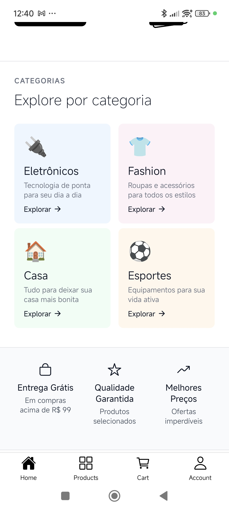
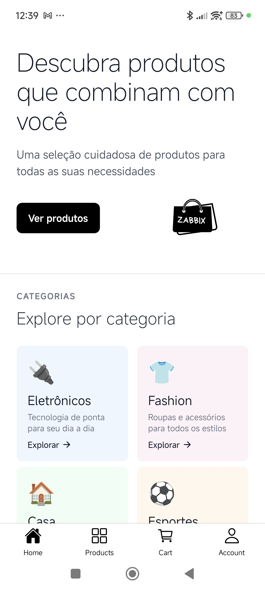
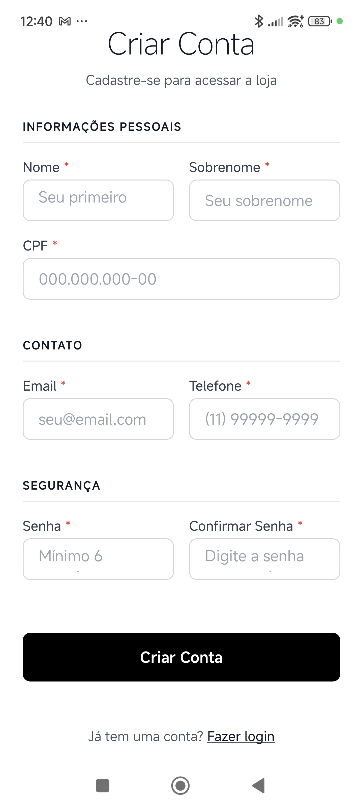
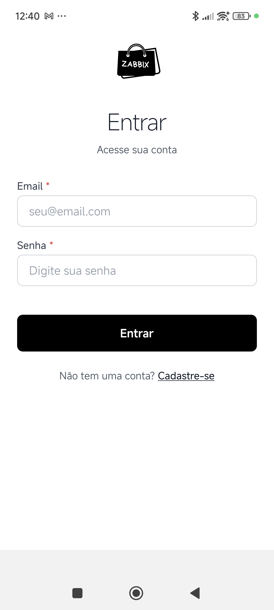
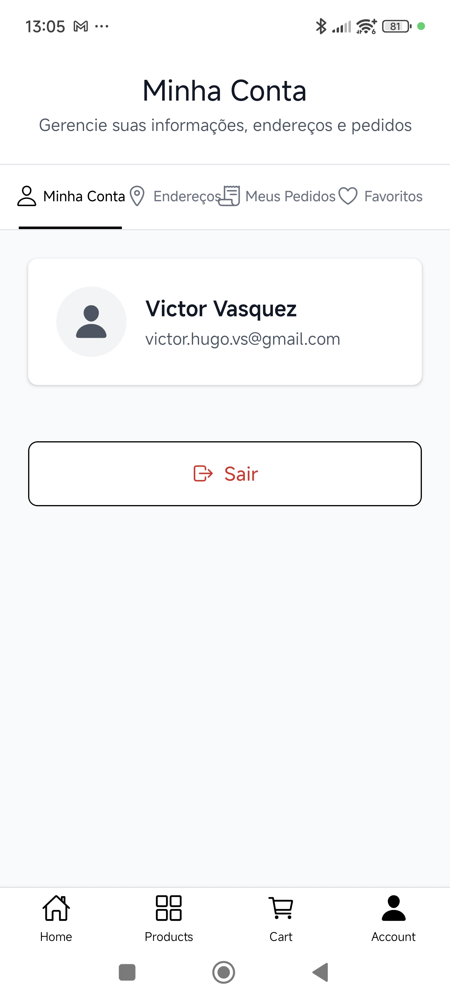
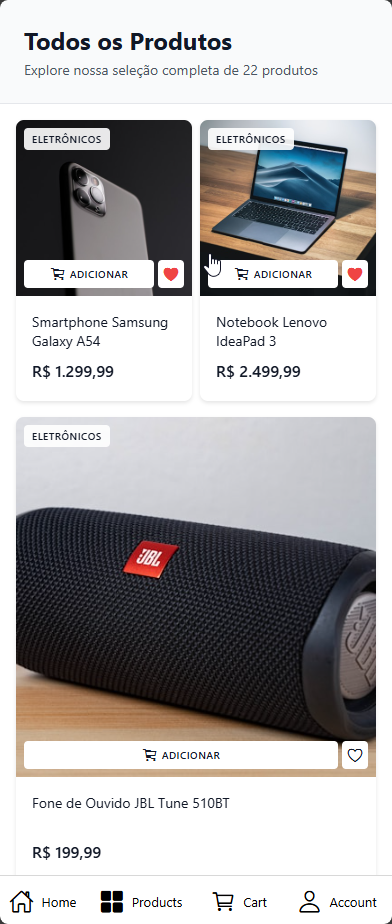
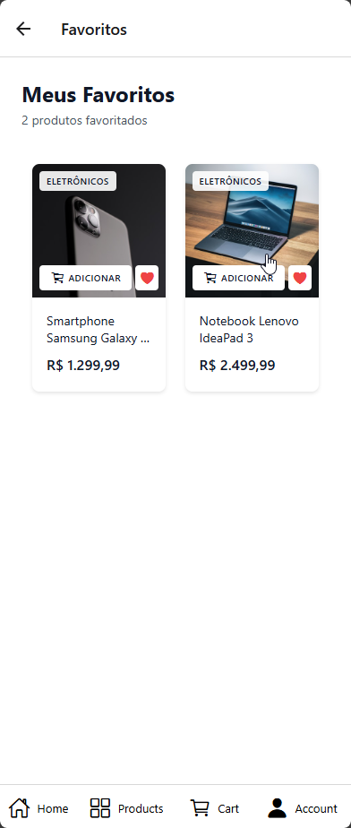
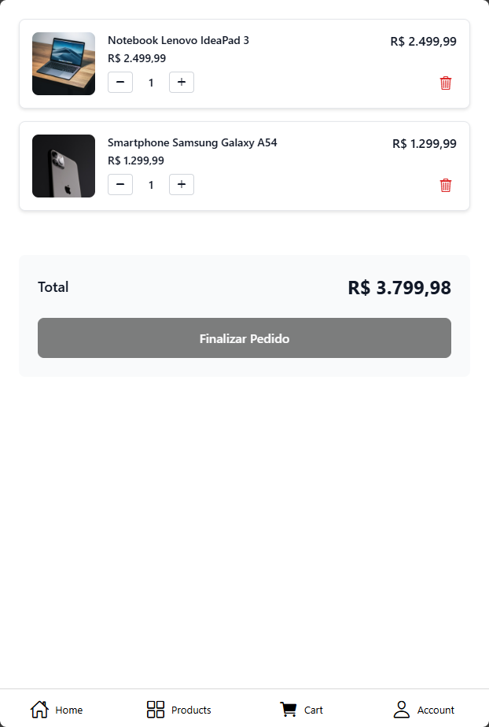
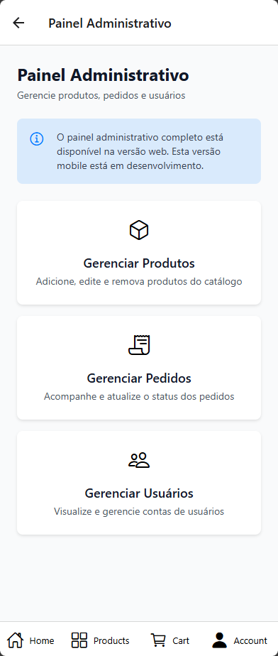

# Front-end Móvel

O **Zabbix Store** tem como objetivo oferecer uma **plataforma de e-commerce mobile**, onde vendedores possam disponibilizar seus produtos e clientes possam pesquisar, comparar e realizar compras de maneira simples e rápida diretamente pelo smartphone.

- **Facilitar a jornada do usuário**: desde a busca por produtos até o checkout em dispositivos móveis.
- **Garantir usabilidade** otimizada para telas touch e diferentes tamanhos de dispositivos.
- **Fornecer segurança** em todo o fluxo de navegação e compra mobile.
- **Disponibilizar análise de vendas para fornecedores**, auxiliando no acompanhamento de desempenho e estratégias comerciais através do app mobile.

## Projeto da Interface Mobile

A interface mobile da Zabbix Store será desenvolvida com foco em usabilidade, consistência visual e experiência de compra fluida, garantindo que clientes e fornecedores realizem suas tarefas de forma intuitiva e segura em dispositivos móveis.

### Design Visual

- Layout moderno e clean, priorizando **clareza e hierarquia visual** adaptada para telas menores.
- Paleta de cores neutras com acentos para **destaques, estados e categorias**, transmitindo profissionalismo e confiança.
- Tipografia moderna: **Poppins** para títulos e elementos de destaque, **Montserrat** e **Inter** para textos complementares e descrições.
- Ícones padronizados (React Native Vector Icons / Feather Icons) e componentes consistentes para facilitar a navegação touch.
- Sombras suaves, bordas arredondadas e transições de toque para melhorar percepção de interatividade.

### Layout das Telas

- **Tela Inicial (Home):** banners promocionais, produtos em destaque, categorias e atalhos para seções principais com navegação por gestos.
- **Tela de Categoria / Catálogo:** listagem de produtos com filtros por preço, avaliação, categorias e ordenação dinâmica, com scroll infinito.
- **Tela de Produto:** informações detalhadas, imagens em carrossel com zoom, preço, avaliações, descrições e botão de ação "Adicionar ao Carrinho".
- **Carrinho e Checkout:** exibição organizada dos produtos selecionados, possibilidade de alterar quantidades ou remover itens, e finalização da compra de forma simples e intuitiva.
- **Painel do Usuário (Cliente):** histórico de pedidos, favoritos e configurações de perfil acessíveis via navegação por abas.
- **Painel do Fornecedor:** cadastro e gerenciamento de produtos, controle de estoque e relatórios de vendas adaptados para mobile.

### Interações do Usuário

- Navegação por gestos: swipe para navegar entre telas, pull-to-refresh para atualizar listas.
- Pesquisa dinâmica com **autocompletar** otimizado para teclado mobile.
- Filtros e ordenações **dinâmicos**, atualizando produtos sem recarregar a tela.
- Feedbacks visuais: notificações push, loaders, mensagens de sucesso e alerta.
- Carrinho persistente, mantendo produtos adicionados mesmo após fechar o app.
- Navegação por abas (Tab Navigator) para acesso rápido às principais funcionalidades.

### Outros Aspectos Relevantes

- **Design responsivo**, compatível com diferentes tamanhos de tela mobile (smartphones e tablets).
- Integração com APIs do backend para exibição de dados e atualização de estoque em tempo real.
- **Segurança** no tratamento de informações do usuário e autenticação via tokens JWT.
- Elementos de UI/UX que promovem **fluidez na jornada de compra**, desde a busca até o checkout, otimizados para interação touch.

### Wireframes

<details>
  <summary><strong>🏠 Home</strong></summary>
  <p><code>Versão Mobile Nativa</code></p>
  
  
</details>
<details>
    <summary><strong>👤 Acesso do Usuário</strong></summary>
    <details>
        <summary><strong>📝 Cadastro</strong></summary>
        <p><code>Versão Mobile Nativa</code></p>
        
    </details>
    <details>
    <summary><strong>🔑 Login</strong></summary>
    <p><code>Versão Mobile Nativa</code></p>
    
    </details>
    <details>
      <summary><strong>⚙️ Gerenciamento de conta</strong></summary>
      <p><code>Versão Mobile Nativa</code></p>
      
    </details>
</details>
<details>
  <summary><strong>🛍️ Compras</strong></summary>
    <details>
      <summary><strong>📦 Produtos</strong></summary>
      <p><code>Versão Mobile Nativa</code></p>
      
    </details> 
    <details>
      <summary><strong>❤️ Favoritos</strong></summary>
      <p><code>Versão Mobile Nativa</code></p>
      
    </details>      
    <details>
      <summary><strong>🛒 Carrinho</strong></summary>
      <p><code>Versão Mobile Nativa</code></p>
      
    </details>
</details>
<details>
  <summary><strong>📊 Dashbord fornecedor</strong></summary>
   <details>
      <summary><strong>📈 Análise de Vendas</strong></summary>
      <p><code>Versão Mobile Nativa</code></p>
      
  </details>
</details>
### Design Visual

#### Tipografia

O projeto adota uma combinação de fontes que equilibra modernidade, legibilidade e consistência visual em toda a interface mobile. As famílias tipográficas foram selecionadas para oferecer contraste harmônico entre títulos, textos e elementos complementares, otimizadas para leitura em telas menores.

**Poppins**

- Utilizada em títulos, cabeçalhos e elementos de destaque da interface mobile.
- Transmite modernidade e clareza visual, reforçando a identidade do produto.

**Montserrat**

- Aplicada em textos secundários, descrições e blocos de conteúdo mais extensos.
- Oferece excelente leitura em tamanhos menores e complementa visualmente a Poppins.

**Inter**

- Definida como fonte de fallback, garantindo compatibilidade e legibilidade em sistemas que não suportem as fontes principais.


#### Paleta de Cores

A paleta de cores do ZabbixStore mobile foi desenvolvida com base em um design minimalista e profissional, utilizando tons neutros com acentos em preto para criar contraste e hierarquia visual:


#### Elementos Gráficos

**Ícones:**

A iconografia abaixo foi desenvolvida para garantir uma comunicação visual clara e padronizada em todas as telas do sistema mobile. Cada ícone possui um significado específico, facilitando a navegação e a compreensão das ações disponíveis para o usuário.

- Utilização de React Native Vector Icons (Feather Icons) para consistência visual
- Ícones principais: FiShoppingBag, FiStar, FiTrendingUp, FiArrowRight
- Tamanho padrão: 24px para ícones de interface, com áreas de toque mínimas de 44x44px


| Nº  | Significado             | Descrição                                                  |
| --- | ----------------------- | ---------------------------------------------------------- |
| 1   | Menu                    | Abre o menu lateral de navegação.                          |
| 2   | Perfil                  | Exibe as informações do usuário.                           |
| 3   | Logout                  | Encerra a sessão.                                          |
| 4   | Sacola de pedidos       | Permite visualizar os pedidos realizados ou em andamento.  |
| 5   | Produto / Item          | Representa produtos, pacotes ou estoque.                   |
| 6   | Carrinho                | Adiciona ou visualiza itens no carrinho de compras.        |
| 7   | Remover dos favoritos   | Retira um item da lista de favoritos.                      |
| 8   | Favoritar               | Adiciona um item aos favoritos.                            |
| 9   | Receita                 | Indica valores do painel de controle da área financeira.   |
| 10  | Painel administrativo   | Permite gerenciar produtos, pedidos e visualizar métricas. |
| 11  | Editar                  | Permite alterar ou modificar um item.                      |
| 12  | Excluir                 | Remove permanentemente um item.                            |
| 13  | Localização             | Exibe o endereço e o endereço de entrega.                  |
| 14  | Pedidos / Lista         | Mostra pedidos, tarefas ou histórico.                      |
| 15  | Atualizar / Sincronizar | Atualiza os dados ou sincroniza informações.               |

**Sombras e Efeitos:**

- Sombras suaves com rgba(0, 0, 0, 0.1) para cards de produtos
- Sombras mais pronunciadas (rgba(0, 0, 0, 0.2)) para formulários
- Transições suaves de 0.3s para todos os elementos interativos
- Efeitos de toque com feedback háptico quando disponível

**Bordas e Cantos:**

- Border-radius padrão de 5px para botões e inputs
- Border-radius de 9px para formulários principais
- Bordas sólidas pretas (#000000) para inputs e elementos de foco
- Áreas de toque mínimas de 44x44px para garantir acessibilidade

Esta decisões foram definidas para transmitir confiança, profissionalismo e modernidade, características essenciais para uma plataforma de e-commerce mobile, mantendo a legibilidade e acessibilidade em todos os elementos da interface, com foco especial em interações touch.

## Fluxo de Dados

## Fluxo de Dados da Aplicação Mobile

O fluxo de dados da ZabbixStore mobile é baseado em uma arquitetura cliente-servidor, onde o frontend React Native (Expo) consome APIs REST do backend NestJS, que por sua vez interage com o banco de dados PostgreSQL através do Prisma ORM.

### Arquitetura Geral

```
Frontend Mobile (React Native/Expo) ↔ Backend (NestJS) ↔ Banco de Dados (PostgreSQL)
     ↓                                    ↓                    ↓
- React Navigation                  - Controllers         - Prisma ORM
- Context API                       - Services           - Schema definido
- Componentes                       - DTOs/Validação     - Migrations
- AsyncStorage                      - JWT Auth           - Relacionamentos
- Hooks customizados
```

<details>
<summary><strong>🔝 Header/Navegação</strong></summary>

**Descrição:** Cabeçalho fixo presente em todas as telas da aplicação mobile, proporcionando navegação consistente e acesso rápido às principais funcionalidades através de navegação por abas (Tab Navigator).

**Fluxo de Dados:**

- **Logo da Marca:** Imagem clicável que navega para tela inicial usando React Navigation
- **Menu de Navegação:** Abas inferiores para principais seções (Home, Produtos, Carrinho, Perfil) usando Tab Navigator
- **Campo de Pesquisa:** Input para busca rápida de produtos com sugestões em tempo real e autocompletar otimizado para teclado mobile
- **Ícone de Carrinho:** Badge mostrando contador de itens adicionados, ao tocar navega para tela de carrinho
- **Ícone de Perfil:** Ao tocar, navega para tela de perfil ou exibe menu de opções (Login, Cadastro, Minha Conta, Sair)
- **Badge de Notificações:** Indicador visual de novos pedidos ou mensagens, com suporte a notificações push

</details>

<details>
<summary><strong>🏠 Home</strong></summary>

**Descrição:** A tela inicial serve como ponto de entrada principal da aplicação mobile, apresentando produtos em destaque, categorias principais e banners promocionais com scroll vertical.

**Fluxo de Dados:**

- **Barra de Navegação:** Abas inferiores para navegação rápida, botão de carrinho com contador de itens e ícone de perfil do usuário
- **Banner Promocional:** Carrossel de imagens em destaque no topo da tela que exibe ofertas e promoções principais com navegação por swipe
- **Barra de Pesquisa:** Campo centralizado que permite buscar produtos por nome ou categoria, com sugestões em tempo real
- **Produtos em Destaque:** Cards com imagem, nome, preço e botão "Adicionar ao Carrinho" otimizado para toque, com scroll horizontal
- **Seção de Categorias:** Cards visuais com ícones representando diferentes categorias de produtos (Eletrônicos, Fashion, Esportes, etc.) que ao tocar navegam para listagem filtrada
- **Scroll Infinito:** Carregamento automático de mais produtos ao chegar ao final da lista
- **Pull-to-Refresh:** Gestão de atualização puxando a tela para baixo

</details>

<details>
<summary><strong>🔐 Área de Login</strong></summary>

**Descrição:** Tela de autenticação onde usuários fazem login ou cadastro na plataforma mobile.

**Fluxo de Dados:**

- **Formulário de Login:** Campos para inserir e-mail e senha com validação visual em tempo real, otimizados para teclado mobile
- **Botão "Entrar":** Ao tocar, valida os dados inseridos e autentica o usuário na plataforma, armazenando token JWT no AsyncStorage
- **Link "Esqueci minha senha":** Navega para tela de recuperação de senha
- **Botão "Cadastrar":** Navega para tela de registro de novos usuários
- **Mensagens de Feedback:** Exibe mensagens de erro caso as credenciais estejam incorretas ou sucesso ao fazer login usando Alert ou Toast
- **Redirecionamento:** Após login bem-sucedido, o usuário é direcionado para a tela inicial ou tela que estava tentando acessar usando React Navigation

</details>

<details>
<summary><strong>👤 Área Logada</strong></summary>

**Descrição:** Painel do usuário autenticado com acesso a funcionalidades personalizadas através de navegação por abas ou menu lateral.

**Fluxo de Dados:**

- **Menu de Navegação:** Abas inferiores ou menu lateral (Drawer Navigator) com opções como Perfil, Pedidos, Favoritos, Endereços e Logout
- **Informações do Perfil:** Seção superior exibindo nome do usuário, e-mail e opção de editar dados pessoais
- **Botão "Editar Dados":** Navega para tela de edição permitindo modificar informações pessoais como nome, e-mail e telefone
- **Seção de Endereços:** Lista de endereços cadastrados com opção de adicionar novos ou editar existentes, com swipe para ações rápidas
- **Botão "Adicionar Endereço":** Navega para formulário de cadastro de novo endereço de entrega
- **Botão "Sair":** Finaliza a sessão do usuário, limpa AsyncStorage e retorna para tela de login

</details>

<details>
<summary><strong>🛒 Carrinho de Compras</strong></summary>

**Descrição:** Tela para gerenciar produtos selecionados antes da finalização da compra, com dados persistidos no AsyncStorage.

**Fluxo de Dados:**

- **Lista de Produtos:** Cards exibindo imagem, nome, preço unitário e quantidade de cada item no carrinho, com scroll vertical
- **Botões de Quantidade:** Botões "+" e "-" grandes o suficiente para toque, aumentando ou diminuindo a quantidade de cada produto
- **Botão "Remover":** Ícone de lixeira em cada item que remove o produto do carrinho quando tocado, com confirmação via Alert
- **Resumo do Pedido:** Seção fixa no rodapé mostrando subtotal, frete e valor total da compra
- **Botão "Finalizar Compra":** Navega para tela de checkout para concluir a compra
- **Botão "Continuar Comprando":** Navega de volta para tela de produtos para adicionar mais itens
- **Sincronização:** Carrinho sincronizado com backend quando usuário está logado, persistido localmente quando não logado

</details>

<details>
<summary><strong>📦 Produto Selecionado</strong></summary>

**Descrição:** Tela de detalhes de um produto específico com informações completas e galeria de imagens.

**Fluxo de Dados:**

- **Galeria de Imagens:** Carrossel mostrando diferentes ângulos e imagens do produto com navegação por swipe e zoom ao tocar
- **Informações do Produto:** Nome, descrição detalhada, preço, estoque disponível e categoria com scroll vertical
- **Botão "Adicionar ao Carrinho":** Permite incluir o produto no carrinho com a quantidade desejada, com feedback visual e haptico
- **Seletor de Quantidade:** Campo numérico ou botões para definir quantas unidades do produto serão adicionadas
- **Botão "Favoritar":** Ícone de coração para salvar o produto na lista de favoritos, sincronizado com backend
- **Seção de Avaliações:** Exibe comentários e avaliações de outros clientes sobre o produto com scroll
- **Produtos Relacionados:** Sugestão de itens similares no final da tela com scroll horizontal

</details>

<details>
<summary><strong>❤️ Lista de Favoritos</strong></summary>

**Descrição:** Tela onde usuários visualizam produtos marcados como favoritos, sincronizados com o backend.

**Fluxo de Dados:**

- **Lista de Produtos Favoritos:** Cards com imagem, nome, preço e avaliação de cada produto salvo, com scroll vertical
- **Botão "Remover dos Favoritos":** Ícone de coração preenchido que ao tocar remove o produto da lista com confirmação
- **Botão "Adicionar ao Carrinho":** Adiciona o produto diretamente ao carrinho de compras
- **Botão "Ver Detalhes":** Navega para tela de detalhes do produto
- **Mensagem de Lista Vazia:** Exibe mensagem quando não há produtos favoritados
- **Ordenação:** Opção de ordenar produtos por preço, nome ou data de adição aos favoritos através de filtros
- **Pull-to-Refresh:** Atualização da lista puxando a tela para baixo

</details>

<details>
<summary><strong>📊 Painel Administrativo - Visão Geral</strong></summary>

**Descrição:** Dashboard principal para fornecedores com métricas e visão geral das vendas, adaptado para visualização mobile.

**Fluxo de Dados:**

- **Métricas Principais:** Cards exibindo receita total, número de vendas, produtos vendidos e ticket médio, organizados em grid responsivo
- **Indicadores Visuais:** Uso de cores (verde para crescimento, vermelho para queda) para facilitar análise rápida
- **Gráficos:** Visualizações adaptadas para telas menores com scroll e zoom quando necessário
- **Filtros:** Opções de filtro por data e categoria através de modais ou bottom sheets

</details>

<details>
<summary><strong>📦 Painel Administrativo - Produtos</strong></summary>

**Descrição:** Interface para gerenciamento completo do catálogo de produtos, otimizada para mobile.

**Fluxo de Dados:**

- **Lista de Produtos:** Lista ou grid exibindo todos os produtos cadastrados com imagem, nome, preço, estoque e categoria, com scroll vertical
- **Botão "Adicionar Produto":** Navega para formulário de cadastro de novo produto no catálogo
- **Botão "Editar":** Ícone de lápis em cada produto que navega para formulário pré-preenchido para edição
- **Botão "Excluir":** Ícone de lixeira que remove o produto do catálogo após confirmação via Alert
- **Formulário de Produto:** Campos para nome, descrição, preço, categoria, quantidade em estoque e upload de imagens
- **Upload de Imagens:** Seleção de imagens da galeria do dispositivo ou câmera
- **Botão "Salvar":** Salva as alterações do produto e retorna para lista
- **Botão "Cancelar":** Descarta as alterações e volta para lista sem salvar
- **Swipe Actions:** Gestos de swipe para ações rápidas (editar, excluir)

</details>

<details>
<summary><strong>ℹ️ Sobre</strong></summary>

**Descrição:** Tela institucional apresentando informações sobre a ZabbixStore, com scroll vertical.

**Fluxo de Dados:**

- **Apresentação da Empresa:** Seção descrevendo a história e missão da ZabbixStore
- **Nossos Valores:** Cards destacando os principais valores da empresa
- **Equipe:** Apresentação dos membros do time e suas funções
- **Funcionalidades:** Lista das principais características e benefícios da plataforma
- **Contato:** Formulário para envio de mensagens e canais de comunicação (email, telefone, endereço) com links clicáveis
- **Links Úteis:** Atalhos para áreas importantes da plataforma e recursos adicionais
- **Redes Sociais:** Links para redes sociais que abrem em navegador externo

</details>

## Diagramas Visuais do Fluxo de Dados

[Dados devem ser preenchidos]

## Tecnologias Utilizadas

A aplicação mobile foi desenvolvida utilizando um conjunto de tecnologias modernas, visando desempenho, escalabilidade e uma ótima experiência do usuário em dispositivos móveis:

### Frontend Mobile

- **Figma** — Utilizado para modelagem dos wireframes, prototipação visual e definição da interface da aplicação mobile.
- **React Native** — Framework utilizado para construção da aplicação mobile multiplataforma (iOS e Android) com código compartilhado.
- **Expo** — Plataforma e conjunto de ferramentas construídas em torno do React Native, facilitando desenvolvimento, build e deploy.
- **Expo Go** — Aplicativo para testar e visualizar a aplicação durante o desenvolvimento através de QR Code, sem necessidade de build nativo.
- **TypeScript** — Linguagem com tipagem estática, garantindo mais segurança, previsibilidade e manutenção no código mobile.
- **React Navigation** — Biblioteca de navegação para React Native, fornecendo navegação por abas (Tab Navigator), stack (Stack Navigator) e drawer (Drawer Navigator).
- **AsyncStorage** — Sistema de armazenamento local assíncrono para persistir dados do usuário (carrinho, favoritos, tokens) no dispositivo.
- **Axios / Fetch API** — Camada de comunicação com o backend, responsável pelo consumo das APIs REST, autenticação e envio de dados.
- **React Native Vector Icons** — Biblioteca de ícones para React Native, incluindo Feather Icons para consistência visual.
- **React Native Gesture Handler** — Biblioteca para gestos touch avançados (swipe, pinch, etc.).
- **Jest / React Native Testing Library** — Ferramentas utilizadas para testes de componentes e integração mobile, garantindo qualidade e estabilidade da aplicação.
- **Expo Notifications** — Sistema de notificações push para alertas e atualizações em tempo real.

## Considerações de Segurança

Como se trata de uma aplicação mobile distribuída, foram implementadas práticas essenciais de segurança para proteger dados e usuários:

- **Autenticação via JWT** com tokens assíncronos e tempo de expiração definido, armazenados de forma segura no AsyncStorage.
- **Autorização baseada em perfis** (cliente, fornecedor, administrador) com verificação de permissões no app e backend.
- **Comunicação via HTTPS** para evitar interceptação de dados sensíveis em redes públicas.
- **CORS configurado** no backend para permitir acesso apenas de domínios/origens autorizados.
- **Hash de senhas** utilizando bcrypt ou argon2 no backend.
- **Armazenamento seguro** de tokens JWT no AsyncStorage com criptografia quando necessário.
- **Proteção contra ataques comuns**, como:
  - **SQL Injection** (mitigado pelo Prisma e validações no backend)
  - **XSS** (sanitização de entradas e validação no React Native)
  - **Man-in-the-Middle** (HTTPS obrigatório, certificate pinning quando necessário)
  - **Token theft** (refresh tokens, expiração de tokens, revogação)
- **Rate Limiting** no backend e bloqueio após tentativas excessivas de login.
- **Validação de entrada** tanto no frontend quanto no backend para prevenir dados maliciosos.
- **Logs e monitoramento** de atividades suspeitas no backend.

## Implantação

### Desenvolvimento e Testes com Expo Go

A aplicação mobile da Zabbix Store utiliza o **Expo Go** para desenvolvimento e apresentação, permitindo testar a aplicação diretamente em dispositivos móveis sem necessidade de build nativo ou deploy em lojas de aplicativos.

#### Requisitos

- **Node.js** (versão 18 ou superior)
- **npm** ou **yarn** como gerenciador de pacotes
- **Expo CLI** instalado globalmente
- **Expo Go** instalado no dispositivo móvel (iOS ou Android)
- Dispositivo móvel e computador na mesma rede Wi-Fi (ou cabo USB para Android)

#### Configuração do Ambiente

1. **Instalação do Expo CLI:**

   ```bash
   npm install -g expo-cli
   ```

2. **Instalação de dependências:**

   ```bash
   cd infrastructure/mobile
   npm install
   ```

3. **Configuração de variáveis de ambiente:**
   - Criar arquivo `.env` na raiz do projeto mobile
   - Configurar URL da API backend
   - Configurar outras variáveis necessárias

#### Execução da Aplicação

1. **Iniciar o servidor de desenvolvimento:**

   ```bash
   npm start
   # ou
   expo start
   ```

2. **Visualizar QR Code:**

   - O Expo CLI exibirá um QR Code no terminal
   - O QR Code também estará disponível em uma página web local

3. **Conectar dispositivo:**

   - **Android:** Abrir Expo Go e escanear o QR Code, ou usar `a` no terminal para abrir no emulador
   - **iOS:** Abrir Expo Go e escanear o QR Code, ou usar `i` no terminal para abrir no simulador

4. **Desenvolvimento:**
   - Alterações no código são refletidas automaticamente no dispositivo (Hot Reload)
   - Shake do dispositivo abre menu de desenvolvedor
   - `r` no terminal recarrega a aplicação
   - `m` no terminal abre menu de desenvolvedor

#### Apresentação

Para apresentação da aplicação:

1. **Garantir que o backend está rodando** e acessível na rede
2. **Iniciar o servidor Expo** com `npm start` ou `expo start`
3. **Exibir o QR Code** para os avaliadores
4. **Instruir instalação do Expo Go** caso não esteja instalado:
   - iOS: App Store
   - Android: Google Play Store
5. **Escanear o QR Code** com o Expo Go
6. **Demonstrar funcionalidades** da aplicação

#### Vantagens do Expo Go

- **Desenvolvimento rápido:** Sem necessidade de build nativo
- **Teste imediato:** Mudanças refletidas instantaneamente
- **Multiplataforma:** Testa em iOS e Android simultaneamente
- **Fácil compartilhamento:** QR Code permite testar em qualquer dispositivo
- **Sem deploy:** Ideal para apresentações e testes iniciais

#### Limitações

- **Funcionalidades nativas limitadas:** Algumas funcionalidades nativas podem não estar disponíveis no Expo Go
- **Dependência de rede:** Requer conexão com servidor de desenvolvimento
- **Não é produção:** Expo Go é apenas para desenvolvimento e testes

#### Notas Importantes

- A aplicação não será publicada nas lojas de aplicativos (App Store/Google Play) nesta etapa
- O foco é demonstrar funcionalidades através do Expo Go
- O backend deve estar acessível na mesma rede ou configurado para acesso externo
- Para produção futura, seria necessário gerar builds nativos (APK/IPA) ou usar EAS Build do Expo

## Testes

### Estratégia de Teste Mobile

A estratégia de teste do frontend mobile da ZabbixStore segue a pirâmide de testes com foco em testes unitários (70%) e testes de integração (30%). Os testes são desenvolvidos utilizando React Native Testing Library para testes unitários e de integração de componentes mobile.

### Ferramentas Utilizadas

- **React Native Testing Library**: Para testes unitários e de integração de componentes React Native
- **Jest**: Framework de teste principal para React Native
- **MSW (Mock Service Worker)**: Para mock de APIs e requisições HTTP
- **@testing-library/react-native**: Para renderização e interação com componentes
- **@testing-library/user-event**: Para simulação de interações do usuário (toques, gestos)
- **AsyncStorage Mock**: Para mock do AsyncStorage em testes
- **React Navigation Testing**: Para testar navegação entre telas

### Casos de Teste por Funcionalidade

<details>
<summary><strong>🔝 Header/Navegação</strong></summary>

**Teste de Renderização**

- Deve renderizar o logo da marca tocável
- Deve renderizar menu de navegação com abas principais (Tab Navigator)
- Deve renderizar campo de pesquisa
- Deve renderizar ícone de carrinho com contador (badge)
- Deve renderizar ícone de perfil
- Deve renderizar navegação por abas inferiores

**Teste de Interações**

- Ao tocar no logo, deve navegar para tela inicial usando React Navigation
- Ao tocar em "Home", deve navegar para tela inicial
- Ao tocar em "Categorias", deve navegar para tela de categorias
- Ao tocar em "Sobre", deve navegar para tela sobre
- Ao tocar no ícone de carrinho, deve navegar para tela de carrinho
- Ao tocar no ícone de perfil, deve navegar para tela de perfil ou exibir menu

**Teste de Funcionalidades**

- Campo de pesquisa deve permitir digitação com teclado mobile
- Campo de pesquisa deve exibir sugestões em tempo real
- Contador do carrinho deve atualizar quando produtos são adicionados
- Menu de perfil deve exibir opções corretas baseadas no estado de login
- Pesquisa deve funcionar com botão de envio do teclado
- Pesquisa deve limpar campo ao tocar em "X"

**Teste de Estados**

- Deve exibir loading state durante pesquisa
- Deve exibir mensagem de erro se pesquisa falhar (Alert ou Toast)
- Deve exibir mensagem quando não há resultados de pesquisa
- Deve manter estado de pesquisa após navegação

**Teste de Responsividade Mobile**

- Header deve adaptar-se corretamente em diferentes tamanhos de tela (320px, 375px, 414px)
- Menu de abas deve funcionar corretamente em diferentes dispositivos
- Campo de pesquisa deve manter funcionalidade em diferentes orientações
- Ícones devem manter tamanho adequado (mínimo 44x44px para toque)
- Badge de contador deve ser visível e legível

**Teste de Acessibilidade**

- Todos os elementos devem ter atributos accessibilityLabel apropriados
- Navegação deve funcionar com leitores de tela (TalkBack/VoiceOver)
- Campo de pesquisa deve ter accessibilityHint para instruções
- Contraste de cores deve atender WCAG 2.1 AA
- Foco deve ser visível em todos os elementos interativos

**Teste por Tipo de Usuário**

- **Usuário não logado**: Deve exibir opções "Login" e "Cadastro"
- **Cliente logado**: Deve exibir "Minha Conta", "Pedidos", "Favoritos", "Sair"
- **Fornecedor logado**: Deve exibir "Dashboard", "Produtos", "Vendas", "Sair"
- **Admin**: Deve exibir todas as opções anteriores mais "Administração"

</details>

<details>
<summary><strong>🏠 Tela Home</strong></summary>

**Teste de Renderização**

- Deve renderizar banner promocional (carrossel)
- Deve renderizar barra de pesquisa centralizada
- Deve renderizar seção de produtos em destaque com scroll horizontal
- Deve renderizar seção de categorias
- Deve renderizar seção de produtos mais vendidos
- Deve renderizar seção de ofertas especiais

**Teste de Interações**

- Ao tocar em produto em destaque, deve navegar para tela do produto
- Ao tocar em categoria, deve navegar para listagem filtrada
- Ao pesquisar na barra centralizada, deve exibir resultados
- Botão "Adicionar ao Carrinho" deve adicionar produto ao carrinho
- Banner promocional deve permitir navegação por swipe
- Produtos relacionados devem ser tocáveis
- Pull-to-refresh deve atualizar a lista

**Teste de Estados**

- Deve exibir loading state durante carregamento de produtos
- Deve exibir mensagem de erro se falhar ao carregar produtos (Alert)
- Deve exibir mensagem quando não há produtos disponíveis
- Deve exibir skeleton loading para produtos
- Deve exibir estado vazio quando não há categorias
- Scroll infinito deve carregar mais produtos automaticamente

**Teste de Responsividade Mobile**

- Layout deve adaptar-se corretamente em diferentes tamanhos de tela
- Cards de produtos devem reorganizar-se adequadamente
- Banner deve manter proporção em diferentes telas
- Scroll horizontal deve funcionar corretamente
- Menu de categorias deve ser acessível em mobile

**Teste de Acessibilidade**

- Todos os produtos devem ter accessibilityLabel descritivo
- Botões devem ter accessibilityLabel apropriado
- Navegação por leitores de tela deve funcionar em todas as seções
- Contraste de cores deve atender WCAG 2.1 AA
- Screen readers devem conseguir navegar pelo conteúdo

**Teste por Tipo de Usuário**

- **Usuário não logado**: Deve exibir produtos públicos e opções de login
- **Cliente logado**: Deve exibir produtos personalizados baseados no histórico
- **Fornecedor logado**: Deve exibir produtos próprios em destaque
- **Admin**: Deve exibir todos os produtos incluindo os desativados

</details>

<details>
<summary><strong>🔐 Autenticação (Login/Cadastro)</strong></summary>

**Teste de Login**

- Deve renderizar campos de email e senha
- Deve validar formato de email em tempo real
- Deve exibir mensagem de erro para credenciais inválidas (Alert)
- Deve redirecionar após login bem-sucedido usando React Navigation
- Deve manter usuário logado após fechar e reabrir o app (AsyncStorage)
- Deve exibir loading state durante autenticação
- Deve armazenar token JWT no AsyncStorage

**Teste de Cadastro**

- Deve renderizar formulário com campos obrigatórios
- Deve validar campos em tempo real
- Deve exibir mensagem de erro para email já cadastrado
- Deve redirecionar para login após cadastro bem-sucedido
- Deve validar força da senha
- Deve exibir confirmação de cadastro
- Deve enviar email de confirmação

**Teste de Validações**

- Campos obrigatórios devem ser destacados quando vazios
- Email deve ter formato válido
- Senha deve ter mínimo de 8 caracteres
- Confirmação de senha deve coincidir com senha
- Nome deve ter mínimo de 2 caracteres
- Telefone deve ter formato válido (se aplicável)
- CPF deve ter formato válido (se aplicável)

**Teste de Estados**

- Deve exibir loading state durante login/cadastro
- Deve exibir mensagem de sucesso após operação bem-sucedida (Toast)
- Deve exibir mensagem de erro específica para cada tipo de erro
- Deve desabilitar botões durante processamento
- Deve exibir indicador de força da senha

**Teste de Responsividade Mobile**

- Formulários devem adaptar-se corretamente em diferentes tamanhos de tela
- Campos devem ter tamanho adequado para toque (mínimo 44px altura)
- Botões devem ter área de toque suficiente (44x44px mínimo)
- Layout deve funcionar em orientação portrait e landscape
- Teclado não deve cobrir campos importantes

**Teste de Acessibilidade**

- Campos devem ter accessibilityLabel associados
- Mensagens de erro devem ser anunciadas por leitores de tela
- Formulários devem ter navegação por teclado
- Contraste deve atender WCAG 2.1 AA
- Foco deve ser visível em todos os campos

**Teste de Segurança**

- Senha não deve ser exibida em texto plano (secureTextEntry)
- Deve implementar rate limiting para tentativas de login
- Deve usar HTTPS para transmissão de dados
- Token deve ser armazenado de forma segura no AsyncStorage
- Deve implementar timeout de sessão

**Teste por Tipo de Usuário**

- **Cliente**: Deve permitir cadastro com dados básicos
- **Fornecedor**: Deve exigir dados adicionais (CNPJ, etc.)
- **Admin**: Deve ter processo de cadastro diferenciado
- **Usuário existente**: Deve redirecionar para login

</details>

<details>
<summary><strong>👤 Área Logada do Usuário</strong></summary>

**Teste de Renderização**

- Deve renderizar menu de navegação (abas ou drawer)
- Deve exibir informações do perfil do usuário
- Deve renderizar seção de endereços cadastrados
- Deve renderizar histórico de pedidos
- Deve renderizar lista de favoritos
- Deve renderizar configurações de conta

**Teste de Interações**

- Ao tocar em "Editar Dados", deve navegar para tela de edição
- Ao tocar em "Adicionar Endereço", deve navegar para formulário de endereço
- Ao tocar em "Sair", deve fazer logout, limpar AsyncStorage e redirecionar
- Formulário de edição deve salvar alterações
- Formulário de endereço deve validar CEP
- Ao tocar em pedido, deve exibir detalhes
- Ao tocar em produto favorito, deve navegar para tela do produto
- Swipe actions devem funcionar (editar, excluir)

**Teste de Estados**

- Deve exibir loading durante carregamento de dados
- Deve exibir mensagem de sucesso após alterações (Toast)
- Deve exibir mensagem de erro em caso de falha (Alert)
- Deve exibir estado vazio quando não há pedidos
- Deve exibir estado vazio quando não há favoritos
- Deve exibir skeleton loading para dados
- Pull-to-refresh deve atualizar dados

**Teste de Validações**

- CEP deve ser validado em tempo real
- Email deve manter formato válido
- Telefone deve ter formato correto
- Campos obrigatórios devem ser validados
- Senha deve atender critérios de segurança

**Teste de Responsividade Mobile**

- Menu de navegação deve funcionar corretamente em mobile
- Formulários devem adaptar-se a diferentes telas
- Listas devem ser responsivas com scroll
- Botões devem ter tamanho adequado para toque

**Teste de Acessibilidade**

- Menu deve ter navegação por leitores de tela
- Formulários devem ter accessibilityLabel apropriados
- Listas devem ter headers associados
- Contraste deve atender WCAG 2.1 AA
- Foco deve ser visível em todos os elementos

**Teste de Segurança**

- Dados sensíveis não devem ser exibidos em texto plano
- Sessão deve expirar após inatividade
- Alterações devem ser confirmadas
- Logout deve limpar AsyncStorage e tokens

**Teste por Tipo de Usuário**

- **Cliente**: Deve exibir opções de pedidos, favoritos, endereços
- **Fornecedor**: Deve exibir opções de produtos, vendas, relatórios
- **Admin**: Deve exibir todas as opções anteriores mais administração
- **Usuário inativo**: Deve exibir mensagem de conta suspensa

</details>

<details>
<summary><strong>🛒 Carrinho de Compras</strong></summary>

**Teste de Renderização**

- Deve renderizar lista de produtos adicionados
- Deve exibir imagem, nome, preço e quantidade de cada item
- Deve renderizar resumo do pedido com subtotal e total
- Deve renderizar botões de ação
- Deve renderizar campo de cupom de desconto
- Deve renderizar opções de frete
- Deve renderizar botão de finalizar compra

**Teste de Interações**

- Botões "+" e "-" devem alterar quantidade
- Ícone de lixeira deve remover item do carrinho (com confirmação Alert)
- Botão "Finalizar Compra" deve navegar para checkout
- Botão "Continuar Comprando" deve retornar para produtos
- Alterações de quantidade devem atualizar total em tempo real
- Campo de cupom deve aplicar desconto
- Seleção de frete deve atualizar total
- Swipe para remover item deve funcionar

**Teste de Estados**

- Deve exibir mensagem quando carrinho está vazio
- Deve persistir itens no AsyncStorage após logout/login
- Deve atualizar contador no header/navegação
- Deve exibir loading durante atualizações
- Deve exibir mensagem de erro se item não disponível
- Deve exibir mensagem de sucesso ao adicionar item (Toast)

**Teste de Validações**

- Quantidade não pode ser menor que 1
- Quantidade não pode exceder estoque disponível
- Cupom deve ser válido e não expirado
- Frete deve ser calculado corretamente
- Total deve ser calculado com precisão

**Teste de Responsividade Mobile**

- Lista deve adaptar-se a diferentes telas com scroll
- Botões devem ter tamanho adequado para toque (44x44px)
- Resumo deve ser visível e fixo no rodapé
- Formulários devem ser responsivos

**Teste de Acessibilidade**

- Lista deve ter navegação por leitores de tela
- Botões devem ter accessibilityLabel apropriado
- Totais devem ser anunciados por screen readers
- Contraste deve atender WCAG 2.1 AA

**Teste por Tipo de Usuário**

- **Usuário não logado**: Deve permitir adicionar itens temporariamente no AsyncStorage
- **Cliente logado**: Deve persistir carrinho entre sessões e sincronizar com backend
- **Fornecedor**: Deve exibir produtos próprios com preços especiais
- **Admin**: Deve ter acesso a todos os produtos

</details>

<details>
<summary><strong>📦 Tela de Produtos</strong></summary>

**Teste de Renderização**

- Deve renderizar galeria de imagens com navegação por swipe
- Deve exibir informações completas do produto
- Deve renderizar seletor de quantidade
- Deve renderizar botões de ação (Adicionar ao Carrinho, Favoritar)
- Deve renderizar seção de avaliações
- Deve renderizar produtos relacionados
- Deve renderizar informações de estoque

**Teste de Interações**

- Galeria de imagens deve permitir navegação por swipe
- Zoom de imagens deve funcionar ao tocar
- Seletor de quantidade deve aceitar valores válidos
- Botão "Adicionar ao Carrinho" deve adicionar produto
- Botão "Favoritar" deve adicionar/remover dos favoritos
- Produtos relacionados devem ser tocáveis
- Avaliações devem ser expansíveis
- Scroll vertical deve funcionar corretamente

**Teste de Validações**

- Quantidade não pode ser menor que 1
- Quantidade não pode exceder estoque disponível
- Produto sem estoque deve desabilitar botão de compra
- Avaliações devem ter formato válido
- Imagens devem carregar corretamente

**Teste de Estados**

- Deve exibir loading durante carregamento
- Deve exibir erro se produto não encontrado (Alert)
- Deve exibir estado de produto indisponível
- Deve exibir skeleton loading para imagens
- Deve exibir loading durante adição ao carrinho

**Teste de Responsividade Mobile**

- Galeria deve adaptar-se a diferentes telas
- Imagens devem manter proporção
- Botões devem ter tamanho adequado para toque
- Layout deve reorganizar-se em diferentes orientações
- Zoom deve funcionar em dispositivos touch

**Teste de Acessibilidade**

- Imagens devem ter accessibilityLabel descritivo
- Galeria deve ter navegação por leitores de tela
- Botões devem ter accessibilityLabel apropriado
- Informações de estoque devem ser anunciadas
- Contraste deve atender WCAG 2.1 AA

**Teste por Tipo de Usuário**

- **Usuário não logado**: Deve exibir produto público
- **Cliente logado**: Deve exibir preços e disponibilidade
- **Fornecedor**: Deve exibir produtos próprios com opções de edição
- **Admin**: Deve ter acesso a todos os produtos incluindo desativados

</details>

<details>
<summary><strong>❤️ Lista de Favoritos</strong></summary>

**Teste de Renderização**

- Deve renderizar lista de produtos favoritados
- Deve exibir imagem, nome, preço e avaliação de cada produto
- Deve renderizar botões de ação para cada item
- Deve renderizar opções de ordenação
- Deve renderizar filtros por categoria
- Deve renderizar contador de itens

**Teste de Interações**

- Botão "Remover dos Favoritos" deve remover item da lista
- Botão "Adicionar ao Carrinho" deve adicionar produto ao carrinho
- Botão "Ver Detalhes" deve navegar para tela do produto
- Opções de ordenação devem funcionar corretamente
- Filtros por categoria devem funcionar
- Swipe para remover deve funcionar
- Pull-to-refresh deve atualizar lista

**Teste de Estados**

- Deve exibir mensagem quando lista está vazia
- Deve persistir favoritos no AsyncStorage e sincronizar com backend
- Deve exibir loading durante carregamento
- Deve exibir erro se falhar ao carregar
- Deve exibir skeleton loading para produtos

**Teste de Validações**

- Produtos removidos devem ser atualizados em tempo real
- Ordenação deve manter consistência
- Filtros devem funcionar corretamente
- Contador deve ser atualizado automaticamente

**Teste de Responsividade Mobile**

- Lista deve adaptar-se a diferentes telas com scroll
- Cards devem reorganizar-se adequadamente
- Botões devem ter tamanho adequado para toque
- Filtros devem colapsar em mobile

**Teste de Acessibilidade**

- Lista deve ter navegação por leitores de tela
- Botões devem ter accessibilityLabel apropriado
- Contador deve ser anunciado por screen readers
- Contraste deve atender WCAG 2.1 AA

**Teste por Tipo de Usuário**

- **Cliente**: Deve exibir favoritos pessoais
- **Fornecedor**: Deve exibir produtos próprios favoritados
- **Admin**: Deve ter acesso a todos os favoritos
- **Usuário não logado**: Deve redirecionar para login

</details>

<details>
<summary><strong>📊 Painel Administrativo</strong></summary>

**Teste de Visão Geral**

- Deve renderizar métricas principais (receita, vendas, produtos)
- Deve exibir indicadores visuais com cores apropriadas
- Deve permitir filtros por data e categoria
- Deve renderizar gráficos de vendas (adaptados para mobile)
- Deve renderizar lista de produtos mais vendidos
- Deve renderizar alertas de estoque baixo

**Teste de Gerenciamento de Produtos**

- Deve renderizar lista de produtos cadastrados
- Botão "Adicionar Produto" deve navegar para formulário
- Botões "Editar" e "Excluir" devem funcionar corretamente
- Formulário deve validar todos os campos obrigatórios
- Upload de imagens deve funcionar (galeria ou câmera)
- Deve permitir ativar/desativar produtos
- Deve permitir gerenciar estoque
- Swipe actions devem funcionar

**Teste de Validações**

- Campos obrigatórios devem ser validados
- Preços devem ser valores positivos
- Quantidade em estoque não pode ser negativa
- Imagens devem ter formatos válidos
- Categorias devem ser selecionadas
- Descrições devem ter tamanho mínimo

**Teste de Estados**

- Deve exibir loading durante carregamento de dados
- Deve exibir mensagem de sucesso após operações (Toast)
- Deve exibir mensagem de erro em caso de falha (Alert)
- Deve exibir skeleton loading para listas
- Deve exibir estado vazio quando não há produtos

**Teste de Responsividade Mobile**

- Dashboard deve adaptar-se a diferentes telas
- Listas devem ser responsivas com scroll
- Gráficos devem redimensionar corretamente
- Formulários devem funcionar em mobile
- Botões devem ter tamanho adequado para toque

**Teste de Acessibilidade**

- Gráficos devem ter descrições textuais
- Listas devem ter headers associados
- Formulários devem ter accessibilityLabel apropriados
- Contraste deve atender WCAG 2.1 AA
- Navegação por leitores de tela deve funcionar

**Teste de Segurança**

- Acesso deve ser restrito a fornecedores
- Dados sensíveis devem ser protegidos
- Operações críticas devem ser confirmadas (Alert)
- Logs de ações devem ser mantidos

**Teste por Tipo de Usuário**

- **Fornecedor**: Deve ter acesso apenas aos próprios produtos
- **Admin**: Deve ter acesso a todos os produtos e métricas
- **Cliente**: Não deve ter acesso ao painel
- **Usuário não logado**: Deve redirecionar para login

</details>

<details>
<summary><strong>ℹ️ Tela Sobre</strong></summary>

**Teste de Renderização**

- Deve renderizar seção de apresentação da empresa
- Deve exibir cards com valores da empresa
- Deve renderizar seção da equipe
- Deve renderizar lista de funcionalidades
- Deve renderizar formulário de contato
- Deve renderizar links úteis
- Deve renderizar informações de contato
- Deve renderizar redes sociais

**Teste de Interações**

- Formulário de contato deve validar campos
- Links úteis devem navegar corretamente
- Formulário deve enviar dados corretamente
- Links de redes sociais devem abrir em navegador externo
- Botões de ação devem funcionar
- Scroll vertical deve funcionar

**Teste de Validações**

- Campos obrigatórios devem ser validados
- Email deve ter formato válido
- Mensagem deve ter tamanho mínimo
- Nome deve ter tamanho mínimo
- Telefone deve ter formato válido

**Teste de Estados**

- Deve exibir loading durante envio do formulário
- Deve exibir mensagem de sucesso após envio (Toast)
- Deve exibir mensagem de erro em caso de falha (Alert)
- Deve exibir estado vazio quando não há dados

**Teste de Responsividade Mobile**

- Layout deve adaptar-se a diferentes telas
- Cards devem reorganizar-se adequadamente
- Formulário deve funcionar em mobile
- Imagens devem manter proporção
- Texto deve ser legível em todas as telas

**Teste de Acessibilidade**

- Formulário deve ter accessibilityLabel associados
- Links devem ter accessibilityLabel apropriado
- Contraste deve atender WCAG 2.1 AA
- Navegação por leitores de tela deve funcionar

**Teste por Tipo de Usuário**

- **Todos os usuários**: Deve ter acesso completo à tela
- **Usuário não logado**: Deve exibir opções de cadastro
- **Cliente logado**: Deve exibir opções personalizadas
- **Fornecedor**: Deve exibir opções de parceria

</details>

<details>
<summary><strong>📋 Especificações de Dados de Teste</strong></summary>

#### Dados de Usuário para Testes

**Cliente de Teste**

```javascript
const testClient = {
  id: 1,
  name: "João Silva",
  email: "joao.silva@teste.com",
  password: "senha123456",
  phone: "(11) 99999-9999",
  cpf: "123.456.789-00",
  addresses: [
    {
      id: 1,
      street: "Rua das Flores, 123",
      city: "São Paulo",
      state: "SP",
      zipCode: "01234-567",
      isDefault: true,
    },
  ],
};
```

**Fornecedor de Teste**

```javascript
const testSupplier = {
  id: 2,
  name: "TechStore Ltda",
  email: "contato@techstore.com",
  password: "senha123456",
  phone: "(11) 88888-8888",
  cnpj: "12.345.678/0001-90",
  businessName: "TechStore Tecnologia",
  products: [
    {
      id: 1,
      name: "Smartphone XYZ",
      price: 999.99,
      stock: 50,
      category: "Eletrônicos",
    },
  ],
};
```

**Admin de Teste**

```javascript
const testAdmin = {
  id: 3,
  name: "Admin Sistema",
  email: "admin@zabbixstore.com",
  password: "admin123456",
  role: "ADMIN",
  permissions: ["ALL"],
};
```

#### Dados de Produto para Testes

**Produto Completo**

```javascript
const testProduct = {
  id: 1,
  name: "Smartphone XYZ Pro",
  description:
    "Smartphone com tela de 6.1 polegadas, câmera tripla e processador de última geração",
  price: 1299.99,
  originalPrice: 1499.99,
  stock: 25,
  category: "Eletrônicos",
  subcategory: "Smartphones",
  images: [
    "https://example.com/product1-front.jpg",
    "https://example.com/product1-back.jpg",
    "https://example.com/product1-side.jpg",
  ],
  specifications: {
    Tela: "6.1 polegadas",
    Processador: "Snapdragon 888",
    Memória: "8GB RAM",
    Armazenamento: "128GB",
    Câmera: "Tripla 48MP",
  },
  reviews: [
    {
      id: 1,
      user: "Maria Santos",
      rating: 5,
      comment: "Excelente produto, recomendo!",
      date: "2024-01-15",
    },
  ],
  isActive: true,
  supplierId: 2,
};
```

#### Dados de Carrinho para Testes

**Carrinho com Itens**

```javascript
const testCart = {
  id: 1,
  userId: 1,
  items: [
    {
      productId: 1,
      quantity: 2,
      price: 999.99,
      name: "Smartphone XYZ",
    },
    {
      productId: 2,
      quantity: 1,
      price: 599.99,
      name: "Tablet ABC",
    },
  ],
  subtotal: 2599.97,
  shipping: 15.0,
  discount: 0,
  total: 2614.97,
  updatedAt: "2024-01-15T10:30:00Z",
};
```

**Carrinho Vazio**

```javascript
const emptyCart = {
  id: 1,
  userId: 1,
  items: [],
  subtotal: 0,
  shipping: 0,
  discount: 0,
  total: 0,
  updatedAt: "2024-01-15T10:30:00Z",
};
```

#### Dados de Pedido para Testes

**Pedido Completo**

```javascript
const testOrder = {
  id: 1,
  userId: 1,
  items: [
    {
      productId: 1,
      quantity: 2,
      price: 999.99,
      name: "Smartphone XYZ",
    },
  ],
  subtotal: 1999.98,
  shipping: 15.0,
  discount: 0,
  total: 2014.98,
  status: "pending",
  shippingAddress: {
    street: "Rua das Flores, 123",
    city: "São Paulo",
    state: "SP",
    zipCode: "01234-567",
  },
  paymentMethod: "credit_card",
  createdAt: "2024-01-15T10:30:00Z",
};
```

**Produto Sem Estoque**

```javascript
const outOfStockProduct = {
  ...testProduct,
  id: 2,
  name: "Produto Esgotado",
  stock: 0,
  isActive: false,
};
```

</details>

### Cobertura de Testes

A cobertura mínima estabelecida é de 80% para branches, functions, lines e statements. Os testes são executados automaticamente em cada commit através de GitHub Actions, garantindo que novas funcionalidades sejam testadas adequadamente.

### Execução dos Testes

```bash
# Executar todos os testes
npm test

# Executar testes com cobertura
npm run test:coverage

# Executar testes em modo watch
npm run test:watch

# Executar testes em dispositivo/emulador específico
npm run test:ios
npm run test:android
```

### Notas sobre Testes Mobile

- **AsyncStorage Mock**: Utilizar `@react-native-async-storage/async-storage/jest/async-storage-mock` para mockar armazenamento local
- **React Navigation Mock**: Utilizar `@react-navigation/native` com mocks apropriados para testar navegação
- **Gestos**: Utilizar `@testing-library/react-native` com `fireEvent` para simular toques e gestos
- **Alert/Toast**: Mockar componentes de feedback visual (Alert, Toast) para testes
- **Imagens**: Mockar componentes de imagem do React Native para testes mais rápidos
- **Orientação**: Testar em diferentes orientações (portrait/landscape) quando aplicável

# Referências

## Documentação Oficial

- [React Native Documentation](https://reactnative.dev/) – Framework para desenvolvimento de aplicações mobile multiplataforma
- [Expo Documentation](https://docs.expo.dev/) – Plataforma e conjunto de ferramentas para React Native
- [React Navigation](https://reactnavigation.org/) – Biblioteca de navegação para React Native
- [TypeScript Handbook](https://www.typescriptlang.org/docs/) – Superset do JavaScript com tipagem estática
- [React Documentation](https://react.dev/) – Biblioteca base para React Native

## Ferramentas e Testes

- [Jest Documentation](https://jestjs.io/docs/) – Framework de testes unitários
- [React Native Testing Library](https://callstack.github.io/react-native-testing-library/) – Testes focados na interação do usuário em React Native
- [Expo Testing Guide](https://docs.expo.dev/guides/testing-with-jest/) – Guia de testes com Expo e Jest

## Armazenamento e Persistência

- [AsyncStorage Documentation](https://react-native-async-storage.github.io/async-storage/) – Armazenamento local assíncrono para React Native
- [Expo SecureStore](https://docs.expo.dev/versions/latest/sdk/securestore/) – Armazenamento seguro para dados sensíveis

## Padrões e Boas Práticas

- [REST API Design Best Practices](https://restfulapi.net/) – Integração com APIs do backend
- [JWT.io](https://jwt.io/) – Autenticação via JSON Web Tokens
- [OWASP Mobile Security](https://owasp.org/www-project-mobile-security/) – Segurança em aplicações mobile
- [React Native Best Practices](https://reactnative.dev/docs/performance) – Boas práticas de performance e desenvolvimento

## UI/UX e Design Mobile

- [Material Design](https://material.io/) – Guia de design para interfaces mobile
- [Human Interface Guidelines (iOS)](https://developer.apple.com/design/human-interface-guidelines/) – Diretrizes de design para iOS
- [Material Design (Android)](https://material.io/design) – Diretrizes de design para Android
- [UX Design Principles](https://www.nngroup.com/articles/definition-user-experience/) – Princípios de experiência do usuário
- [Mobile UX Design](https://www.nngroup.com/articles/mobile-ux/) – Design de experiência do usuário para mobile

## Navegação e Gestos

- [React Navigation Guides](https://reactnavigation.org/docs/getting-started) – Guias de navegação em React Native
- [React Native Gesture Handler](https://docs.swmansion.com/react-native-gesture-handler/) – Biblioteca para gestos touch avançados

## Ícones e Componentes

- [React Native Vector Icons](https://github.com/oblador/react-native-vector-icons) – Biblioteca de ícones para React Native
- [Expo Icons](https://docs.expo.dev/guides/icons/) – Ícones do Expo

## Notificações

- [Expo Notifications](https://docs.expo.dev/versions/latest/sdk/notifications/) – Sistema de notificações push do Expo

# Planejamento

## Quadro de tarefas

> Apresente a divisão de tarefas entre os membros do grupo e o acompanhamento da execução, conforme o exemplo abaixo.

### Etapa 4

| Responsável          | Tarefa/Requisito            | Iniciado em |   Prazo    | Status | Terminado em |
| :------------------- | :-------------------------- | :---------: | :--------: | :----: | :----------: |
| Todos                | Correção da Etapa           | 10/11/2025  | 17/11/2025 |   ✔️    |  05/11/2025  |
| Todos                | Front-end Móvel             | 17/11/2025  | 28/11/2025 |   ⌛    |              |
| Jully/Vinicius/Italo | Projeto da Interface        | 01/11/2025  | 24/11/2025 |   ✔️    |  20/11/2025  |
| Victor               | Wireframes                  | 01/11/2025  | 24/11/2025 |   ✔️    |  23/11/2025  |
| Pedro/Victor/Lucas   | Design Visual               | 01/11/2025  | 24/11/2025 |   ⌛    |              |
| Vinicius             | Fluxo de Dados              | 01/11/2025  | 24/11/2025 |   ⌛    |              |
| Lucas                | Tecnologias Utilizadas      | 01/11/2025  | 20/11/2025 |   ✔️    |  20/11/2025  |
| Pedro                | Considerações de Segurança  | 01/11/2025  | 20/11/2025 |   ✔️    |  20/11/2025  |
| Italo                | Testes                      | 24/11/2025  | 28/11/2025 |   ⌛    |              |
| Jully                | Montar apresentação etapa 4 | 01/11/2025  | 28/11/2025 |   ✔️    |  20/11/2025  |

Legenda:

- ✔️: terminado
- 📝: em execução
- ⌛: atrasado
- ❌: não iniciado
