# Front-end Web

O **Zabbix Store** tem como objetivo oferecer uma **plataforma de e-commerce**, onde vendedores possam disponibilizar seus produtos e clientes possam pesquisar, comparar e realizar compras de maneira simples e rápida.  

- **Facilitar a jornada do usuário**: desde a busca por produtos até o checkout.  
- **Garantir usabilidade** em diferentes dispositivos (desktop, tablet, mobile).  
- **Fornecer segurança** em todo o fluxo de navegação e compra.
- **Disponibilizar análise de vendas para fornecedores**, auxiliando no acompanhamento de desempenho e estratégias comerciais. 

## Projeto da Interface Web

A interface web da Zabbix Store será desenvolvida com foco em usabilidade, consistência visual e experiência de compra fluida, garantindo que clientes e fornecedores realizem suas tarefas de forma intuitiva e segura.


### Design Visual
- Layout moderno e clean, priorizando **clareza e hierarquia visual**.  
- Paleta de cores neutras com acentos para **destaques, estados e categorias**, transmitindo profissionalismo e confiança.  
- Tipografia moderna: **Poppins** para títulos e elementos de destaque, **Montserrat** e **Inter** para textos complementares e descrições.  
- Ícones padronizados (React Icons / Feather Icons) e componentes consistentes para facilitar a navegação.  
- Sombras suaves, bordas arredondadas e transições de hover para melhorar percepção de interatividade.


### Layout das Páginas
- **Página Inicial (Home):** banners promocionais, produtos em destaque, categorias e atalhos para seções principais.  
- **Página de Categoria / Catálogo:** listagem de produtos com filtros por preço, avaliação, categorias e ordenação dinâmica.  
- **Página de Produto:** informações detalhadas, imagens em cards, preço, avaliações, descrições e botão de ação “Adicionar ao Carrinho”.  
- **Carrinho e Checkout:** exibição organizada dos produtos selecionados, possibilidade de alterar quantidades ou remover itens, e finalização da compra de forma simples e intuitiva.
- **Painel do Usuário (Cliente):** histórico de pedidos, favoritos e configurações de perfil.  
- **Painel do Fornecedor:** cadastro e gerenciamento de produtos, controle de estoque e relatórios de vendas.


### Interações do Usuário
- Barra de navegação intuitiva, breadcrumbs e menus claros para fácil localização.  
- Pesquisa dinâmica com **autocompletar**.  
- Filtros e ordenações **dinâmicos**, atualizando produtos sem recarregar a página.  
- Feedbacks visuais: notificações, loaders, mensagens de sucesso e alerta.  
- Carrinho persistente, mantendo produtos adicionados mesmo após logout.


### Outros Aspectos Relevantes
- **Design responsivo**, compatível com desktop, tablet e mobile.  
- Integração com APIs do backend para exibição de dados e atualização de estoque em tempo real.  
- **Segurança** no tratamento de informações do usuário e autenticação.  
- Elementos de UI/UX que promovem **fluidez na jornada de compra**, desde a busca até o checkout.


### Wireframes

<details>
  <summary><strong>🏠 Home</strong></summary>

  <p><code>Versão Web_Desktop e Web_Mobile</code></p>

  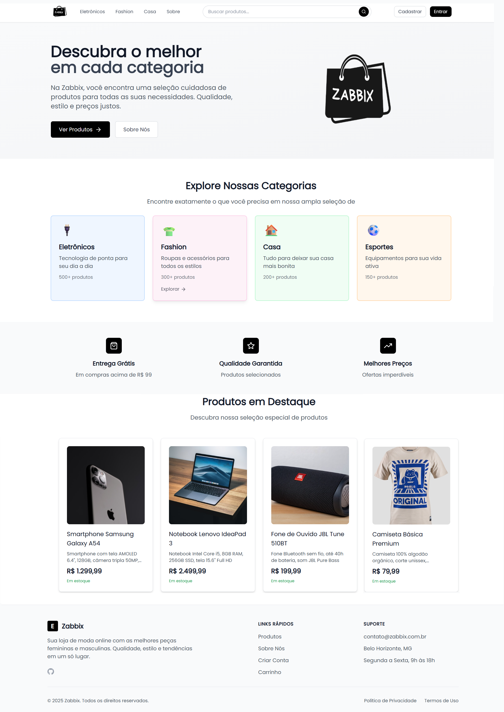
  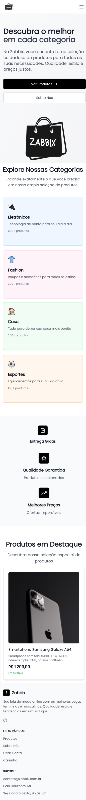

A tela inicial foi desenvolvida como o ponto de entrada principal da plataforma, oferecendo uma navegação moderna, intuitiva e organizada. Seu objetivo é destacar os principais produtos e categorias, facilitando o acesso rápido às áreas de interesse do usuário.

O layout é responsivo e funcional, adaptando-se perfeitamente a diferentes dispositivos. O menu fixo superior reúne as opções Início, Categorias, Cadastro, Carrinho e Perfil, garantindo fácil navegação.

Logo abaixo, um banner principal destaca produtos em evidência, seguido por seções organizadas por categoria, como Eletrônicos, Fashion e Esporte, apresentadas em cards visuais com imagem, nome, preço e botão de compra.

A página conta ainda com uma barra de busca centralizada, que agiliza a localização de produtos. O design adota cores sóbrias combinadas a tons de destaque para realçar elementos interativos, transmitindo profissionalismo e confiança.

Por fim, o rodapé reúne links institucionais, contatos e políticas da loja, reforçando a credibilidade e completando uma estrutura pensada para usabilidade e conversão.  

</details>

<details>
  <summary><strong>👤 Acesso do Usuário</strong></summary>

As telas protegidas da Zabbix Store foram desenvolvidas para garantir a segurança e privacidade dos usuários, permitindo o acesso apenas mediante autenticação. Essas páginas fazem parte do fluxo de controle de acesso da plataforma, assegurando que cada usuário possa gerenciar suas informações e atividades de forma segura e personalizada.

  <details>
    <summary><strong>📝 Cadastro</strong></summary>
    <p><code>Versão Web_Desktop e Web_Mobile</code></p>
    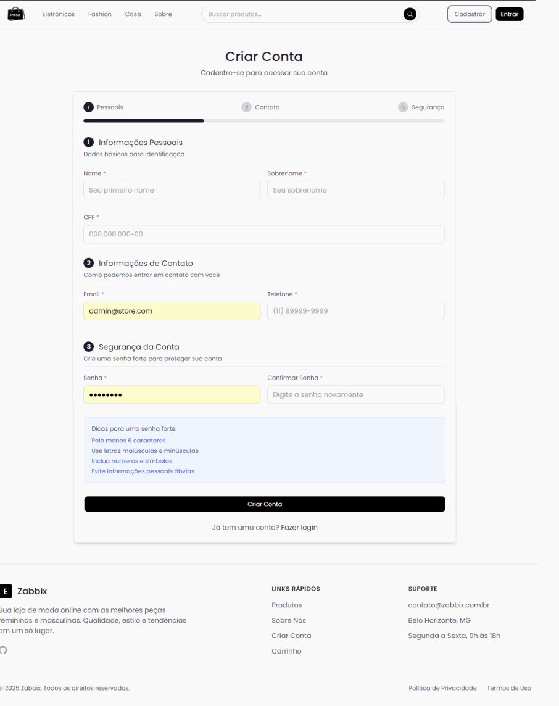
    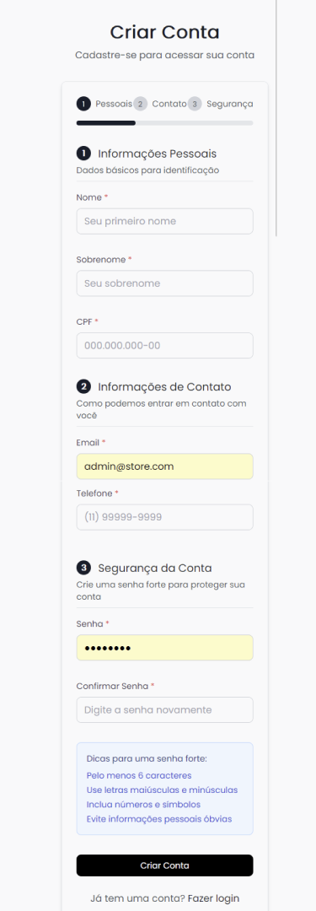

Na página de cadastro, o usuário pode criar uma nova conta informando dados básicos, como nome, e-mail e senha. O processo é direto e validado em tempo real, garantindo a integridade das informações inseridas.

  </details>

  <details>
    <summary><strong>🔑 Login</strong></summary>
    <p><code>Versão Web_Desktop e Web_Mobile</code></p>
    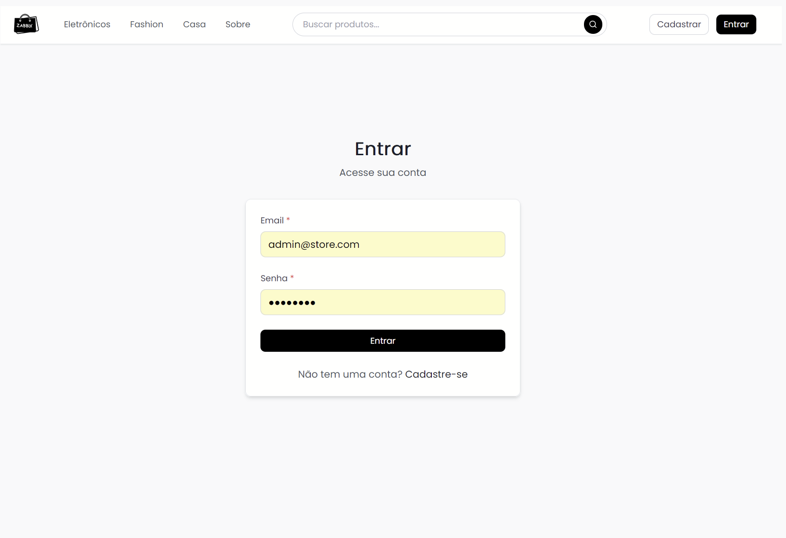
    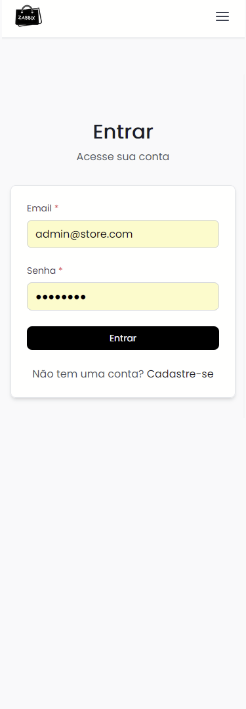

A página de login oferece uma interface simples e intuitiva, com campos para e-mail e senha. O design segue o padrão visual da plataforma, mantendo a coerência com o restante do site.
    
  </details>

  <details>
    <summary><strong>⚙️ Gerenciamento de conta</strong></summary>
    <p><code>Versão Web_Desktop e Web_Mobile</code></p>
    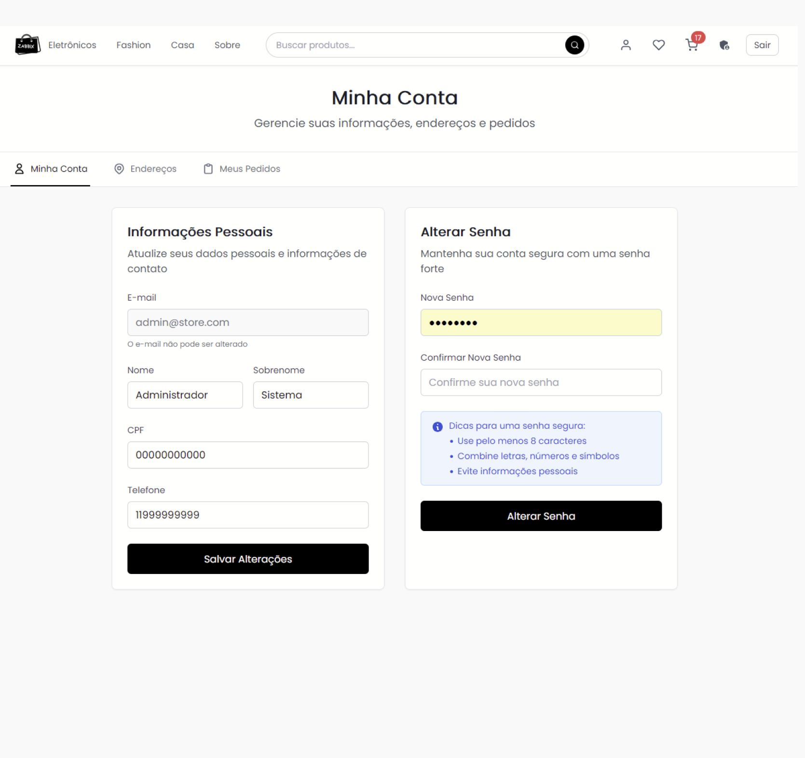
    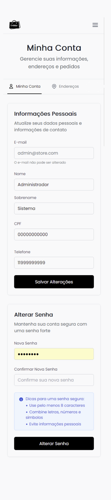

    Já o gerenciamento de conta permite que o usuário visualize e edite seus dados pessoais e gerencie endereços. Essa área é acessível apenas após o login, garantindo a proteção dos dados armazenados.

  </details>

</details>

<details>
  <summary><strong>🛍️ Compras</strong></summary>

  <details>
    <summary><strong>📦 Produtos</strong></summary>
    <p><code>Versão Web_Desktop e Web_Mobile</code></p>
    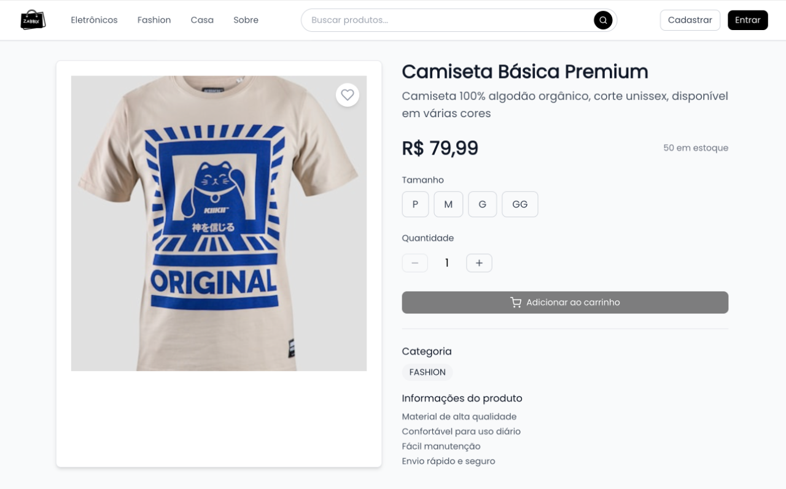
    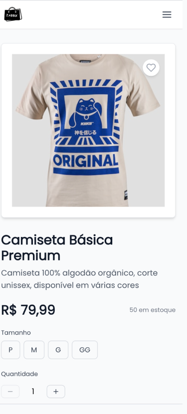

Os produtos são apresentados em uma listagem de itens disponíveis na plataforma, organizada por categorias e filtros de busca. Cada produto é exibido em um card visual, contendo imagem, nome, preço e botão de compra.
O usuário pode visualizar detalhes completos do item ao clicar no card, incluindo descrição, avaliações, estoque e informações técnicas.

  </details>

  <details>
    <summary><strong>❤️ Favoritos</strong></summary>
    <p><code>Versão Web_Desktop e Web_Mobile</code></p>
    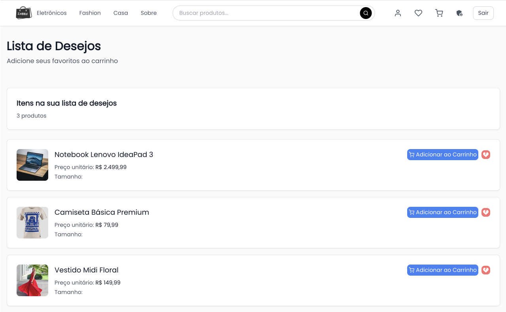
    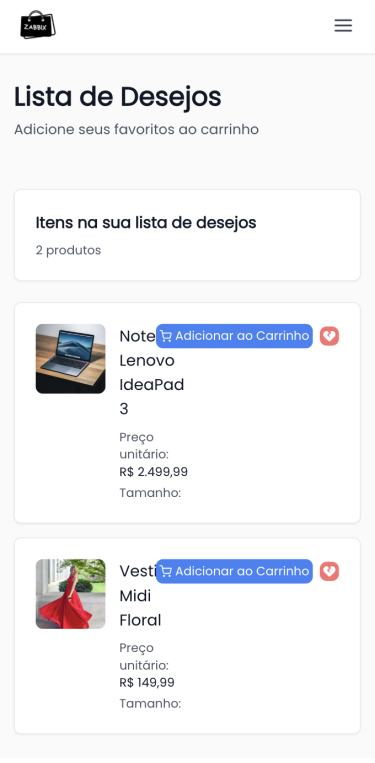

A página de favoritos permite que o usuário salve produtos de interesse para consultar ou comprar mais tarde.
Os itens marcados como favoritos aparecem organizados em uma lista visual semelhante à da página de produtos, exibindo imagem, nome, preço e atalhos para “Ver Detalhes” ou “Adicionar ao Carrinho”.

  </details>

  <details>
    <summary><strong>🛒 Carrinho</strong></summary>
    <p><code>Versão Web_Desktop e Web_Mobile</code></p>
    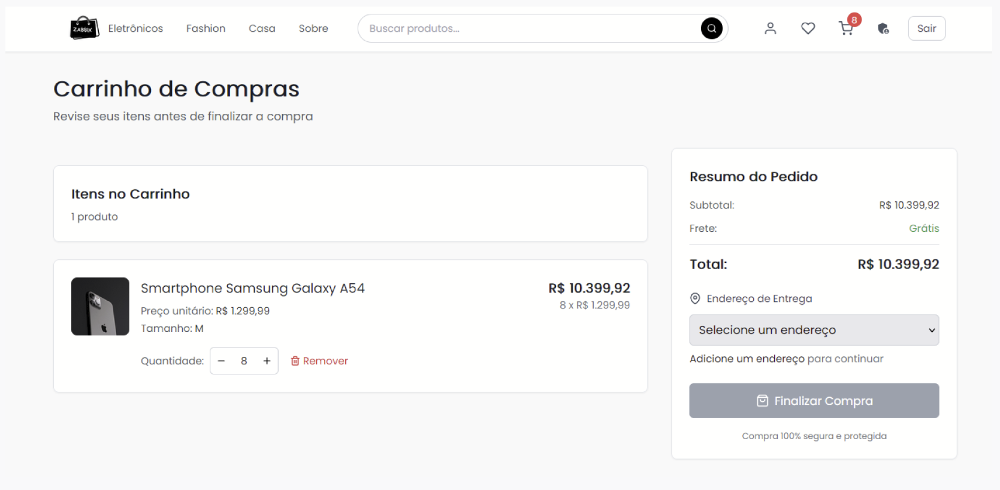
    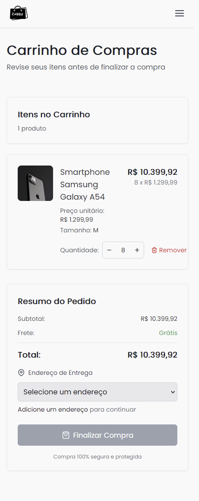

A página de carrinho reúne todos os produtos selecionados para compra. Cada item é apresentado com imagem, nome, preço unitário, quantidade e valor total.
O usuário pode alterar quantidades, remover itens ou seguir para o checkout, visualizando em tempo real o subtotal da compra.

  </details>

</details>

<details>
  <summary><strong>📊 Dashbord fornecedor</strong></summary>

O Dashboard contém  áreas restritas aos usuários fornecedores, permitindo o acompanhamento e controle das atividades comerciais dentro da plataforma.

  <details>
    <summary><strong>📈 Análise de Vendas</strong></summary>
    <p><code>Versão Web_Desktop e Web_Mobile</code></p>
    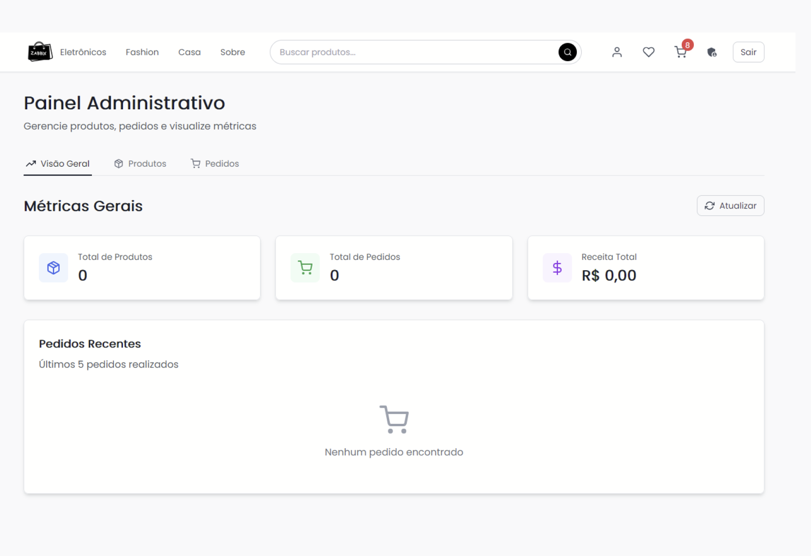
    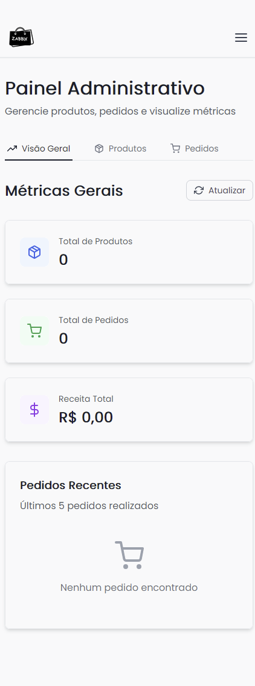

Na seção de Análise de Vendas, o fornecedor tem acesso a relatórios detalhados sobre pedidos, lucros, produtos mais vendidos e períodos de maior movimentação. As informações podem ser filtradas por data e categoria, auxiliando na tomada de decisões estratégicas.

  </details>

  <details>
    <summary><strong>📦 Gerenciamento e cadastro de produtos </strong></summary>
    <p><code>Versão Web_Desktop e Web_Mobile</code></p>
    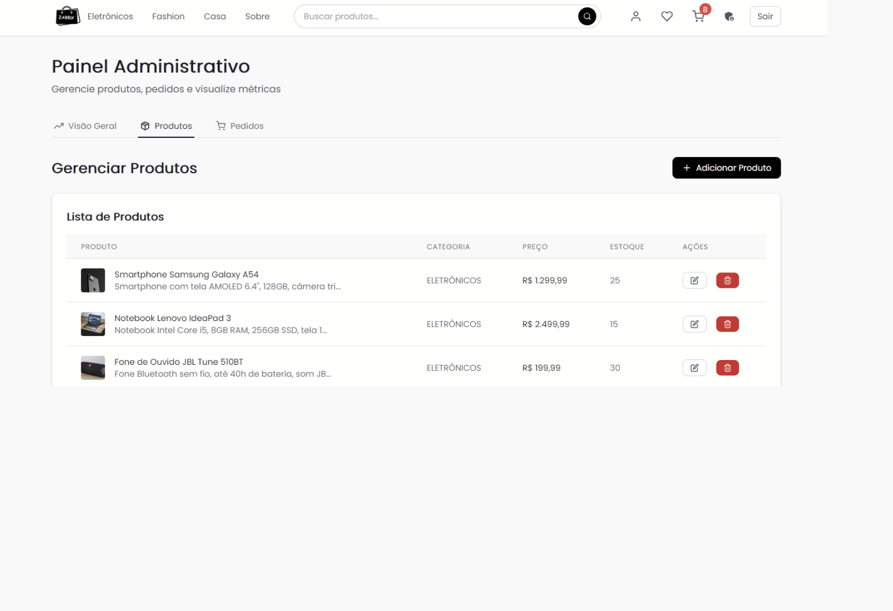
    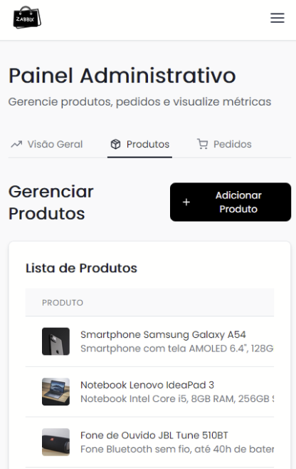

O Gerenciamento e cadastro de Produtos permite ao fornecedor inserir, editar ou remover itens da loja. É possível definir nome, descrição, categoria, preço, imagens e quantidade em estoque. Essa funcionalidade oferece controle total sobre o catálogo de produtos, garantindo que as informações exibidas aos clientes estejam sempre atualizadas.

  </details>

</details>

<details>
  <summary><strong>ℹ️ Sobre</strong></summary>

  <p><code>Versão Web_Desktop e Web_Mobile</code></p>

  
  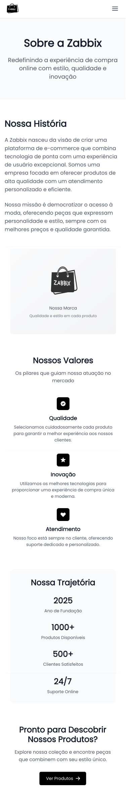

A página Sobre tem como objetivo apresentar a Zabbix Store, destacando sua proposta, valores e funcionalidades principais.
  
</details>

### Design Visual

#### Tipografia

O projeto adota uma combinação de fontes que equilibra modernidade, legibilidade e consistência visual em toda a interface. As famílias tipográficas foram selecionadas para oferecer contraste harmônico entre títulos, textos e elementos complementares.

**Poppins**
- Utilizada em títulos, cabeçalhos e elementos de destaque da interface.
- Transmite modernidade e clareza visual, reforçando a identidade do produto.

**Montserrat**
- Aplicada em textos secundários, descrições e blocos de conteúdo mais extensos.
- Oferece excelente leitura em tamanhos menores e complementa visualmente a Poppins.

**Inter**
- Definida como fonte de fallback, garantindo compatibilidade e legibilidade em sistemas que não suportem as fontes principais.

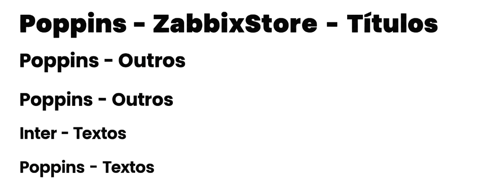

#### Paleta de Cores

A paleta de cores do ZabbixStore foi desenvolvida com base em um design minimalista e profissional, utilizando tons neutros com acentos em preto para criar contraste e hierarquia visual:

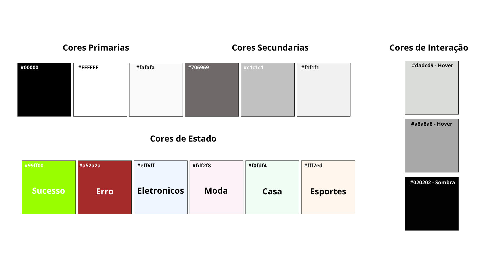

#### Elementos Gráficos

**Ícones:**

A iconografia abaixo foi desenvolvida para garantir uma comunicação visual clara e padronizada em todas as telas do sistema. Cada ícone possui um significado específico, facilitando a navegação e a compreensão das ações disponíveis para o usuário.

- Utilização de React Icons (Feather Icons) para consistência visual
- Ícones principais: FiShoppingBag, FiStar, FiTrendingUp, FiArrowRight
- Tamanho padrão: 24px (w-6 h-6) para ícones de interface

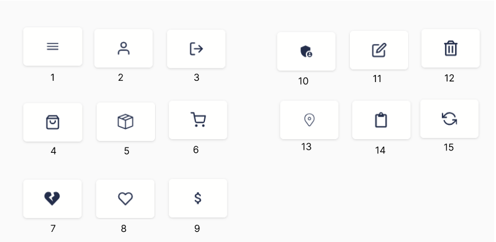

| Nº  | Significado               | Descrição                                                                 |
|-----|---------------------------|---------------------------------------------------------------------------|
| 1   | Menu                      | Abre o menu lateral de navegação.                                         |
| 2   | Perfil                    | Exibe as informações do usuário.                                          |
| 3   | Logout                    | Encerra a sessão.                                                         |
| 4   | Sacola de pedidos         | Permite visualizar os pedidos realizados ou em andamento.                 |
| 5   | Produto / Item            | Representa produtos, pacotes ou estoque.                                  |
| 6   | Carrinho                  | Adiciona ou visualiza itens no carrinho de compras.                       |
| 7   | Remover dos favoritos     | Retira um item da lista de favoritos.                                     |
| 8   | Favoritar                 | Adiciona um item aos favoritos.                                           |
| 9   | Receita                   | Indica valores do painel de controle da área financeira.                  |
| 10  | Painel administrativo     | Permite gerenciar produtos, pedidos e visualizar métricas.                |
| 11  | Editar                    | Permite alterar ou modificar um item.                                     |
| 12  | Excluir                   | Remove permanentemente um item.                                           |
| 13  | Localização               | Exibe o endereço e o endereço de entrega.                                 |
| 14  | Pedidos / Lista           | Mostra pedidos, tarefas ou histórico.                                     |
| 15  | Atualizar / Sincronizar   | Atualiza os dados ou sincroniza informações.                              | 

**Sombras e Efeitos:**
- Sombras suaves com rgba(0, 0, 0, 0.1) para cards de produtos
- Sombras mais pronunciadas (rgba(0, 0, 0, 0.2)) para formulários
- Transições suaves de 0.3s para todos os elementos interativos
- Efeitos de hover com mudança de escala (scale-105) e sombra

**Bordas e Cantos:**
- Border-radius padrão de 5px para botões e inputs
- Border-radius de 9px para formulários principais
- Bordas sólidas pretas (#000000) para inputs e elementos de foco

Esta decisões foram definidas para transmitir confiança, profissionalismo e modernidade, características essenciais para uma plataforma de e-commerce, mantendo a legibilidade e acessibilidade em todos os elementos da interface.


## Fluxo de Dados

## Fluxo de Dados da Aplicação

O fluxo de dados da ZabbixStore é baseado em uma arquitetura cliente-servidor, onde o frontend React consome APIs REST do backend NestJS, que por sua vez interage com o banco de dados PostgreSQL através do Prisma ORM.

### Arquitetura Geral

```
Frontend (React) ↔ Backend (NestJS) ↔ Banco de Dados (PostgreSQL)
     ↓                    ↓                    ↓
- Contextos React    - Controllers         - Prisma ORM
- Hooks customizados - Services           - Schema definido
- Componentes        - DTOs/Validação     - Migrations
- LocalStorage       - JWT Auth           - Relacionamentos
```

<details>
<summary><strong>🔝 Header</strong></summary>

**Descrição:** Cabeçalho fixo presente em todas as páginas da plataforma, proporcionando navegação consistente e acesso rápido às principais funcionalidades.

**Fluxo de Dados:**
- **Logo da Marca:** Imagem clicável que redireciona para página inicial
- **Menu de Navegação:** Links para principais seções (Home, Produtos, Categorias, Sobre)
- **Campo de Pesquisa:** Input para busca rápida de produtos com sugestões em tempo real
- **Ícone de Carrinho:** Mostra contador de itens adicionados e ao clicar abre carrinho de compras
- **Ícone de Perfil:** Ao clicar, exibe menu dropdown com opções (Login, Cadastro, Minha Conta, Sair)
- **Badge de Notificações:** Indicador visual de novos pedidos ou mensagens (se aplicável)

</details>

<details>
<summary><strong>🏠 Home</strong></summary>

**Descrição:** A página inicial serve como ponto de entrada principal da plataforma, apresentando produtos em destaque, categorias principais e banners promocionais.

**Fluxo de Dados:**
- **Barra de Navegação:** Contém links para página inicial, categorias, botão de carrinho com contador de itens e ícone de perfil do usuário
- **Banner Promocional:** Imagem em destaque no topo da página que exibe ofertas e promoções principais
- **Barra de Pesquisa:** Campo centralizado que permite buscar produtos por nome ou categoria
- **Produtos em Destaque:** Cards com imagem, nome, preço e botão "Adicionar ao Carrinho" que permite selecionar produtos rapidamente
- **Seção de Categorias:** Cards visuais com ícones representando diferentes categorias de produtos (Eletrônicos, Fashion, Esportes, etc.) que ao clicar redirecionam para listagem filtrada
- **Rodapé:** Links institucionais, contatos e políticas da loja

</details>

<details>
<summary><strong>🔐 Área de Login</strong></summary>

**Descrição:** Interface de autenticação onde usuários fazem login ou cadastro na plataforma.

**Fluxo de Dados:**
- **Formulário de Login:** Campos para inserir e-mail e senha com validação visual em tempo real
- **Botão "Entrar":** Ao clicar, valida os dados inseridos e autentica o usuário na plataforma
- **Link "Esqueci minha senha":** Permite recuperar acesso à conta esquecida
- **Botão "Cadastrar":** Redireciona para página de registro de novos usuários
- **Mensagens de Feedback:** Exibe mensagens de erro caso as credenciais estejam incorretas ou sucesso ao fazer login
- **Redirecionamento:** Após login bem-sucedido, o usuário é direcionado para a página inicial ou página que estava tentando acessar

</details>

<details>
<summary><strong>👤 Área Logada</strong></summary>

**Descrição:** Painel do usuário autenticado com acesso a funcionalidades personalizadas.

**Fluxo de Dados:**
- **Menu Lateral:** Painel com opções de navegação como Perfil, Pedidos, Favoritos, Endereços e Logout
- **Informações do Perfil:** Seção superior exibindo nome do usuário, e-mail e opção de editar dados pessoais
- **Botão "Editar Dados":** Permite modificar informações pessoais como nome, e-mail e telefone
- **Seção de Endereços:** Lista de endereços cadastrados com opção de adicionar novos ou editar existentes
- **Botão "Adicionar Endereço":** Abre formulário para cadastro de novo endereço de entrega
- **Botão "Sair":** Finaliza a sessão do usuário e retorna para página de login

</details>

<details>
<summary><strong>🛒 Carrinho de Compras</strong></summary>

**Descrição:** Interface para gerenciar produtos selecionados antes da finalização da compra.

**Fluxo de Dados:**
- **Lista de Produtos:** Cards exibindo imagem, nome, preço unitário e quantidade de cada item no carrinho
- **Botões de Quantidade:** Botões "+" e "-" para aumentar ou diminuir a quantidade de cada produto
- **Botão "Remover":** Ícone de lixeira em cada item que remove o produto do carrinho quando clicado
- **Resumo do Pedido:** Painel lateral mostrando subtotal, frete e valor total da compra
- **Botão "Finalizar Compra":** Direciona para página de checkout para concluir a compra
- **Botão "Continuar Comprando":** Retorna para página de produtos para adicionar mais itens

</details>

<details>
<summary><strong>📦 Produto Selecionado</strong></summary>

**Descrição:** Página de detalhes de um produto específico com informações completas.

**Fluxo de Dados:**
- **Galeria de Imagens:** Carrossel mostrando diferentes ângulos e imagens do produto com botões de navegação
- **Informações do Produto:** Nome, descrição detalhada, preço, estoque disponível e categoria
- **Botão "Adicionar ao Carrinho":** Permite incluir o produto no carrinho com a quantidade desejada
- **Seletor de Quantidade:** Campo numérico para definir quantas unidades do produto serão adicionadas
- **Botão "Favoritar":** Ícone de coração para salvar o produto na lista de favoritos
- **Seção de Avaliações:** Exibe comentários e avaliações de outros clientes sobre o produto
- **Produtos Relacionados:** Sugestão de itens similares no final da página

</details>

<details>
<summary><strong>❤️ Lista de Favoritos</strong></summary>

**Descrição:** Página onde usuários visualizam produtos marcados como favoritos.

**Fluxo de Dados:**
- **Lista de Produtos Favoritos:** Cards com imagem, nome, preço e avaliação de cada produto salvo
- **Botão "Remover dos Favoritos":** Ícone de coração preenchido que ao clicar remove o produto da lista
- **Botão "Adicionar ao Carrinho":** Adiciona o produto diretamente ao carrinho de compras
- **Botão "Ver Detalhes":** Redireciona para página de detalhes do produto
- **Mensagem de Lista Vazia:** Exibe mensagem quando não há produtos favoritados
- **Ordenação:** Opção de ordenar produtos por preço, nome ou data de adição aos favoritos

</details>

<details>
<summary><strong>📊 Painel Administrativo - Visão Geral</strong></summary>

**Descrição:** Dashboard principal para fornecedores com métricas e visão geral das vendas.

**Fluxo de Dados:**
- **Métricas Principais:** Cards exibindo receita total, número de vendas, produtos vendidos e ticket médio
- **Indicadores Visuais:** Uso de cores (verde para crescimento, vermelho para queda) para facilitar análise rápida

</details>

<details>
<summary><strong>📦 Painel Administrativo - Produtos</strong></summary>

**Descrição:** Interface para gerenciamento completo do catálogo de produtos.

**Fluxo de Dados:**
- **Lista de Produtos:** Tabela ou grid exibindo todos os produtos cadastrados com imagem, nome, preço, estoque e categoria
- **Botão "Adicionar Produto":** Abre formulário para cadastrar novo produto no catálogo
- **Botão "Editar":** Ícone de lápis em cada produto que abre formulário pré-preenchido para edição
- **Botão "Excluir":** Ícone de lixeira que remove o produto do catálogo após confirmação
- **Formulário de Produto:** Campos para nome, descrição, preço, categoria, quantidade em estoque e upload de imagens
- **Upload de Imagens:** Área de arrastar e soltar ou botão para selecionar múltiplas imagens do produto
- **Botão "Salvar":** Salva as alterações do produto e retorna para lista
- **Botão "Cancelar":** Descarta as alterações e volta para lista sem salvar

</details>

<details>
<summary><strong>ℹ️ Sobre</strong></summary>

**Descrição:** Página institucional apresentando informações sobre a ZabbixStore.

**Fluxo de Dados:**
- **Apresentação da Empresa:** Seção descrevendo a história e missão da ZabbixStore
- **Nossos Valores:** Cards destacando os principais valores da empresa
- **Equipe:** Apresentação dos membros do time e suas funções
- **Funcionalidades:** Lista das principais características e benefícios da plataforma
- **Contato:** Formulário para envio de mensagens e canais de comunicação (email, telefone, endereço)
- **Links Úteis:** Atalhos para áreas importantes da plataforma e recursos adicionais

</details>

## Diagramas Visuais do Fluxo de Dados

Para melhor compreensão dos fluxos de dados da aplicação, segue os diagramas visuais:

<details>
<summary><strong>🔝 Header</strong></summary>

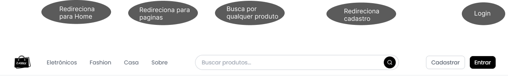

</details>

<details>
<summary><strong>🏠 Home</strong></summary>

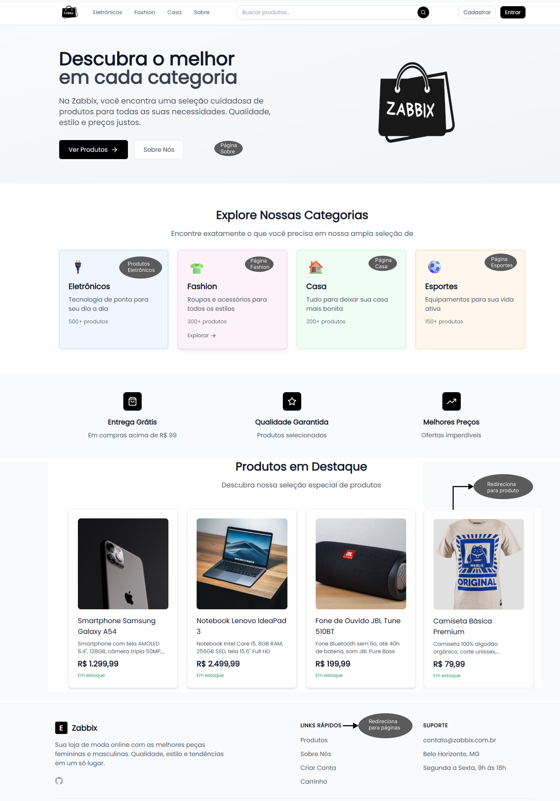

</details>

<details>
<summary><strong>🔐 Área de Login</strong></summary>

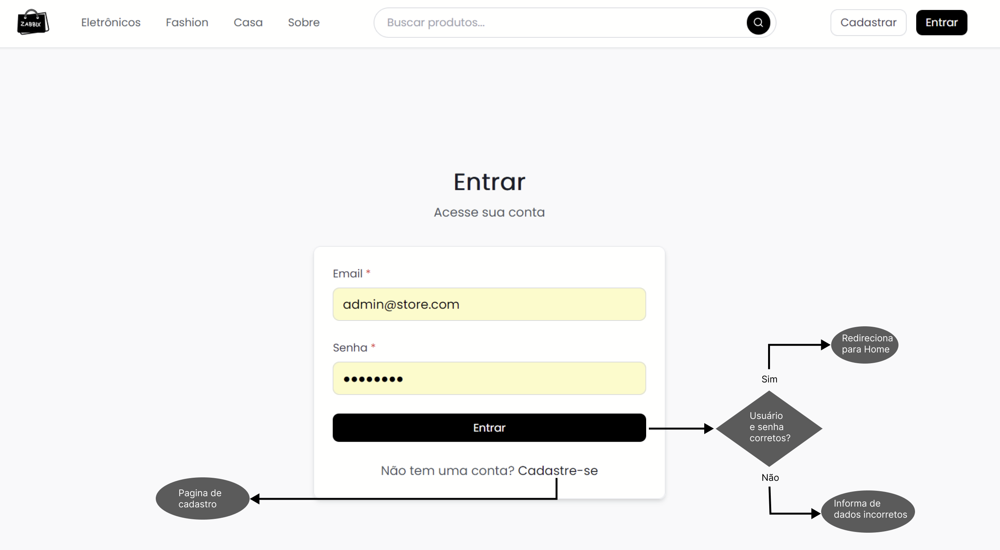

</details>

<details>
<summary><strong>👤 Área Logada</strong></summary>

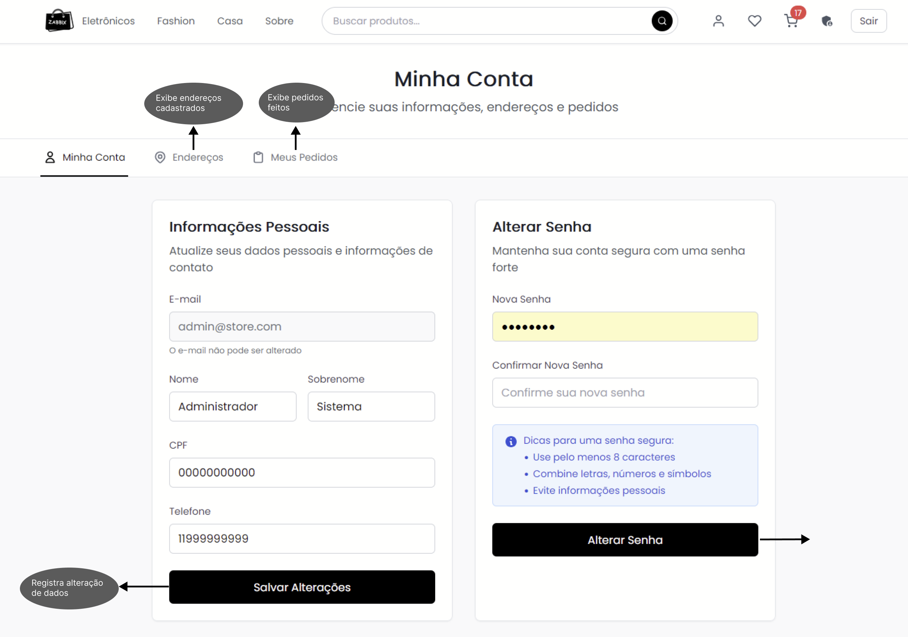

</details>

<details>
<summary><strong>🛒 Carrinho de Compras</strong></summary>

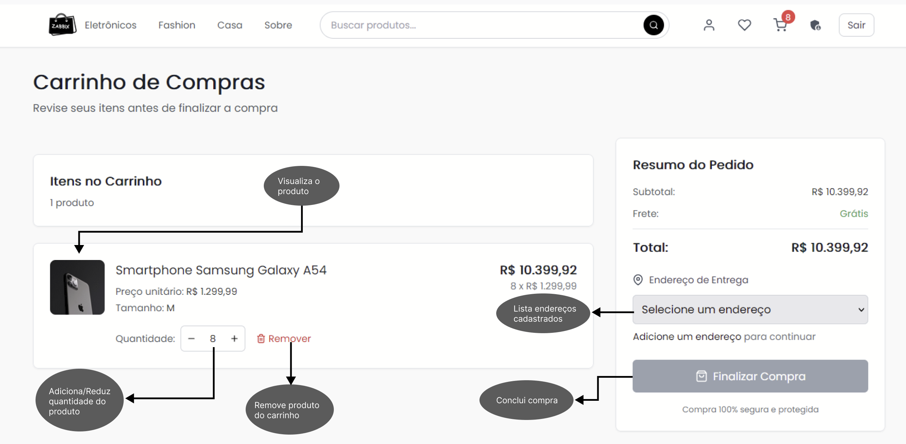

</details>

<details>
<summary><strong>📦 Produto Selecionado</strong></summary>

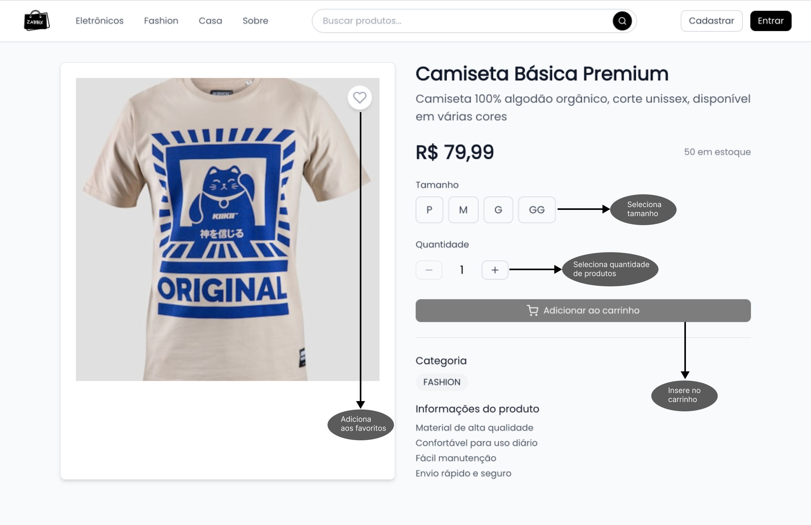

</details>

<details>
<summary><strong>❤️ Lista de Favoritos</strong></summary>

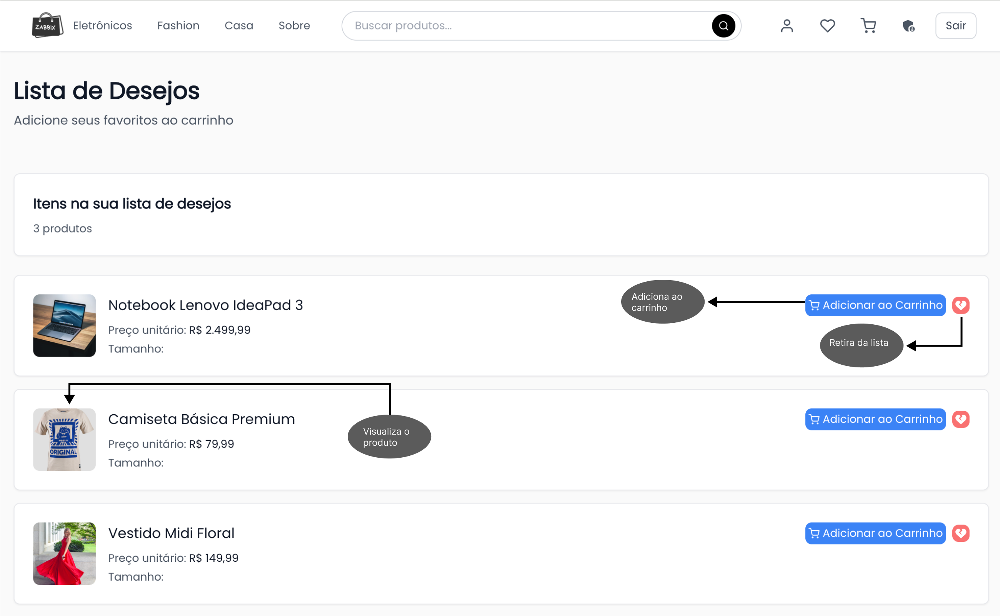

</details>

<details>
<summary><strong>📊 Painel Administrativo - Visão Geral</strong></summary>

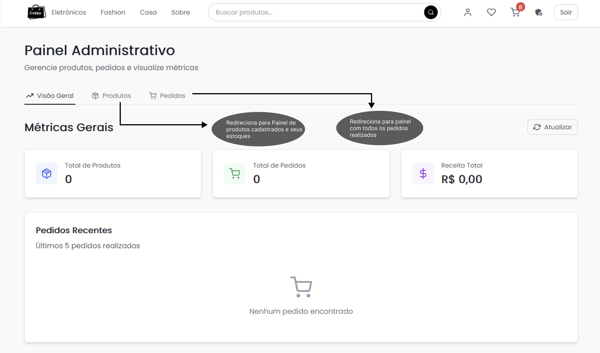

</details>

<details>
<summary><strong>📦 Painel Administrativo - Produtos</strong></summary>

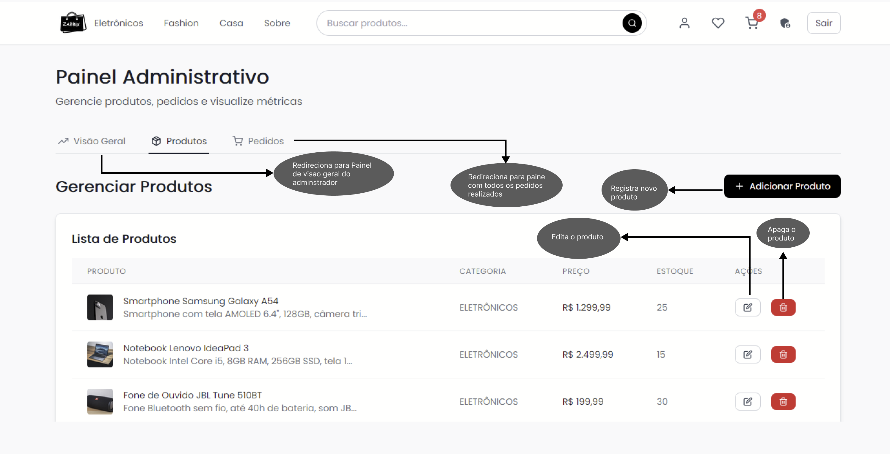

</details>

<details>
<summary><strong>ℹ️ Sobre</strong></summary>

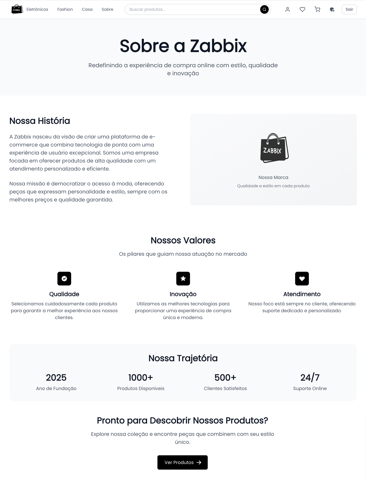

</details>

## Tecnologias Utilizadas
[Lista das tecnologias principais que serão utilizadas no projeto.]

## Considerações de Segurança

[Discuta as considerações de segurança relevantes para a aplicação distribuída, como autenticação, autorização, proteção contra ataques, etc.]

## Implantação

[Instruções para implantar a aplicação distribuída em um ambiente de produção.]

1. Defina os requisitos de hardware e software necessários para implantar a aplicação em um ambiente de produção.
2. Escolha uma plataforma de hospedagem adequada, como um provedor de nuvem ou um servidor dedicado.
3. Configure o ambiente de implantação, incluindo a instalação de dependências e configuração de variáveis de ambiente.
4. Faça o deploy da aplicação no ambiente escolhido, seguindo as instruções específicas da plataforma de hospedagem.
5. Realize testes para garantir que a aplicação esteja funcionando corretamente no ambiente de produção.

## Testes

[Descreva a estratégia de teste, incluindo os tipos de teste a serem realizados (unitários, integração, carga, etc.) e as ferramentas a serem utilizadas.]

1. Crie casos de teste para cobrir todos os requisitos funcionais e não funcionais da aplicação.
2. Implemente testes unitários para testar unidades individuais de código, como funções e classes.
3. Realize testes de integração para verificar a interação correta entre os componentes da aplicação.
4. Execute testes de carga para avaliar o desempenho da aplicação sob carga significativa.
5. Utilize ferramentas de teste adequadas, como frameworks de teste e ferramentas de automação de teste, para agilizar o processo de teste.

# Referências

Inclua todas as referências (livros, artigos, sites, etc) utilizados no desenvolvimento do trabalho.

# Planejamento

##  Quadro de tarefas

> Apresente a divisão de tarefas entre os membros do grupo e o acompanhamento da execução, conforme o exemplo abaixo.

### Etapa 3 

Atualizado em: 01/10/2025

| Responsável          | Tarefa/Requisito                             | Iniciado em    | Prazo      | Status | Terminado em    |
| :----                |    :----                                     |      :----:    | :----:     | :----: | :----:          |
| Jully                | Front-end Web - Documentação                 | 01/10/2025     | 10/10/2025 | ✔️     |  03/10/2025     |
| Vinicius/Jully       | Projeto da Interface Web                     | 01/10/2025     | 20/10/2025 | ✔️     |   10/10/2025    |
| Jully                | Wireframes                                   | 01/10/2025     | 20/10/2025 | ✔️     |   10/10/2025    |
| Vinicius             | Design Visual                                | 01/10/2025     | 20/10/2025 | ✔️     |   10/10/2025    |
| Lucas / Italo        | Fluxo de Dados                               | 01/01/2024     | 20/10/2025 | 📝    |                 |
| Victor               | Tecnologias Utilizadas                       | 01/01/2024     | 20/10/2025 | 📝    |                 |
| Lucas                | Considerações de Segurança                   | 01/01/2024     | 20/10/2025 | 📝    |                 |
| Pedro                | Implantação                                  | 01/10/2025     | 26/10/2025 | 📝    |                 |
| Jully                | Implantação Page - Home                      | 01/10/2025     | 26/10/2025 | 📝    |                 |
| Lucas                | Implantação Page - Cadastro de usuarios      | 01/10/2025     | 26/10/2025 | 📝    |                 |
| Italo                | Implantação Page - Cadastro de produtos      | 01/10/2025     | 26/10/2025 | 📝    |                 |
| Pedro                | Implantação Page - Produtos                  | 01/10/2025     | 26/10/2025 | 📝    |                 |
| Victor               | Implantação Page - Carrinho                  | 01/10/2025     | 26/10/2025 | 📝    |                 |
| Vinicius             | Implantação Page - Favoritos                 | 01/10/2025     | 26/10/2025 | 📝    |                 |
| Pedro                | Implantação Page - Sobre nos                 | 01/10/2025     | 26/10/2025 | 📝    |                 |
| Italo                | Testes                                       | 27/10/2025     | 01/11/2025 | ❌    |                 |
| Jully                | Apresentação 3 Etapa                         | 27/10/2025     | 01/11/2025 | ❌    |                 |


Legenda:
- ✔️: terminado
- 📝: em execução
- ⌛: atrasado
- ❌: não iniciado

