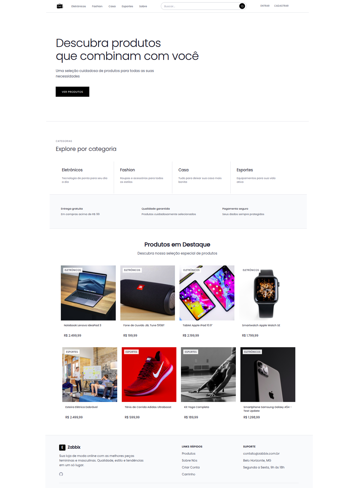
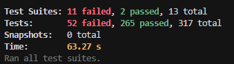

# Front-end Web

O **Zabbix Store** tem como objetivo oferecer uma **plataforma de e-commerce**, onde vendedores possam disponibilizar seus produtos e clientes possam pesquisar, comparar e realizar compras de maneira simples e rápida.  

- **Facilitar a jornada do usuário**: desde a busca por produtos até o checkout.  
- **Garantir usabilidade** em diferentes dispositivos (desktop, tablet, mobile).  
- **Fornecer segurança** em todo o fluxo de navegação e compra.
- **Disponibilizar análise de vendas para fornecedores**, auxiliando no acompanhamento de desempenho e estratégias comerciais. 

## Projeto da Interface Web

A interface web da Zabbix Store será desenvolvida com foco em usabilidade, consistência visual e experiência de compra fluida, garantindo que clientes e fornecedores realizem suas tarefas de forma intuitiva e segura.


### Design Visual
- Layout moderno e clean, priorizando **clareza e hierarquia visual**.  
- Paleta de cores neutras com acentos para **destaques, estados e categorias**, transmitindo profissionalismo e confiança.  
- Tipografia moderna: **Poppins** para títulos e elementos de destaque, **Montserrat** e **Inter** para textos complementares e descrições.  
- Ícones padronizados (React Icons / Feather Icons) e componentes consistentes para facilitar a navegação.  
- Sombras suaves, bordas arredondadas e transições de hover para melhorar percepção de interatividade.


### Layout das Páginas
- **Página Inicial (Home):** banners promocionais, produtos em destaque, categorias e atalhos para seções principais.  
- **Página de Categoria / Catálogo:** listagem de produtos com filtros por preço, avaliação, categorias e ordenação dinâmica.  
- **Página de Produto:** informações detalhadas, imagens em cards, preço, avaliações, descrições e botão de ação “Adicionar ao Carrinho”.  
- **Carrinho e Checkout:** exibição organizada dos produtos selecionados, possibilidade de alterar quantidades ou remover itens, e finalização da compra de forma simples e intuitiva.
- **Painel do Usuário (Cliente):** histórico de pedidos, favoritos e configurações de perfil.  
- **Painel do Fornecedor:** cadastro e gerenciamento de produtos, controle de estoque e relatórios de vendas.


### Interações do Usuário
- Barra de navegação intuitiva, breadcrumbs e menus claros para fácil localização.  
- Pesquisa dinâmica com **autocompletar**.  
- Filtros e ordenações **dinâmicos**, atualizando produtos sem recarregar a página.  
- Feedbacks visuais: notificações, loaders, mensagens de sucesso e alerta.  
- Carrinho persistente, mantendo produtos adicionados mesmo após logout.


### Outros Aspectos Relevantes
- **Design responsivo**, compatível com desktop, tablet e mobile.  
- Integração com APIs do backend para exibição de dados e atualização de estoque em tempo real.  
- **Segurança** no tratamento de informações do usuário e autenticação.  
- Elementos de UI/UX que promovem **fluidez na jornada de compra**, desde a busca até o checkout.


### Wireframes

<details>
  <summary><strong>🏠 Home</strong></summary>

  <p><code>Versão Web_Desktop e Web_Mobile</code></p>

  
  

A tela inicial foi desenvolvida como o ponto de entrada principal da plataforma, oferecendo uma navegação moderna, intuitiva e organizada. Seu objetivo é destacar os principais produtos e categorias, facilitando o acesso rápido às áreas de interesse do usuário.

O layout é responsivo e funcional, adaptando-se perfeitamente a diferentes dispositivos. O menu fixo superior reúne as opções Início, Categorias, Cadastro, Carrinho e Perfil, garantindo fácil navegação.

Logo abaixo, um banner principal destaca produtos em evidência, seguido por seções organizadas por categoria, como Eletrônicos, Fashion e Esporte, apresentadas em cards visuais com imagem, nome, preço e botão de compra.

A página conta ainda com uma barra de busca centralizada, que agiliza a localização de produtos. O design adota cores sóbrias combinadas a tons de destaque para realçar elementos interativos, transmitindo profissionalismo e confiança.

Por fim, o rodapé reúne links institucionais, contatos e políticas da loja, reforçando a credibilidade e completando uma estrutura pensada para usabilidade e conversão.  

</details>

<details>
  <summary><strong>👤 Acesso do Usuário</strong></summary>

As telas protegidas da Zabbix Store foram desenvolvidas para garantir a segurança e privacidade dos usuários, permitindo o acesso apenas mediante autenticação. Essas páginas fazem parte do fluxo de controle de acesso da plataforma, assegurando que cada usuário possa gerenciar suas informações e atividades de forma segura e personalizada.

  <details>
    <summary><strong>📝 Cadastro</strong></summary>
    <p><code>Versão Web_Desktop e Web_Mobile</code></p>
    
    

Na página de cadastro, o usuário pode criar uma nova conta informando dados básicos, como nome, e-mail e senha. O processo é direto e validado em tempo real, garantindo a integridade das informações inseridas.

  </details>

  <details>
    <summary><strong>🔑 Login</strong></summary>
    <p><code>Versão Web_Desktop e Web_Mobile</code></p>
    
    

A página de login oferece uma interface simples e intuitiva, com campos para e-mail e senha. O design segue o padrão visual da plataforma, mantendo a coerência com o restante do site.
    
  </details>

  <details>
    <summary><strong>⚙️ Gerenciamento de conta</strong></summary>
    <p><code>Versão Web_Desktop e Web_Mobile</code></p>
    
    

    Já o gerenciamento de conta permite que o usuário visualize e edite seus dados pessoais e gerencie endereços. Essa área é acessível apenas após o login, garantindo a proteção dos dados armazenados.

  </details>

</details>

<details>
  <summary><strong>🛍️ Compras</strong></summary>

  <details>
    <summary><strong>📦 Produtos</strong></summary>
    <p><code>Versão Web_Desktop e Web_Mobile</code></p>
    
    

Os produtos são apresentados em uma listagem de itens disponíveis na plataforma, organizada por categorias e filtros de busca. Cada produto é exibido em um card visual, contendo imagem, nome, preço e botão de compra.
O usuário pode visualizar detalhes completos do item ao clicar no card, incluindo descrição, avaliações, estoque e informações técnicas.

  </details>

  <details>
    <summary><strong>❤️ Favoritos</strong></summary>
    <p><code>Versão Web_Desktop e Web_Mobile</code></p>
    
    

A página de favoritos permite que o usuário salve produtos de interesse para consultar ou comprar mais tarde.
Os itens marcados como favoritos aparecem organizados em uma lista visual semelhante à da página de produtos, exibindo imagem, nome, preço e atalhos para “Ver Detalhes” ou “Adicionar ao Carrinho”.

  </details>

  <details>
    <summary><strong>🛒 Carrinho</strong></summary>
    <p><code>Versão Web_Desktop e Web_Mobile</code></p>
    
    

A página de carrinho reúne todos os produtos selecionados para compra. Cada item é apresentado com imagem, nome, preço unitário, quantidade e valor total.
O usuário pode alterar quantidades, remover itens ou seguir para o checkout, visualizando em tempo real o subtotal da compra.

  </details>

</details>

<details>
  <summary><strong>📊 Dashbord fornecedor</strong></summary>

O Dashboard contém  áreas restritas aos usuários fornecedores, permitindo o acompanhamento e controle das atividades comerciais dentro da plataforma.

  <details>
    <summary><strong>📈 Análise de Vendas</strong></summary>
    <p><code>Versão Web_Desktop e Web_Mobile</code></p>
    
    

Na seção de Análise de Vendas, o fornecedor tem acesso a relatórios detalhados sobre pedidos, lucros, produtos mais vendidos e períodos de maior movimentação. As informações podem ser filtradas por data e categoria, auxiliando na tomada de decisões estratégicas.

  </details>

  <details>
    <summary><strong>📦 Gerenciamento e cadastro de produtos </strong></summary>
    <p><code>Versão Web_Desktop e Web_Mobile</code></p>
    
    

O Gerenciamento e cadastro de Produtos permite ao fornecedor inserir, editar ou remover itens da loja. É possível definir nome, descrição, categoria, preço, imagens e quantidade em estoque. Essa funcionalidade oferece controle total sobre o catálogo de produtos, garantindo que as informações exibidas aos clientes estejam sempre atualizadas.

  </details>

</details>

<details>
  <summary><strong>ℹ️ Sobre</strong></summary>

  <p><code>Versão Web_Desktop e Web_Mobile</code></p>

  
  

A página Sobre tem como objetivo apresentar a Zabbix Store, destacando sua proposta, valores e funcionalidades principais.
  
</details>

### Design Visual

#### Tipografia

O projeto adota uma combinação de fontes que equilibra modernidade, legibilidade e consistência visual em toda a interface. As famílias tipográficas foram selecionadas para oferecer contraste harmônico entre títulos, textos e elementos complementares.

**Poppins**
- Utilizada em títulos, cabeçalhos e elementos de destaque da interface.
- Transmite modernidade e clareza visual, reforçando a identidade do produto.

**Montserrat**
- Aplicada em textos secundários, descrições e blocos de conteúdo mais extensos.
- Oferece excelente leitura em tamanhos menores e complementa visualmente a Poppins.

**Inter**
- Definida como fonte de fallback, garantindo compatibilidade e legibilidade em sistemas que não suportem as fontes principais.


#### Paleta de Cores

A paleta de cores do ZabbixStore foi desenvolvida com base em um design minimalista e profissional, utilizando tons neutros com acentos em preto para criar contraste e hierarquia visual:


#### Elementos Gráficos

**Ícones:**

A iconografia abaixo foi desenvolvida para garantir uma comunicação visual clara e padronizada em todas as telas do sistema. Cada ícone possui um significado específico, facilitando a navegação e a compreensão das ações disponíveis para o usuário.

- Utilização de React Icons (Feather Icons) para consistência visual
- Ícones principais: FiShoppingBag, FiStar, FiTrendingUp, FiArrowRight
- Tamanho padrão: 24px (w-6 h-6) para ícones de interface


| Nº  | Significado               | Descrição                                                                 |
|-----|---------------------------|---------------------------------------------------------------------------|
| 1   | Menu                      | Abre o menu lateral de navegação.                                         |
| 2   | Perfil                    | Exibe as informações do usuário.                                          |
| 3   | Logout                    | Encerra a sessão.                                                         |
| 4   | Sacola de pedidos         | Permite visualizar os pedidos realizados ou em andamento.                 |
| 5   | Produto / Item            | Representa produtos, pacotes ou estoque.                                  |
| 6   | Carrinho                  | Adiciona ou visualiza itens no carrinho de compras.                       |
| 7   | Remover dos favoritos     | Retira um item da lista de favoritos.                                     |
| 8   | Favoritar                 | Adiciona um item aos favoritos.                                           |
| 9   | Receita                   | Indica valores do painel de controle da área financeira.                  |
| 10  | Painel administrativo     | Permite gerenciar produtos, pedidos e visualizar métricas.                |
| 11  | Editar                    | Permite alterar ou modificar um item.                                     |
| 12  | Excluir                   | Remove permanentemente um item.                                           |
| 13  | Localização               | Exibe o endereço e o endereço de entrega.                                 |
| 14  | Pedidos / Lista           | Mostra pedidos, tarefas ou histórico.                                     |
| 15  | Atualizar / Sincronizar   | Atualiza os dados ou sincroniza informações.                              | 

**Sombras e Efeitos:**
- Sombras suaves com rgba(0, 0, 0, 0.1) para cards de produtos
- Sombras mais pronunciadas (rgba(0, 0, 0, 0.2)) para formulários
- Transições suaves de 0.3s para todos os elementos interativos
- Efeitos de hover com mudança de escala (scale-105) e sombra

**Bordas e Cantos:**
- Border-radius padrão de 5px para botões e inputs
- Border-radius de 9px para formulários principais
- Bordas sólidas pretas (#000000) para inputs e elementos de foco

Esta decisões foram definidas para transmitir confiança, profissionalismo e modernidade, características essenciais para uma plataforma de e-commerce, mantendo a legibilidade e acessibilidade em todos os elementos da interface.


## Fluxo de Dados

## Fluxo de Dados da Aplicação

O fluxo de dados da ZabbixStore é baseado em uma arquitetura cliente-servidor, onde o frontend React consome APIs REST do backend NestJS, que por sua vez interage com o banco de dados PostgreSQL através do Prisma ORM.

### Arquitetura Geral

```
Frontend (React) ↔ Backend (NestJS) ↔ Banco de Dados (PostgreSQL)
     ↓                    ↓                    ↓
- Contextos React    - Controllers         - Prisma ORM
- Hooks customizados - Services           - Schema definido
- Componentes        - DTOs/Validação     - Migrations
- LocalStorage       - JWT Auth           - Relacionamentos
```

<details>
<summary><strong>🔝 Header</strong></summary>

**Descrição:** Cabeçalho fixo presente em todas as páginas da plataforma, proporcionando navegação consistente e acesso rápido às principais funcionalidades.

**Fluxo de Dados:**
- **Logo da Marca:** Imagem clicável que redireciona para página inicial
- **Menu de Navegação:** Links para principais seções (Home, Produtos, Categorias, Sobre)
- **Campo de Pesquisa:** Input para busca rápida de produtos com sugestões em tempo real
- **Ícone de Carrinho:** Mostra contador de itens adicionados e ao clicar abre carrinho de compras
- **Ícone de Perfil:** Ao clicar, exibe menu dropdown com opções (Login, Cadastro, Minha Conta, Sair)
- **Badge de Notificações:** Indicador visual de novos pedidos ou mensagens (se aplicável)

</details>

<details>
<summary><strong>🏠 Home</strong></summary>

**Descrição:** A página inicial serve como ponto de entrada principal da plataforma, apresentando produtos em destaque, categorias principais e banners promocionais.

**Fluxo de Dados:**
- **Barra de Navegação:** Contém links para página inicial, categorias, botão de carrinho com contador de itens e ícone de perfil do usuário
- **Banner Promocional:** Imagem em destaque no topo da página que exibe ofertas e promoções principais
- **Barra de Pesquisa:** Campo centralizado que permite buscar produtos por nome ou categoria
- **Produtos em Destaque:** Cards com imagem, nome, preço e botão "Adicionar ao Carrinho" que permite selecionar produtos rapidamente
- **Seção de Categorias:** Cards visuais com ícones representando diferentes categorias de produtos (Eletrônicos, Fashion, Esportes, etc.) que ao clicar redirecionam para listagem filtrada
- **Rodapé:** Links institucionais, contatos e políticas da loja

</details>

<details>
<summary><strong>🔐 Área de Login</strong></summary>

**Descrição:** Interface de autenticação onde usuários fazem login ou cadastro na plataforma.

**Fluxo de Dados:**
- **Formulário de Login:** Campos para inserir e-mail e senha com validação visual em tempo real
- **Botão "Entrar":** Ao clicar, valida os dados inseridos e autentica o usuário na plataforma
- **Link "Esqueci minha senha":** Permite recuperar acesso à conta esquecida
- **Botão "Cadastrar":** Redireciona para página de registro de novos usuários
- **Mensagens de Feedback:** Exibe mensagens de erro caso as credenciais estejam incorretas ou sucesso ao fazer login
- **Redirecionamento:** Após login bem-sucedido, o usuário é direcionado para a página inicial ou página que estava tentando acessar

</details>

<details>
<summary><strong>👤 Área Logada</strong></summary>

**Descrição:** Painel do usuário autenticado com acesso a funcionalidades personalizadas.

**Fluxo de Dados:**
- **Menu Lateral:** Painel com opções de navegação como Perfil, Pedidos, Favoritos, Endereços e Logout
- **Informações do Perfil:** Seção superior exibindo nome do usuário, e-mail e opção de editar dados pessoais
- **Botão "Editar Dados":** Permite modificar informações pessoais como nome, e-mail e telefone
- **Seção de Endereços:** Lista de endereços cadastrados com opção de adicionar novos ou editar existentes
- **Botão "Adicionar Endereço":** Abre formulário para cadastro de novo endereço de entrega
- **Botão "Sair":** Finaliza a sessão do usuário e retorna para página de login

</details>

<details>
<summary><strong>🛒 Carrinho de Compras</strong></summary>

**Descrição:** Interface para gerenciar produtos selecionados antes da finalização da compra.

**Fluxo de Dados:**
- **Lista de Produtos:** Cards exibindo imagem, nome, preço unitário e quantidade de cada item no carrinho
- **Botões de Quantidade:** Botões "+" e "-" para aumentar ou diminuir a quantidade de cada produto
- **Botão "Remover":** Ícone de lixeira em cada item que remove o produto do carrinho quando clicado
- **Resumo do Pedido:** Painel lateral mostrando subtotal, frete e valor total da compra
- **Botão "Finalizar Compra":** Direciona para página de checkout para concluir a compra
- **Botão "Continuar Comprando":** Retorna para página de produtos para adicionar mais itens

</details>

<details>
<summary><strong>📦 Produto Selecionado</strong></summary>

**Descrição:** Página de detalhes de um produto específico com informações completas.

**Fluxo de Dados:**
- **Galeria de Imagens:** Carrossel mostrando diferentes ângulos e imagens do produto com botões de navegação
- **Informações do Produto:** Nome, descrição detalhada, preço, estoque disponível e categoria
- **Botão "Adicionar ao Carrinho":** Permite incluir o produto no carrinho com a quantidade desejada
- **Seletor de Quantidade:** Campo numérico para definir quantas unidades do produto serão adicionadas
- **Botão "Favoritar":** Ícone de coração para salvar o produto na lista de favoritos
- **Seção de Avaliações:** Exibe comentários e avaliações de outros clientes sobre o produto
- **Produtos Relacionados:** Sugestão de itens similares no final da página

</details>

<details>
<summary><strong>❤️ Lista de Favoritos</strong></summary>

**Descrição:** Página onde usuários visualizam produtos marcados como favoritos.

**Fluxo de Dados:**
- **Lista de Produtos Favoritos:** Cards com imagem, nome, preço e avaliação de cada produto salvo
- **Botão "Remover dos Favoritos":** Ícone de coração preenchido que ao clicar remove o produto da lista
- **Botão "Adicionar ao Carrinho":** Adiciona o produto diretamente ao carrinho de compras
- **Botão "Ver Detalhes":** Redireciona para página de detalhes do produto
- **Mensagem de Lista Vazia:** Exibe mensagem quando não há produtos favoritados
- **Ordenação:** Opção de ordenar produtos por preço, nome ou data de adição aos favoritos

</details>

<details>
<summary><strong>📊 Painel Administrativo - Visão Geral</strong></summary>

**Descrição:** Dashboard principal para fornecedores com métricas e visão geral das vendas.

**Fluxo de Dados:**
- **Métricas Principais:** Cards exibindo receita total, número de vendas, produtos vendidos e ticket médio
- **Indicadores Visuais:** Uso de cores (verde para crescimento, vermelho para queda) para facilitar análise rápida

</details>

<details>
<summary><strong>📦 Painel Administrativo - Produtos</strong></summary>

**Descrição:** Interface para gerenciamento completo do catálogo de produtos.

**Fluxo de Dados:**
- **Lista de Produtos:** Tabela ou grid exibindo todos os produtos cadastrados com imagem, nome, preço, estoque e categoria
- **Botão "Adicionar Produto":** Abre formulário para cadastrar novo produto no catálogo
- **Botão "Editar":** Ícone de lápis em cada produto que abre formulário pré-preenchido para edição
- **Botão "Excluir":** Ícone de lixeira que remove o produto do catálogo após confirmação
- **Formulário de Produto:** Campos para nome, descrição, preço, categoria, quantidade em estoque e upload de imagens
- **Upload de Imagens:** Área de arrastar e soltar ou botão para selecionar múltiplas imagens do produto
- **Botão "Salvar":** Salva as alterações do produto e retorna para lista
- **Botão "Cancelar":** Descarta as alterações e volta para lista sem salvar

</details>

<details>
<summary><strong>ℹ️ Sobre</strong></summary>

**Descrição:** Página institucional apresentando informações sobre a ZabbixStore.

**Fluxo de Dados:**
- **Apresentação da Empresa:** Seção descrevendo a história e missão da ZabbixStore
- **Nossos Valores:** Cards destacando os principais valores da empresa
- **Equipe:** Apresentação dos membros do time e suas funções
- **Funcionalidades:** Lista das principais características e benefícios da plataforma
- **Contato:** Formulário para envio de mensagens e canais de comunicação (email, telefone, endereço)
- **Links Úteis:** Atalhos para áreas importantes da plataforma e recursos adicionais

</details>

## Diagramas Visuais do Fluxo de Dados

Para melhor compreensão dos fluxos de dados da aplicação, segue os diagramas visuais:

<details>
<summary><strong>🔝 Header</strong></summary>


</details>

<details>
<summary><strong>🏠 Home</strong></summary>


</details>

<details>
<summary><strong>🔐 Área de Login</strong></summary>


</details>

<details>
<summary><strong>👤 Área Logada</strong></summary>


</details>

<details>
<summary><strong>🛒 Carrinho de Compras</strong></summary>


</details>

<details>
<summary><strong>📦 Produto Selecionado</strong></summary>


</details>

<details>
<summary><strong>❤️ Lista de Favoritos</strong></summary>


</details>

<details>
<summary><strong>📊 Painel Administrativo - Visão Geral</strong></summary>


</details>

<details>
<summary><strong>📦 Painel Administrativo - Produtos</strong></summary>


</details>

<details>
<summary><strong>ℹ️ Sobre</strong></summary>


</details>

## Tecnologias Utilizadas

A aplicação foi desenvolvida utilizando um conjunto de tecnologias modernas, visando desempenho, escalabilidade e uma ótima experiência do usuário:

Frontend

- **Figma** — Utilizado para modelagem dos wireframes, prototipação visual e definição da interface da aplicação.
- **React** — Biblioteca utilizada para construção da interface web e criação de componentes reutilizáveis.
- **Vite** — Ferramenta de build rápida, oferecendo tempo de desenvolvimento reduzido e otimizações para produção.
- **TypeScript** — Linguagem com tipagem estática, garantindo mais segurança, previsibilidade e manutenção no código.
- **Tailwind CSS** — Framework CSS utilitário que possibilita estilização rápida, responsiva e consistente.
- **Axios / Fetch API** — Camada de comunicação com o backend, responsável pelo consumo das APIs REST, autenticação e envio de dados.
- **Cypress / Testing Library** — Ferramentas utilizadas para testes de interface e integração, garantindo qualidade e estabilidade da aplicação.


## Considerações de Segurança

Como se trata de uma aplicação distribuída, foram implementadas práticas essenciais de segurança para proteger dados e usuários:

- **Autenticação via JWT** com tokens assíncronos e tempo de expiração definido.
- **Autorização baseada em perfis** (cliente, fornecedor, administrador).
- **Comunicação via HTTPS** para evitar interceptação de dados sensíveis.
- **CORS configurado** para permitir acesso apenas de domínios autorizados.
- **Hash de senhas** utilizando bcrypt ou argon2.
- **Proteção contra ataques comuns**, como:
  - **SQL Injection** (mitigado pelo Prisma e validações)
  - **XSS** (sanitização de entradas e modo estrito do React)
  - **CSRF** (uso de tokens e cabeçalhos seguros)
- **Rate Limiting** e bloqueio após tentativas excessivas de login.
- **Logs e monitoramento** de atividades suspeitas.

## Implantação

### Infraestrutura na Hetzner

A aplicação Zabbix Store está hospedada na Hetzner Cloud, um provedor europeu conhecido pelo excelente custo-benefício. O projeto utiliza um servidor CX21 com 2 vCPUs e 4GB de RAM, configuração adequada para o volume inicial de usuários esperado.


### Containerização com Docker

O projeto utiliza Docker para garantir consistência entre os ambientes de desenvolvimento e produção. Esta abordagem elimina problemas de compatibilidade e facilita a manutenção da aplicação.


A arquitetura é composta por três containers principais: frontend React, API NestJS e banco de dados PostgreSQL, todos gerenciados através do Docker Compose.

### Automação com GitHub Actions

O projeto implementa um pipeline automatizado que gerencia todo o fluxo desde o desenvolvimento até a produção. A cada alteração na branch principal, o sistema executa testes, constrói as imagens Docker e realiza o deploy automaticamente.


O processo funciona em três etapas: execução de testes para garantir qualidade, construção e envio das imagens para o DockerHub, e deploy no servidor. Caso alguma etapa falhe, o processo é interrompido automaticamente.

A estratégia de branches é simples: a branch principal sempre reflete o ambiente de produção. O desenvolvimento ocorre em branches de funcionalidade, com merge apenas após aprovação dos testes. Correções urgentes utilizam branches específicas com deploy direto.

### Gestão de Imagens no DockerHub

As imagens Docker do projeto são armazenadas no DockerHub, escolhido pela simplicidade de integração com o GitHub Actions e por ser gratuito para repositórios públicos.


O sistema mantém duas imagens principais: uma para o frontend React/Vite e outra para a API NestJS.

#### Configuração de Segurança

O pipeline utiliza secrets configurados no GitHub para gerenciar credenciais de acesso ao DockerHub, servidor Hetzner e variáveis sensíveis da aplicação, garantindo que informações confidenciais não sejam expostas no código.

### Configuração do Servidor

A preparação do servidor Hetzner seguiu um processo padrão, iniciando com uma instalação limpa do Ubuntu 24.04. O ambiente foi configurado para receber deploys automatizados através da instalação do Docker e criação de um usuário específico para operações de deploy.

#### Processo de Deploy


O deploy ocorre automaticamente quando há alterações na branch principal, seguindo esta sequência:

1. **Execução de testes** - Processo interrompido em caso de falha
2. **Construção de imagens** - Frontend e backend processados em paralelo
3. **Envio para DockerHub** - Novas versões disponibilizadas
4. **Deploy no servidor** - Conexão SSH atualiza os containers
5. **Verificação** - Health check confirma funcionamento

#### Monitoramento e Manutenção

O sistema implementa monitoramento através de health checks e logs do Docker para acompanhamento em tempo real.

### Vantagens da Solução Implementada

A arquitetura escolhida prioriza simplicidade e confiabilidade, evitando ferramentas complexas desnecessárias para o volume atual da aplicação. O Docker Compose atende às necessidades do projeto sem adicionar complexidade excessiva.

**Benefícios obtidos:**
- **Deploy contínuo**: Atualizações sem interrupção do serviço
- **Desenvolvimento ágil**: Ciclo rápido do código até o usuário final
- **Custo otimizado**: Combinação de Hetzner, DockerHub gratuito e GitHub Actions

**Aspectos de segurança:**
- Autenticação via chaves SSH
- Isolamento através de containers

A solução permite que qualquer membro da equipe realize deploys com segurança, desde que os testes sejam aprovados, garantindo confiabilidade no processo de entrega.


## Testes

### Estratégia de Teste Frontend

A estratégia de teste do frontend da ZabbixStore segue a pirâmide de testes com foco em testes unitários (70%) e testes de integração (30%). Os testes são desenvolvidos utilizando React Testing Library para testes unitários e de integração.

### Ferramentas Utilizadas

- **React Testing Library**: Para testes unitários e de integração de componentes
- **Jest**: Framework de teste principal
- **MSW (Mock Service Worker)**: Para mock de APIs
- **Testing Library User Event**: Para simulação de interações do usuário

### Casos de Teste por Funcionalidade

<details>
<summary><strong>🔝 Header/Navegação</strong></summary>

**Teste de Renderização**
- Deve renderizar o logo da marca clicável
- Deve renderizar menu de navegação com links principais
- Deve renderizar campo de pesquisa
- Deve renderizar ícone de carrinho com contador
- Deve renderizar ícone de perfil
- Deve renderizar breadcrumbs quando aplicável

**Teste de Interações**
- Ao clicar no logo, deve redirecionar para página inicial
- Ao clicar em "Home", deve navegar para página inicial
- Ao clicar em "Categorias", deve navegar para página de categorias
- Ao clicar em "Sobre", deve navegar para página sobre
- Ao clicar no ícone de carrinho, deve abrir carrinho de compras
- Ao clicar no ícone de perfil, deve exibir menu dropdown

**Teste de Funcionalidades**
- Campo de pesquisa deve permitir digitação
- Campo de pesquisa deve exibir sugestões em tempo real
- Contador do carrinho deve atualizar quando produtos são adicionados
- Menu dropdown do perfil deve exibir opções corretas baseadas no estado de login
- Pesquisa deve funcionar com teclado Enter
- Pesquisa deve limpar campo ao clicar em "X"

**Teste de Estados**
- Deve exibir loading state durante pesquisa
- Deve exibir mensagem de erro se pesquisa falhar
- Deve exibir mensagem quando não há resultados de pesquisa
- Deve manter estado de pesquisa após navegação

**Teste de Responsividade**
- Header deve adaptar-se corretamente em dispositivos móveis (320px, 768px, 1024px)
- Menu deve colapsar em telas pequenas (< 768px)
- Campo de pesquisa deve manter funcionalidade em mobile
- Ícones devem manter tamanho adequado em diferentes resoluções
- Menu hambúrguer deve funcionar corretamente em mobile

**Teste de Acessibilidade**
- Todos os elementos devem ter atributos aria-label apropriados
- Navegação deve funcionar com teclado (Tab, Enter, Escape)
- Campo de pesquisa deve ter aria-describedby para instruções
- Contraste de cores deve atender WCAG 2.1 AA
- Foco deve ser visível em todos os elementos interativos

**Teste por Tipo de Usuário**
- **Usuário não logado**: Deve exibir opções "Login" e "Cadastro"
- **Cliente logado**: Deve exibir "Minha Conta", "Pedidos", "Favoritos", "Sair"
- **Fornecedor logado**: Deve exibir "Dashboard", "Produtos", "Vendas", "Sair"
- **Admin**: Deve exibir todas as opções anteriores mais "Administração"

</details>

<details>
<summary><strong>🏠 Página Home</strong></summary>

**Teste de Renderização**
- Deve renderizar banner promocional
- Deve renderizar barra de pesquisa centralizada
- Deve renderizar seção de produtos em destaque
- Deve renderizar seção de categorias
- Deve renderizar rodapé com links institucionais
- Deve renderizar seção de produtos mais vendidos
- Deve renderizar seção de ofertas especiais

**Teste de Interações**
- Ao clicar em produto em destaque, deve navegar para página do produto
- Ao clicar em categoria, deve navegar para listagem filtrada
- Ao pesquisar na barra centralizada, deve exibir resultados
- Botão "Adicionar ao Carrinho" deve adicionar produto ao carrinho
- Banner promocional deve ser clicável e redirecionar para promoção
- Produtos relacionados devem ser clicáveis

**Teste de Estados**
- Deve exibir loading state durante carregamento de produtos
- Deve exibir mensagem de erro se falhar ao carregar produtos
- Deve exibir mensagem quando não há produtos disponíveis
- Deve exibir skeleton loading para produtos
- Deve exibir estado vazio quando não há categorias

**Teste de Responsividade**
- Layout deve adaptar-se corretamente em mobile (320px)
- Layout deve adaptar-se corretamente em tablet (768px)
- Layout deve adaptar-se corretamente em desktop (1024px+)
- Cards de produtos devem reorganizar-se em grid responsivo
- Banner deve manter proporção em diferentes telas
- Menu de categorias deve colapsar em mobile

**Teste de Acessibilidade**
- Todos os produtos devem ter alt text descritivo
- Botões devem ter aria-label apropriado
- Navegação por teclado deve funcionar em todas as seções
- Contraste de cores deve atender WCAG 2.1 AA
- Screen readers devem conseguir navegar pelo conteúdo


**Teste por Tipo de Usuário**
- **Usuário não logado**: Deve exibir produtos públicos e opções de login
- **Cliente logado**: Deve exibir produtos personalizados baseados no histórico
- **Fornecedor logado**: Deve exibir produtos próprios em destaque
- **Admin**: Deve exibir todos os produtos incluindo os desativados

</details>

<details>
<summary><strong>🔐 Autenticação (Login/Cadastro)</strong></summary>

**Teste de Login**
- Deve renderizar campos de email e senha
- Deve validar formato de email em tempo real
- Deve exibir mensagem de erro para credenciais inválidas
- Deve redirecionar após login bem-sucedido
- Deve manter usuário logado após refresh da página
- Deve exibir loading state durante autenticação
- Deve lembrar email do usuário (opcional)

**Teste de Cadastro**
- Deve renderizar formulário com campos obrigatórios
- Deve validar campos em tempo real
- Deve exibir mensagem de erro para email já cadastrado
- Deve redirecionar para login após cadastro bem-sucedido
- Deve validar força da senha
- Deve exibir confirmação de cadastro
- Deve enviar email de confirmação

**Teste de Validações**
- Campos obrigatórios devem ser destacados quando vazios
- Email deve ter formato válido
- Senha deve ter mínimo de 8 caracteres
- Confirmação de senha deve coincidir com senha
- Nome deve ter mínimo de 2 caracteres
- Telefone deve ter formato válido (se aplicável)
- CPF deve ter formato válido (se aplicável)

**Teste de Estados**
- Deve exibir loading state durante login/cadastro
- Deve exibir mensagem de sucesso após operação bem-sucedida
- Deve exibir mensagem de erro específica para cada tipo de erro
- Deve desabilitar botões durante processamento
- Deve exibir indicador de força da senha

**Teste de Responsividade**
- Formulários devem adaptar-se corretamente em mobile
- Campos devem ter tamanho adequado para touch
- Botões devem ter área de toque suficiente (44px mínimo)
- Layout deve funcionar em orientação portrait e landscape

**Teste de Acessibilidade**
- Campos devem ter labels associados
- Mensagens de erro devem ter aria-live
- Formulários devem ter navegação por teclado
- Contraste deve atender WCAG 2.1 AA
- Foco deve ser visível em todos os campos

**Teste de Segurança**
- Senha não deve ser exibida em texto plano
- Deve implementar rate limiting para tentativas de login
- Deve validar CSRF tokens
- Deve usar HTTPS para transmissão de dados
- Deve implementar timeout de sessão

**Teste por Tipo de Usuário**
- **Cliente**: Deve permitir cadastro com dados básicos
- **Fornecedor**: Deve exigir dados adicionais (CNPJ, etc.)
- **Admin**: Deve ter processo de cadastro diferenciado
- **Usuário existente**: Deve redirecionar para login

</details>

<details>
<summary><strong>👤 Área Logada do Usuário</strong></summary>

**Teste de Renderização**
- Deve renderizar menu lateral com opções de navegação
- Deve exibir informações do perfil do usuário
- Deve renderizar seção de endereços cadastrados
- Deve renderizar histórico de pedidos
- Deve renderizar lista de favoritos
- Deve renderizar configurações de conta

**Teste de Interações**
- Ao clicar em "Editar Dados", deve abrir formulário de edição
- Ao clicar em "Adicionar Endereço", deve abrir formulário de endereço
- Ao clicar em "Sair", deve fazer logout e redirecionar
- Formulário de edição deve salvar alterações
- Formulário de endereço deve validar CEP
- Ao clicar em pedido, deve exibir detalhes
- Ao clicar em produto favorito, deve navegar para página do produto

**Teste de Estados**
- Deve exibir loading durante carregamento de dados
- Deve exibir mensagem de sucesso após alterações
- Deve exibir mensagem de erro em caso de falha
- Deve exibir estado vazio quando não há pedidos
- Deve exibir estado vazio quando não há favoritos
- Deve exibir skeleton loading para dados

**Teste de Validações**
- CEP deve ser validado em tempo real
- Email deve manter formato válido
- Telefone deve ter formato correto
- Campos obrigatórios devem ser validados
- Senha deve atender critérios de segurança

**Teste de Responsividade**
- Menu lateral deve colapsar em mobile
- Formulários devem adaptar-se a diferentes telas
- Tabelas devem ser responsivas
- Botões devem ter tamanho adequado para touch

**Teste de Acessibilidade**
- Menu deve ter navegação por teclado
- Formulários devem ter labels apropriados
- Tabelas devem ter headers associados
- Contraste deve atender WCAG 2.1 AA
- Foco deve ser visível em todos os elementos

**Teste de Segurança**
- Dados sensíveis não devem ser exibidos em texto plano
- Sessão deve expirar após inatividade
- Alterações devem ser confirmadas
- Logout deve limpar dados sensíveis

**Teste por Tipo de Usuário**
- **Cliente**: Deve exibir opções de pedidos, favoritos, endereços
- **Fornecedor**: Deve exibir opções de produtos, vendas, relatórios
- **Admin**: Deve exibir todas as opções anteriores mais administração
- **Usuário inativo**: Deve exibir mensagem de conta suspensa

</details>

<details>
<summary><strong>🛒 Carrinho de Compras</strong></summary>

**Teste de Renderização**
- Deve renderizar lista de produtos adicionados
- Deve exibir imagem, nome, preço e quantidade de cada item
- Deve renderizar resumo do pedido com subtotal e total
- Deve renderizar botões de ação
- Deve renderizar campo de cupom de desconto
- Deve renderizar opções de frete
- Deve renderizar botão de finalizar compra

**Teste de Interações**
- Botões "+" e "-" devem alterar quantidade
- Ícone de lixeira deve remover item do carrinho
- Botão "Finalizar Compra" deve navegar para checkout
- Botão "Continuar Comprando" deve retornar para produtos
- Alterações de quantidade devem atualizar total em tempo real
- Campo de cupom deve aplicar desconto
- Seleção de frete deve atualizar total

**Teste de Estados**
- Deve exibir mensagem quando carrinho está vazio
- Deve persistir itens após logout/login
- Deve atualizar contador no header
- Deve exibir loading durante atualizações
- Deve exibir mensagem de erro se item não disponível
- Deve exibir mensagem de sucesso ao adicionar item

**Teste de Validações**
- Quantidade não pode ser menor que 1
- Quantidade não pode exceder estoque disponível
- Cupom deve ser válido e não expirado
- Frete deve ser calculado corretamente
- Total deve ser calculado com precisão

**Teste de Responsividade**
- Lista deve adaptar-se a diferentes telas
- Botões devem ter tamanho adequado para touch
- Resumo deve ser visível em mobile
- Formulários devem ser responsivos

**Teste de Acessibilidade**
- Lista deve ter navegação por teclado
- Botões devem ter aria-label apropriado
- Totais devem ser anunciados por screen readers
- Contraste deve atender WCAG 2.1 AA


**Teste por Tipo de Usuário**
- **Usuário não logado**: Deve permitir adicionar itens temporariamente
- **Cliente logado**: Deve persistir carrinho entre sessões
- **Fornecedor**: Deve exibir produtos próprios com preços especiais
- **Admin**: Deve ter acesso a todos os produtos

</details>

<details>
<summary><strong>📦 Página de Produtos</strong></summary>

**Teste de Renderização**
- Deve renderizar galeria de imagens com navegação
- Deve exibir informações completas do produto
- Deve renderizar seletor de quantidade
- Deve renderizar botões de ação (Adicionar ao Carrinho, Favoritar)
- Deve renderizar seção de avaliações
- Deve renderizar produtos relacionados
- Deve renderizar informações de estoque
- Deve renderizar breadcrumbs

**Teste de Interações**
- Galeria de imagens deve permitir navegação
- Seletor de quantidade deve aceitar valores válidos
- Botão "Adicionar ao Carrinho" deve adicionar produto
- Botão "Favoritar" deve adicionar/remover dos favoritos
- Produtos relacionados devem ser clicáveis
- Avaliações devem ser clicáveis para expandir
- Zoom de imagens deve funcionar

**Teste de Validações**
- Quantidade não pode ser menor que 1
- Quantidade não pode exceder estoque disponível
- Produto sem estoque deve desabilitar botão de compra
- Avaliações devem ter formato válido
- Imagens devem carregar corretamente

**Teste de Estados**
- Deve exibir loading durante carregamento
- Deve exibir erro se produto não encontrado
- Deve exibir estado de produto indisponível
- Deve exibir skeleton loading para imagens
- Deve exibir loading durante adição ao carrinho

**Teste de Responsividade**
- Galeria deve adaptar-se a diferentes telas
- Imagens devem manter proporção
- Botões devem ter tamanho adequado para touch
- Layout deve reorganizar-se em mobile
- Zoom deve funcionar em dispositivos touch

**Teste de Acessibilidade**
- Imagens devem ter alt text descritivo
- Galeria deve ter navegação por teclado
- Botões devem ter aria-label apropriado
- Informações de estoque devem ser anunciadas
- Contraste deve atender WCAG 2.1 AA


**Teste por Tipo de Usuário**
- **Usuário não logado**: Deve exibir produto público
- **Cliente logado**: Deve exibir preços e disponibilidade
- **Fornecedor**: Deve exibir produtos próprios com opções de edição
- **Admin**: Deve ter acesso a todos os produtos incluindo desativados

</details>

<details>
<summary><strong>❤️ Lista de Favoritos</strong></summary>

**Teste de Renderização**
- Deve renderizar lista de produtos favoritados
- Deve exibir imagem, nome, preço e avaliação de cada produto
- Deve renderizar botões de ação para cada item
- Deve renderizar opções de ordenação
- Deve renderizar filtros por categoria
- Deve renderizar contador de itens

**Teste de Interações**
- Botão "Remover dos Favoritos" deve remover item da lista
- Botão "Adicionar ao Carrinho" deve adicionar produto ao carrinho
- Botão "Ver Detalhes" deve navegar para página do produto
- Opções de ordenação devem funcionar corretamente
- Filtros por categoria devem funcionar
- Seleção múltipla deve funcionar

**Teste de Estados**
- Deve exibir mensagem quando lista está vazia
- Deve persistir favoritos após logout/login
- Deve exibir loading durante carregamento
- Deve exibir erro se falhar ao carregar
- Deve exibir skeleton loading para produtos

**Teste de Validações**
- Produtos removidos devem ser atualizados em tempo real
- Ordenação deve manter consistência
- Filtros devem funcionar corretamente
- Contador deve ser atualizado automaticamente

**Teste de Responsividade**
- Lista deve adaptar-se a diferentes telas
- Cards devem reorganizar-se em grid responsivo
- Botões devem ter tamanho adequado para touch
- Filtros devem colapsar em mobile

**Teste de Acessibilidade**
- Lista deve ter navegação por teclado
- Botões devem ter aria-label apropriado
- Contador deve ser anunciado por screen readers
- Contraste deve atender WCAG 2.1 AA


**Teste por Tipo de Usuário**
- **Cliente**: Deve exibir favoritos pessoais
- **Fornecedor**: Deve exibir produtos próprios favoritados
- **Admin**: Deve ter acesso a todos os favoritos
- **Usuário não logado**: Deve redirecionar para login

</details>

<details>
<summary><strong>📊 Painel Administrativo</strong></summary>

**Teste de Visão Geral**
- Deve renderizar métricas principais (receita, vendas, produtos)
- Deve exibir indicadores visuais com cores apropriadas
- Deve permitir filtros por data e categoria
- Deve renderizar gráficos de vendas
- Deve renderizar tabela de produtos mais vendidos
- Deve renderizar alertas de estoque baixo

**Teste de Gerenciamento de Produtos**
- Deve renderizar lista/tabela de produtos cadastrados
- Botão "Adicionar Produto" deve abrir formulário
- Botões "Editar" e "Excluir" devem funcionar corretamente
- Formulário deve validar todos os campos obrigatórios
- Upload de imagens deve funcionar corretamente
- Deve permitir ativar/desativar produtos
- Deve permitir gerenciar estoque

**Teste de Validações**
- Campos obrigatórios devem ser validados
- Preços devem ser valores positivos
- Quantidade em estoque não pode ser negativa
- Imagens devem ter formatos válidos
- Categorias devem ser selecionadas
- Descrições devem ter tamanho mínimo

**Teste de Estados**
- Deve exibir loading durante carregamento de dados
- Deve exibir mensagem de sucesso após operações
- Deve exibir mensagem de erro em caso de falha
- Deve exibir skeleton loading para tabelas
- Deve exibir estado vazio quando não há produtos

**Teste de Responsividade**
- Dashboard deve adaptar-se a diferentes telas
- Tabelas devem ser responsivas
- Gráficos devem redimensionar corretamente
- Formulários devem funcionar em mobile
- Botões devem ter tamanho adequado para touch

**Teste de Acessibilidade**
- Gráficos devem ter descrições textuais
- Tabelas devem ter headers associados
- Formulários devem ter labels apropriados
- Contraste deve atender WCAG 2.1 AA
- Navegação por teclado deve funcionar

**Teste de Segurança**
- Acesso deve ser restrito a fornecedores
- Dados sensíveis devem ser protegidos
- Operações críticas devem ser confirmadas
- Logs de ações devem ser mantidos


**Teste por Tipo de Usuário**
- **Fornecedor**: Deve ter acesso apenas aos próprios produtos
- **Admin**: Deve ter acesso a todos os produtos e métricas
- **Cliente**: Não deve ter acesso ao painel
- **Usuário não logado**: Deve redirecionar para login

</details>

<details>
<summary><strong>ℹ️ Página Sobre</strong></summary>

**Teste de Renderização**
- Deve renderizar seção de apresentação da empresa
- Deve exibir cards com valores da empresa
- Deve renderizar seção da equipe
- Deve renderizar lista de funcionalidades
- Deve renderizar formulário de contato
- Deve renderizar links úteis
- Deve renderizar informações de contato
- Deve renderizar redes sociais

**Teste de Interações**
- Formulário de contato deve validar campos
- Links úteis devem navegar corretamente
- Formulário deve enviar dados corretamente
- Links de redes sociais devem abrir em nova aba
- Botões de ação devem funcionar
- Navegação por seções deve funcionar

**Teste de Validações**
- Campos obrigatórios devem ser validados
- Email deve ter formato válido
- Mensagem deve ter tamanho mínimo
- Nome deve ter tamanho mínimo
- Telefone deve ter formato válido

**Teste de Estados**
- Deve exibir loading durante envio do formulário
- Deve exibir mensagem de sucesso após envio
- Deve exibir mensagem de erro em caso de falha
- Deve exibir estado vazio quando não há dados
- Deve exibir skeleton loading para conteúdo

**Teste de Responsividade**
- Layout deve adaptar-se a diferentes telas
- Cards devem reorganizar-se em grid responsivo
- Formulário deve funcionar em mobile
- Imagens devem manter proporção
- Texto deve ser legível em todas as telas

**Teste de Acessibilidade**
- Formulário deve ter labels associados
- Links devem ter aria-label apropriado
- Contraste deve atender WCAG 2.1 AA
- Navegação por teclado deve funcionar
- Screen readers devem conseguir navegar


**Teste por Tipo de Usuário**
- **Todos os usuários**: Deve ter acesso completo à página
- **Usuário não logado**: Deve exibir opções de cadastro
- **Cliente logado**: Deve exibir opções personalizadas
- **Fornecedor**: Deve exibir opções de parceria

</details>

<details>
<summary><strong>📋 Especificações de Dados de Teste</strong></summary>

#### Dados de Usuário para Testes

**Cliente de Teste**
```javascript
const testClient = {
  id: 1,
  name: "João Silva",
  email: "joao.silva@teste.com",
  password: "senha123456",
  phone: "(11) 99999-9999",
  cpf: "123.456.789-00",
  addresses: [
    {
      id: 1,
      street: "Rua das Flores, 123",
      city: "São Paulo",
      state: "SP",
      zipCode: "01234-567",
      isDefault: true
    }
  ]
};
```

**Fornecedor de Teste**
```javascript
const testSupplier = {
  id: 2,
  name: "TechStore Ltda",
  email: "contato@techstore.com",
  password: "senha123456",
  phone: "(11) 88888-8888",
  cnpj: "12.345.678/0001-90",
  businessName: "TechStore Tecnologia",
  products: [
    {
      id: 1,
      name: "Smartphone XYZ",
      price: 999.99,
      stock: 50,
      category: "Eletrônicos"
    }
  ]
};
```

**Admin de Teste**
```javascript
const testAdmin = {
  id: 3,
  name: "Admin Sistema",
  email: "admin@zabbixstore.com",
  password: "admin123456",
  role: "ADMIN",
  permissions: ["ALL"]
};
```

#### Dados de Produto para Testes

**Produto Completo**
```javascript
const testProduct = {
  id: 1,
  name: "Smartphone XYZ Pro",
  description: "Smartphone com tela de 6.1 polegadas, câmera tripla e processador de última geração",
  price: 1299.99,
  originalPrice: 1499.99,
  stock: 25,
  category: "Eletrônicos",
  subcategory: "Smartphones",
  images: [
    "https://example.com/product1-front.jpg",
    "https://example.com/product1-back.jpg",
    "https://example.com/product1-side.jpg"
  ],
  specifications: {
    "Tela": "6.1 polegadas",
    "Processador": "Snapdragon 888",
    "Memória": "8GB RAM",
    "Armazenamento": "128GB",
    "Câmera": "Tripla 48MP"
  },
  reviews: [
    {
      id: 1,
      user: "Maria Santos",
      rating: 5,
      comment: "Excelente produto, recomendo!",
      date: "2024-01-15"
    }
  ],
  isActive: true,
  supplierId: 2
};
```

#### Dados de Carrinho para Testes

**Carrinho com Itens**
```javascript
const testCart = {
  id: 1,
  userId: 1,
  items: [
    {
      productId: 1,
      quantity: 2,
      price: 999.99,
      name: "Smartphone XYZ"
    },
    {
      productId: 2,
      quantity: 1,
      price: 599.99,
      name: "Tablet ABC"
    }
  ],
  subtotal: 2599.97,
  shipping: 15.00,
  discount: 0,
  total: 2614.97,
  updatedAt: "2024-01-15T10:30:00Z"
};
```

**Carrinho Vazio**
```javascript
const emptyCart = {
  id: 1,
  userId: 1,
  items: [],
  subtotal: 0,
  shipping: 0,
  discount: 0,
  total: 0,
  updatedAt: "2024-01-15T10:30:00Z"
};
```

#### Dados de Pedido para Testes

**Pedido Completo**
```javascript
const testOrder = {
  id: 1,
  userId: 1,
  items: [
    {
      productId: 1,
      quantity: 2,
      price: 999.99,
      name: "Smartphone XYZ"
    }
  ],
  subtotal: 1999.98,
  shipping: 15.00,
  discount: 0,
  total: 2014.98,
  status: "pending",
  shippingAddress: {
    street: "Rua das Flores, 123",
    city: "São Paulo",
    state: "SP",
    zipCode: "01234-567"
  },
  paymentMethod: "credit_card",
  createdAt: "2024-01-15T10:30:00Z"
};
```

**Produto Sem Estoque**
```javascript
const outOfStockProduct = {
  ...testProduct,
  id: 2,
  name: "Produto Esgotado",
  stock: 0,
  isActive: false
};
```

</details>


### Cobertura de Testes

A cobertura mínima estabelecida é de 80% para branches, functions, lines e statements. Os testes são executados automaticamente em cada commit através de GitHub Actions, garantindo que novas funcionalidades sejam testadas adequadamente.

### Execução dos Testes

```bash
# Executar todos os testes
npm test

# Executar testes com cobertura
npm run test:coverage

# Executar testes em modo watch
npm run test:watch
```

### Resultado dos Testes




# Referências

## Documentação Oficial

- [React Documentation](https://react.dev/) – Biblioteca para interfaces de usuário
- [Tailwind CSS Documentation](https://tailwindcss.com/docs) – Framework CSS para design responsivo
- [Vite Documentation](https://vitejs.dev/) – Build tool para frontend moderno
- [TypeScript Handbook](https://www.typescriptlang.org/docs/) – Superset do JavaScript com tipagem
- [Docker Documentation](https://docs.docker.com/) – Containerização de ambientes (opcional para frontend fullstack)

## Ferramentas e Testes

- [Jest Documentation](https://jestjs.io/docs/) – Testes unitários
- [Testing Library](https://testing-library.com/) – Testes focados na interação do usuário

## Padrões e Boas Práticas

- [REST API Design Best Practices](https://restfulapi.net/) – Integração com APIs do backend
- [JWT.io](https://jwt.io/) – Autenticação via JSON Web Tokens
- [OWASP API Security](https://owasp.org/www-project-api-security/)– Segurança em frontend ao consumir APIs

## UI/UX e Design

- [Material Design](https://material.io/) – Guia de design para interfaces
- [UX Design Principles ](https://www.nngroup.com/articles/definition-user-experience/)– Princípios de experiência do usuário
- [Responsive Web Design](https://developer.mozilla.org/en-US/docs/Learn/CSS/CSS_layout/Responsive_Design) –  Design responsivo para múltiplos dispositivos


# Planejamento

##  Quadro de tarefas

> Apresente a divisão de tarefas entre os membros do grupo e o acompanhamento da execução, conforme o exemplo abaixo.

### Etapa 3 

Atualizado em: 01/10/2025

| Responsável          | Tarefa/Requisito                             | Iniciado em    | Prazo      | Status | Terminado em    |
| :----                |    :----                                     |      :----:    | :----:     | :----: | :----:          |
| Jully                | Front-end Web - Documentação                 | 01/10/2025     | 10/10/2025 | ✔️     |  03/10/2025     |
| Vinicius/Jully       | Projeto da Interface Web                     | 01/10/2025     | 20/10/2025 | ✔️     |   10/10/2025    |
| Jully                | Wireframes                                   | 01/10/2025     | 20/10/2025 | ✔️     |   10/10/2025    |
| Vinicius             | Design Visual                                | 01/10/2025     | 20/10/2025 | ✔️     |   10/10/2025    |
| Lucas / Italo        | Fluxo de Dados                               | 01/01/2024     | 20/10/2025 | ✔️     |   20/10/2025    |
| Victor               | Tecnologias Utilizadas                       | 01/01/2024     | 20/10/2025 | ✔️     |   20/10/2025    |
| Lucas                | Considerações de Segurança                   | 01/01/2024     | 20/10/2025 | ✔️     |  20/10/2025     |
| Pedro                | Implantação                                  | 01/10/2025     | 26/10/2025 | ✔️     |   20/10/2025    |
| Jully                | Implantação Page - Home                      | 01/10/2025     | 26/10/2025 | ✔️     |   20/10/2025    |
| Lucas                | Implantação Page - Cadastro de usuarios      | 01/10/2025     | 26/10/2025 | ✔️     |   20/10/2025    |
| Italo                | Implantação Page - Cadastro de produtos      | 01/10/2025     | 26/10/2025 | ✔️     |   20/10/2025    |
| Pedro                | Implantação Page - Produtos                  | 01/10/2025     | 26/10/2025 | ✔️     |   20/10/2025    |
| Victor               | Implantação Page - Carrinho                  | 01/10/2025     | 26/10/2025 | ✔️     |   20/10/2025    |
| Vinicius             | Implantação Page - Favoritos                 | 01/10/2025     | 26/10/2025 | ✔️     |   20/10/2025    |
| Pedro                | Implantação Page - Sobre nos                 | 01/10/2025     | 26/10/2025 | ✔️     |   20/10/2025    |
| Italo                | Testes                                       | 27/10/2025     | 01/11/2025 | ✔️     |  01/11/2025     |
| Jully                | Apresentação 3 Etapa                         | 27/10/2025     | 02/11/2025 | ✔️     |  02/11/2025     |


Legenda:
- ✔️: terminado
- 📝: em execução
- ⌛: atrasado
- ❌: não iniciado

